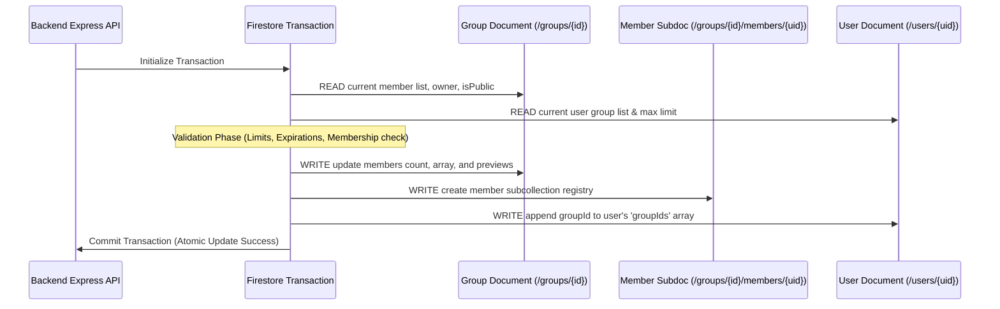

# Firestore Transactions & Counter Service Design

This document details how the backend handles transactions, updates multiple documents atomically, and uses distributed counters to prevent write performance bottlenecks.

---

## 1. The "READ-before-WRITE" Rule

In Google Cloud Firestore transactions, **all read operations (queries, gets) must happen before any write operations (sets, updates, deletes)**.

If you call `transaction.get()` after calling `transaction.update()`, Firestore will throw an error. This is because Firestore transactions use optimistic concurrency control, which requires locking the read data before applying changes.

### Code Example (`groups.ts`)
When a user joins a group, the backend sequences the database operations as follows:

```typescript
const result = await db.runTransaction(async (transaction) => {
    // -------------------------------------------------------------
    // STEP 1: READ PHASE (All database gets must happen here)
    // -------------------------------------------------------------
    const groupDoc = await transaction.get(groupRef);
    const userDoc = await transaction.get(userRef);
    // Dynamic counter lookup must also execute in read phase
    const totalMessages = await CounterService.getCountInTransaction(transaction, groupRef, 'messageCount');

    // -------------------------------------------------------------
    // STEP 2: VALIDATION PHASE (Local business checks)
    // -------------------------------------------------------------
    if (!groupDoc.exists) throw new Error('Group not found.');
    // Check membership limits, duplicate checks, invite expirations...

    // -------------------------------------------------------------
    // STEP 3: WRITE PHASE (Updates and modifications are applied)
    // -------------------------------------------------------------
    transaction.update(groupRef, { ...Updated group array fields ... });
    transaction.set(membersSubCollectionRef, { ...New member sub-doc ... });
    transaction.update(userRef, { ...Add group ID to user registry ... });
});
```

---

## 2. Multi-Document Updates

To make reads fast, related data is stored across multiple collections. When an event occurs (like joining a group), the backend must update multiple documents **atomically** in a single transaction to prevent incomplete or corrupted data states.



### Documents Updated When Joining a Group:
1. **Parent Group Document**: Updates the `members` UID array, `memberPreviews` nickname list, and `membersCount`.
2. **Member Subcollection Document**: Creates a `/groups/{groupId}/members/{uid}` document to store custom settings like `joinedAt` and `kickThreshold`.
3. **User Registry Document**: Adds the group ID to `/users/{uid}.groupIds`. This is checked by Firestore Security Rules to limit memberships.

---

## 3. Distributed Counters & Preventing Hot-spotting

Firestore limits single-document updates to **approximately once per second** in production.

If many users in a group post study notes or send chat messages at the same time, updating a single counter field on a central group document will fail due to contention (hot-spotting).

### The Solution: `CounterService`
To scale counters under high traffic, the app uses a **Distributed Counter** pattern with client-side caching.

```
                   [ High Concurrency Writes ]
                   │      │      │      │      │
                   ▼      ▼      ▼      ▼      ▼
             [ Randomly Shard into 0..N Counter Subdocs ]
             (e.g., /groups/{id}/messageCount_shards/{shardId})
                                 │
                                 ▼
          [ Periodic Backend Batch Aggregation / Reads ]
           Loads and sums all shard documents into total
```

### How It Works:
1. **Dynamic Sharding**: Instead of incrementing `group.messageCount` directly, writes are randomly distributed across a subcollection of shard documents (`/shards/{id}`).
2. **Read Consolidation**: When the exact count is needed, the `CounterService` loads all shard documents, sums their values, and returns the total.
3. **Write Scaling**: Because updates are spread across multiple shards, the database can handle many concurrent count updates per second without slowing down.
