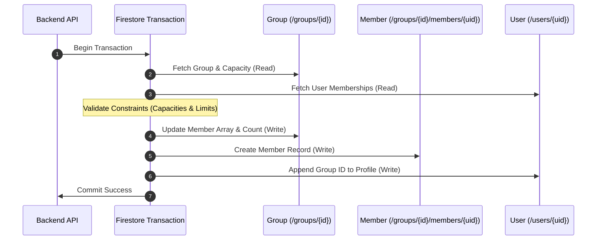

# Firestore Transactions & Counter Design

::: tip Interactive Architecture Tour
Explore the live data-flow blueprint and guided walkthrough for this feature:
- **Online (GitHub Browser Preview)**: [Open Interactive Tour (Group Transactions & Counters)](https://htmlpreview.github.io/?https://github.com/ScriptureHabit/scripture-habit/blob/main/docs/public/architecture-tour.html?tour=tour-groupchat&lang=en)
- **VitePress / Local**: [Open Group Transactions & Counters Tour](/architecture-tour.html?tour=tour-groupchat&lang=en)
:::

This document details the transactional constraints, atomic multi-document updates, and read-cost optimizations implemented for Cloud Firestore in Scripture Habit.

---

## 1. "Read-before-Write" Transaction Rule

In Google Cloud Firestore transactions (`db.runTransaction()`), **all read operations (`get()`) must precede all write operations (`set()`, `update()`, `delete()`)**.

Invoking a read operation after executing any write causes the transaction runner to throw a fatal exception.

```typescript
const result = await db.runTransaction(async (transaction) => {
    // 1. Read Phase (Fetch all required documents first)
    const groupDoc = await transaction.get(groupRef);
    const userDoc = await transaction.get(userRef);

    // 2. Validation Phase (Check business logic & limits)
    if (!groupDoc.exists) throw new Error('Group not found.');
    if (groupDoc.data().members.length >= 5) throw new Error('Group full.');

    // 3. Write Phase (Apply all mutations atomically)
    transaction.update(groupRef, { members: updatedMembers });
    transaction.set(memberSubDocRef, { joinedAt: new Date() });
    transaction.update(userRef, { groupIds: updatedGroupIds });
});
```

### Phase Separation (IIFE Pattern)
In complex mutation pipelines (e.g., note posting), read logic is encapsulated within an immediately invoked async function expression (IIFE), structurally preventing accidental read/write interleaving during future refactoring.

---

## 2. Atomic Multi-Document Updates

High-impact domain events (such as joining a group) update multiple documents atomically within a single transaction:



### Transaction Sequence Breakdown

1. **Pre-Read Isolation**  
   Reads parent group documents and user profiles simultaneously before executing mutations.

2. **Constraint Validation**  
   Evaluates capacity thresholds (max 5) and user membership limits (max 4) without race condition risks.

3. **Indivisible Atomic Commit**  
   Applies mutations across parent documents, subcollections, and user profiles in a single commit phase.

---

## 3. Optimizing Chat Reads (`messages_latest/latest`)

To prevent ballooning read volume during chat sessions, the application uses an aggregated latest-messages architecture:

### ① Aggregated Materialized View
Clients listen to `/groups/{groupId}/messages_latest/latest`, which holds an array of the latest 25 messages.
- **Initial Load Optimization**: Consumes only **1 single read** instead of 25 separate document reads.
- **Real-Time Distribution**: Posting a message updates this single document, broadcasting changes to all active listeners in a single event.

### ② Display Order Stability (`clientTimestamp`)
To prevent visual jumping while waiting for server timestamps, clients supply `clientTimestamp = Date.now()`, enabling stable client-side sorting.

---

## 4. Query Optimization Principles

1. **Snapshot Reuse**: Reuse query snapshots directly rather than calling redundant `transaction.get(docRef)` lookups.
2. **Parallel Batch Reads (`db.getAll`)**: Replace sequential read loops with `db.getAll(...refs)`.
3. **Scope Minimization**: Omit documents not strictly required for transactional validation.

---

## 5. Related Documentation

- [Note Posting & Streak Logic](./logic-note-posting.md)
- [Group Chat Architecture & Implementation](./groupchat-construction-guide.md)
- [Firestore Offline Persistence](./firestore-offline-persistence.md)
