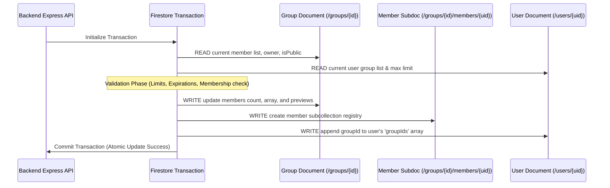

# Firestore Transactions & Counter Service Design

This document details the transactional integrity mechanisms, atomic multi-document updates, and the distributed caching/counter patterns used in the backend to ensure high data consistency and prevent write hot-spotting.

---

## 1. The "READ-before-WRITE" Constraint Order

A fundamental limitation of Google Cloud Firestore transactions is that **all database read operations (queries, gets) must occur before any database write operations (sets, updates, deletes)**.

If a developer attempts to call `transaction.get()` after triggering a `transaction.update()`, Firestore will abort the process and throw a runtime exception. This is because Firestore transactions use optimistic concurrency control, which requires locking the read set before applying changes.

### Clean Code Implementation (`groups.ts`)
During user actions like joining a group, the backend enforces a strict sequencing pipeline:

```typescript
const result = await db.runTransaction(async (transaction) => {
    // -------------------------------------------------------------
    // STEP 1: READ PHASE (All database gets must happen here)
    // -------------------------------------------------------------
    const groupDoc = await transaction.get(groupRef);
    const userDoc = await transaction.get(userRef);
    // Dynamic counter lookup must also execute in read phase
    const totalMessages = await CounterService.getCountInTransaction(transaction, groupRef, 'messageCount');

    // -------------------------------------------------------------
    // STEP 2: VALIDATION PHASE (Local business checks)
    // -------------------------------------------------------------
    if (!groupDoc.exists) throw new Error('Group not found.');
    // Check membership limits, duplicate checks, invite expirations...

    // -------------------------------------------------------------
    // STEP 3: WRITE PHASE (Updates and modifications are applied)
    // -------------------------------------------------------------
    transaction.update(groupRef, { ...Updated group array fields ... });
    transaction.set(membersSubCollectionRef, { ...New member sub-doc ... });
    transaction.update(userRef, { ...Add group ID to user registry ... });
});
```

---

## 2. Atomic Multi-Document State Synchronization

Because of Firestore's document-oriented architecture, related data is denormalized across collections to achieve sub-second read performance. 

When a structural event occurs (e.g., joining or leaving a group), the backend must update multiple documents **atomically** within a single transaction to prevent half-joined or corrupted data states.



### Affected Resources on Group Mutations:
1. **The Parent Group Document**: Updates `members` (UID array), `memberPreviews` (nickname list), `membersCount`, and dynamic timezone mappings.
2. **The Member Subcollection Document**: Creates a dedicated `/groups/{groupId}/members/{uid}` document to hold custom metadata like `joinedAt`, `photoURL`, and individual `kickThreshold` values.
3. **The User Registry Document**: Appends the group ID to `/users/{uid}.groupIds`, satisfying the Firestore Security Rule validation check of `groupIds.size() < 4`.

---

## 3. Distributed Counters & Preventing Firestore "Hot-spotting"

A physical constraint of Firestore is that **a single document can only be updated approximately once per second** in production environments. 

If multiple users inside a large group post notes, react to messages, or chat at the exact same moment, updating a single counter field on a central group document will fail due to contention, resulting in high latency, timeouts, and transaction aborts (Hot-spotting).

### The Solution: `CounterService`
To scale counters across high-concurrency situations, the application utilizes the **Distributed Counter design pattern** combined with client-side caches.

```
                  [ High Concurrency Writes ]
                  │      │      │      │      │
                  ▼      ▼      ▼      ▼      ▼
            [ Randomly Shard into 0..N Counter Subdocs ]
            (e.g., /groups/{id}/messageCount_shards/{shardId})
                                │
                                ▼
         [ Periodic Backend Batch Aggregation / Reads ]
          Loads and sums all shard documents into total
```

### Core Architecture:
1. **Dynamic Sharding**: Instead of incrementing `group.messageCount` directly, write transactions randomly shard increments across a collection of private subdocuments (`/shards/{id}`).
2. **Read Consolidation**: When the exact count is required (such as in a transaction check), the `CounterService` loads the individual shards, sums their values, and returns the total.
3. **Write Scaling**: Because increments are distributed across multiple shards, the database can handle hundreds of concurrent count updates per second without bottlenecking.
