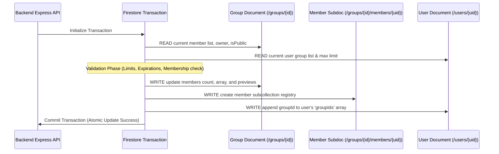

# Firestore Transactions & Counter Service Design

This document details how the backend handles transactions, updates multiple documents atomically, and uses distributed counters to prevent write performance bottlenecks.

---

## 1. The "READ-before-WRITE" Rule

In Google Cloud Firestore transactions, **all read operations (queries, gets) must happen before any write operations (sets, updates, deletes)**.

If you call `transaction.get()` after calling `transaction.update()`, Firestore will throw an error. This is because Firestore transactions use optimistic concurrency control, which requires locking the read data before applying changes.

### Code Example (`groups.ts`)
When a user joins a group, the backend sequences the database operations as follows:

```typescript
const result = await db.runTransaction(async (transaction) => {
    // -------------------------------------------------------------
    // STEP 1: READ PHASE (All database gets must happen here)
    // -------------------------------------------------------------
    const groupDoc = await transaction.get(groupRef);
    const userDoc = await transaction.get(userRef);
    // Bypasses sharded counter reads inside transactions to save 10 reads!
    // Reads directly from the already-fetched groupDoc main snapshot.
    const totalMessages = groupDoc.data()?.messageCount || 0;

    // -------------------------------------------------------------
    // STEP 2: VALIDATION PHASE (Local business checks)
    // -------------------------------------------------------------
    if (!groupDoc.exists) throw new Error('Group not found.');
    // Check membership limits, duplicate checks, invite expirations...

    // -------------------------------------------------------------
    // STEP 3: WRITE PHASE (Updates and modifications are applied)
    // -------------------------------------------------------------
    transaction.update(groupRef, { ...Updated group array fields ... });
    transaction.set(membersSubCollectionRef, { ...New member sub-doc ... });
    transaction.update(userRef, { ...Add group ID to user registry ... });
});
```

### 1.1 Compile-Safe Read/Write Phase Segregation (IIFE Pattern)

To strictly enforce the Read-before-Write constraint by construction, highly complex transactions (such as `postMessage` in `MessageService` and `postNote` in `NoteService`) encapsulate the entire read sequence (including conditional bootstraps/snaps and dependent pure calculations) into an asynchronous Immediately Invoked Function Expression (IIFE) block representing **Phase 1: Read Phase**.

Inside this block, absolutely no write mutations are allowed. All returned resolved states and computation variables are received in the outer scope, and then executed in **Phase 2: Write Phase** (which contains only `transaction.set` and `transaction.update` mutations).

This physical phase segregation guarantees that it is impossible for a developer to accidentally insert a read query after a write mutation during future updates.

#### Code Example (`MessageService.postMessage` / `NoteService.postNote`)
```typescript
const result = await db.runTransaction(async (transaction) => {
    // -------------------------------------------------------------
    // PHASE 1: READ & CALCULATION PHASE (Strict Read-before-Write)
    // -------------------------------------------------------------
    const { userData, currentMessages, allLatestGids, ... } = await (async () => {
        const [userSnap, latestSnap] = await Promise.all([
            transaction.get(userRef),
            transaction.get(latestRef)
        ]);

        // ... Pure Calculations, validations and history bootstrapping queries ...

        return {
            userData: userSnap.data(),
            currentMessages: latestSnap.data()?.messages || [],
            allLatestGids
        };
    })();

    // -------------------------------------------------------------
    // PHASE 2: WRITE PHASE (Strictly mutations only)
    // -------------------------------------------------------------
    transaction.set(msgRef, msgData);
    transaction.set(latestRef, { messages: updatedMessages }, { merge: true });
    transaction.update(userRef, userUpdate);
});
```

---

## 2. Multi-Document Updates

To make reads fast, related data is stored across multiple collections. When an event occurs (like joining a group), the backend must update multiple documents **atomically** in a single transaction to prevent incomplete or corrupted data states.



### Documents Updated When Joining a Group:
1. **Parent Group Document**: Updates the `members` UID array, `memberPreviews` nickname list, and `membersCount`.
2. **Member Subcollection Document**: Creates a `/groups/{groupId}/members/{uid}` document to store custom settings like `joinedAt` and `kickThreshold`.
3. **User Registry Document**: Adds the group ID to `/users/{uid}.groupIds`. This is checked by Firestore Security Rules to limit memberships.

---

## 3. Distributed Counters & Preventing Hot-spotting

Firestore limits single-document updates to **approximately once per second** in production.

If many users in a group post study notes or send chat messages at the same time, updating a single counter field on a central group document will fail due to contention (hot-spotting).

### The Solution: `CounterService`
To scale counters under high traffic, the app uses a **Distributed Counter** pattern with client-side caching.

```
                   [ High Concurrency Writes ]
                   │      │      │      │      │
                   ▼      ▼      ▼      ▼      ▼
             [ Randomly Shard into 0..N Counter Subdocs ]
             (e.g., /groups/{id}/messageCount_shards/{shardId})
                                 │
                                 ▼
          [ Periodic Backend Batch Aggregation / Reads ]
           Loads and sums all shard documents into total
```

### How It Works:
1. **Dynamic Sharding**: Instead of incrementing `group.messageCount` directly, writes are randomly distributed across a subcollection of shard documents (`/shards/{id}`).
2. **Read Consolidation**: When the exact count is needed, the `CounterService` loads all shard documents, sums their values, and returns the total.
3. **Write Scaling**: Because updates are spread across multiple shards, the database can handle many concurrent count updates per second without slowing down.

---

## 4. Message Aggregation (Strategy B) & Low-Read High-Frequency Transactions

To scale high-frequency operations such as chat messaging (`postMessage`) and reaction toggling (`toggleReaction`), scripture-habit implements a **Message Aggregation pattern (Strategy B)** that collapses the active chat sync down to **exactly 1 Firestore read** per active stream:

### 4.1 Materialized Chat Aggregate (`messages_latest/latest`)
Instead of subscribing to the entire `/messages` subcollection (which incurs N reads on load and on any local changes), clients subscribe via `onSnapshot` to a single materialized view document: `/groups/{groupId}/messages_latest/latest`.

During a post, edit, reaction, or delete operation, the backend executes a transaction that:
1. **Reads** the single `latest` document and User profile state (if missing in cache).
2. **Mutates** the message array locally (appending, editing, slicing to 25 items, or shrinking on deletion).
3. **Writes** the updated array back to `/messages_latest/latest` and writes the single message log to the `/messages` subcollection.

This architecture ensures that all active listening clients receive real-time updates instantly through **0 database reads** (paying only for the single write performed by the poster).

### 4.2 Zero-Jitter UI Sorting (`clientTimestamp`)
During Firestore server-timestamp resolution, there is a small period where `createdAt` resolves as `null` locally (during optimistic updates). If client clocks are out of sync, this causes "UI jumps" when the server snapshot returns.

To guarantee zero-jitter sorting:
* Clients attach a client-generated Unix epoch millisecond timestamp (`clientTimestamp = Date.now()`) to the request body when posting messages or study notes.
* The backend persists `clientTimestamp` to both the individual message doc and the `latest` aggregate array.
* The frontend uses `clientTimestamp || parseTimestampToMillis(createdAt)` as the absolute sorting key. Since the sorting key is stable before and after server synchronization, UI jumps are entirely prevented.

### 4.3 Self-Healing Data Reconciliation (`reconcileLatestMessages`)
Since aggregate arrays represent a materialized view, manual database modifications or race conditions might cause them to drift from the actual history in the `/messages` subcollection.

To guarantee eventual data integrity and absolute self-healing:
* **`reconcileLatestMessages(groupId)`**: A transaction-safe method compares the `/messages_latest/latest` array against the actual physical latest 25 messages in the `/messages` subcollection. If any discrepancy (mismatched ID, length, or order) is detected, the aggregate document is automatically overwritten and self-healed.
* **Cron Sync Loop**: This self-healing function is integrated into the hourly cron sync `/aggregate-message-counts` for both active priority groups and maintenance stale recalculations, ensuring background data auto-healing without user intervention.

### 4.4 Group Chat Read Count Operation Cost Audit

To audit and optimize read cost when a user opens and interacts with a group chat, the system utilizes a hybrid model of **static bundles** and **materialized listeners**:

#### Scenario A: Initial Chat Room Entry (History Loading)
When a user opens a group chat, instead of performing multiple document reads for individual messages, the application requests an optimized Firestore Bundle via `/api/groups/bundle/:groupId`.

*   **CDN/Server Cache Hit (Within 30–60s of another member opening the chat)**:
    *   **Firestore Reads: 0 Reads** (Fully served from Edge CDN cache or in-memory server cache. 100% Free).
*   **Cache Miss (First time loaded after expiration)**:
    *   **Firestore Reads: ~26 Reads**
        *   1 Read: `/groups/{groupId}` (to verify user membership).
        *   25 Reads: `/groups/{groupId}/messages` (ordered by `createdAt` desc, limited to 25 items).
        *   *(Note: Once fetched, this bundle is cached globally, saving reads for all other users entering the chat).*

#### Scenario B: Active Chat Sync (Real-time Listening)
Once the initial history is loaded, the client attaches an `onSnapshot` listener to the single materialized aggregate document: `/groups/{groupId}/messages_latest/latest`.

*   **On Initial Listening Attachment**:
    *   **Firestore Reads: 1 Read** (to fetch the aggregate messages array).
*   **When any new message/note is posted or edited by anyone in the group**:
    *   **Firestore Reads: 1 Read** per update (triggered by the modified `latest` snapshot).
    *   *(Note: Listening to the chat stream has an O(1) operational cost. Even if a group has 50 active members posting notes simultaneously, clients pay only 1 read per update, bypassing expensive message collection queries).*

---

## 5. Firestore Read Optimization & Telemetry Audit System

To maintain low database costs and high API response times as scripture-habit scales, the architecture enforces strict guidelines to minimize Firestore document read operations.

### 5.1 Optimization Principles

1. **Query Snapshot Reuse**
   When looking up a document via a query (e.g., searching for a group by `inviteCode`), the resulting `QueryDocumentSnapshot` already contains the full document data. Bypasses secondary `transaction.get(docRef)` calls by directly reusing the snap:
   ```typescript
   // Efficient invite code join
   const querySnap = await transaction.get(inviteCodeQuery);
   const groupDoc = querySnap.docs[0]; // Reuse this directly! (Bypasses groupRef.get())
   ```

2. **Parallel Chunked Fetching (`db.getAll`)**
   Avoid sequential gets inside loops (N+1 queries), which cause multiple network roundtrips. Gather all references and fetch them in parallel using chunked `db.getAll(...)` in batches of 500:
   ```typescript
   // Efficient batch sync
   const allMemberRefs = groupIds.map(gid => db.collection('groups').doc(gid).collection('members').doc(userId));
   const snaps = await db.getAll(...allMemberRefs); // Bypasses loop gets!
   ```

3. **Background Context Propagation**
   When offloading operations to async background workers (e.g., push notifications in `postNote`), propagate pre-loaded snapshots into the worker context instead of re-fetching them.

4. **Optimistic Read Elimination**
   Bypasses optimistic fetches (such as fetching a learning note in `postNote` or `deleteNote`) when those fields or actions are not required for transaction validations.

---

## 6. Automatic Telemetry & Global Read Budgeting

To ensure developers do not accidentally re-introduce N+1 queries or redundant fetches during future updates, the emulated integration test environment runs a transparent **Global Read Audit**.

### 6.1 Transparent Prototype Wrapping
During testing, the [TestSetup](final-project/scripture-habit/api_internal/test-setup.ts) harness intercepts and counts every execution of:
- `admin.firestore.Transaction.prototype.get`
- `admin.firestore.Transaction.prototype.getAll`
- `admin.firestore.DocumentReference.prototype.get`

This tracking is fully immune to standard mock restorations (`vi.restoreAllMocks()`).

### 6.2 Test Output Report & Warning Budget
At the end of each emulated test file, `TestSetup` logs a detailed collection-level breakdown of the database reads:

```text
📊 [Firestore Read Audit] -----------------------------
   Transaction GETs:    18
   Transaction GETALLs: 1
   Document GETs:       10
   👉 Total Reads:      29
   Collection Breakdown:
     - users: 11 reads
     - groups: 16 reads
-------------------------------------------------------
```

If a test file exceeds a generous budget of **300 Firestore reads**, `TestSetup` outputs a prominent compiler warning urging the developer to review the asynchronous chains for N+1 queries.

