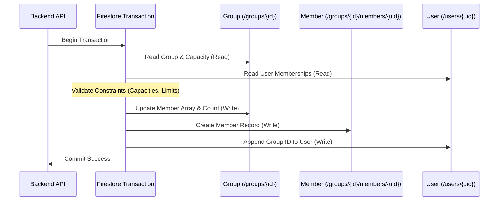

# Firestore Transactions & Counter Design

This document details how the application handles transactional database operations, atomic multi-document writes, and read-cost optimizations.

---

## 1. "Read-before-Write" Transaction Rule

In Google Cloud Firestore transactions (`db.runTransaction()`), **all read operations (`get()`) must precede all write operations (`set()`, `update()`, `delete()`)**.

Calling a read after performing any write will cause Firestore to throw an error.

```typescript
const result = await db.runTransaction(async (transaction) => {
    // 1. Read Phase (Fetch all required documents first)
    const groupDoc = await transaction.get(groupRef);
    const userDoc = await transaction.get(userRef);

    // 2. Validation Phase (Check business logic & limits)
    if (!groupDoc.exists) throw new Error('Group not found.');
    if (groupDoc.data().members.length >= 5) throw new Error('Group full.');

    // 3. Write Phase (Apply all mutations)
    transaction.update(groupRef, { members: updatedMembers });
    transaction.set(memberSubDocRef, { joinedAt: new Date() });
    transaction.update(userRef, { groupIds: updatedGroupIds });
});
```

### Phase Separation (IIFE Pattern)
In complex flows (such as posting notes or messages), the read logic is enclosed in an immediately invoked async function expression (IIFE) before executing writes, ensuring reads and writes cannot be inadvertently mixed during future maintenance.

---

## 2. Atomic Multi-Document Updates

When major events occur (e.g. joining a group), multiple documents must be updated atomically to maintain consistency across collections:



---

## 3. Optimizing Chat Reads (`messages_latest/latest`)

To prevent ballooning read operations in active chat rooms, the application uses an aggregated latest-messages pattern:

### ① Aggregated Materialized Document
Instead of subscribing to the entire `/messages` subcollection, clients listen to `/groups/{groupId}/messages_latest/latest`, which holds an array of the latest 25 messages.
- **Initial Load**: Requires only **1 single read** instead of 25 separate document reads.
- **Real-Time Updates**: When a message is posted, updating this aggregated document delivers the update to all active listeners in a single event.

### ② Preventing UI Jitter (`clientTimestamp`)
To keep messages in a stable display order while waiting for server timestamps to resolve, clients send `clientTimestamp = Date.now()`, ensuring stable sorting without visual layout jumps.

---

## 4. Guidelines for Minimizing Read Costs

1. **Reuse Query Snapshots**: If a query snapshot already contains document data (e.g. searching by `inviteCode`), reuse the snapshot directly rather than calling `transaction.get(docRef)`.
2. **Batch Reads with `db.getAll`**: Avoid reading documents one-by-one in loops; use `db.getAll(...refs)` to fetch them in parallel.
3. **Avoid Unnecessary Reads**: Omit reads for data that is not strictly required for transactional validation.

---

## 5. Related Documentation

- [Note Posting & Streak Logic](./logic-note-posting.md)
- [Group Chat Architecture & Implementation](./groupchat-construction-guide.md)
- [Firestore Offline Persistence](./firestore-offline-persistence.md)
