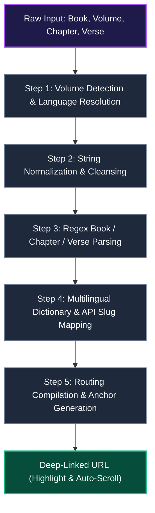

# Gospel Library URL Mapper

The `Gospel Library Mapper` (`src/utils/gospel-library-mapper.ts`) translates user inputs, scripture citations, volumes, and topic references into official study URLs on the Church of Jesus Christ of Latter-day Saints website.

It normalizes strings, extracts chapter and verse selections, and creates multilingual deep-links with active highlights and auto-scroll anchors.

---

## 1. Technical Pipeline & Data Flow

The mapper processes inputs through a 5-step pipeline:



### Pipeline Breakdown

1. **Volume & Language Resolution**  
   Resolves the target volume across 10 languages and maps the client language code to official 3-letter Church parameters (`jpn`, `eng`, `spa`, etc.).
2. **Normalization & Parsing**  
   Converts full-width characters and localized suffixes to standard punctuation, extracting book names, chapter numbers, and verse boundaries via regex.
3. **Dictionary Mapping & Link Compilation**  
   Matches parsed titles against 150+ multilingual slugs (e.g., `bofm/alma`), appending verse highlight parameters (`&id=p...`) and scroll anchors (`#p...`).

---

## 2. Exported Functions

### 1. `getGospelLibraryUrl(...)`
Primary function. Given a volume, chapter/verse text, and language code, builds the official URL.
```typescript
getGospelLibraryUrl(
  volume: string | null | undefined,
  chapterInput: string | null | undefined,
  language: string = 'en'
): string | null
```

### 2. `getCategoryFromScripture(...)`
Extracts the scripture category (e.g., "Book of Mormon", "General Conference") from raw strings.
```typescript
getCategoryFromScripture(scriptureText: string | null | undefined): string
```

### 3. `getScriptureInfoFromText(...)`
Extracts structured header rows (`**Chapter:**` or `**Scripture:**`) from markdown notes and creates the corresponding study link.
```typescript
getScriptureInfoFromText(text: string | null | undefined): string | null
```

---

## 3. Step-by-Step Implementation

### Step 1: Volume Detection & Language Mapping
- **Multilingual Matching**: Detects volume from user strings across 10 languages.
- **Language Code Resolution**: Maps `'ja'` $\rightarrow$ `?lang=jpn`, `'en'` $\rightarrow$ `?lang=eng`, `'es'` $\rightarrow$ `?lang=spa`, etc.
- **Vietnamese Fallback**: Old and New Testament queries fall back to English (`?lang=eng`) due to official site translation availability.

### Step 2: Normalization & Cleansing
- Converts full-width digits (`０-９`) to half-width (`0-9`).
- Unifies colons (`：` $\rightarrow$ `:`), commas (`、` $\rightarrow$ `,`), and spaces (`\u3000` $\rightarrow$ ` `).
- Normalizes localized prefixes and suffixes (e.g., Japanese "第", "章", "節").

### Step 3: Regular Expression Parsing
```typescript
const match = cleanChapterInput.match(/(.*?)\s*(\d+)(?::([\d\s,-]+))?\s*$/);
```
- **Book Name** (`match[1]`): Normalized title string.
- **Chapter Number** (`match[2]`): Chapter integer.
- **Verses** (`match[3]`): Single verse, range (e.g., `3-5`), or comma-separated list.

### Step 4: Multilingual Dictionary Mapping
- **1 Nephi**: `"1 nephi"`, `"1 néfi"`, `"1ニーファイ"`, `"第1ニーファイ"`, `"尼腓一書"` $\rightarrow$ `1-ne`
- **Doctrine and Covenants**: `"doctrine and covenants"`, `"教義と聖約"`, `"d&c"` $\rightarrow$ `dc`

### Step 5: Routing Compilation & Deep-Linking
- **Standard Works**: `https://www.churchofjesuschrist.org/study/scriptures/{volume}/{book}/{chapter}{suffix}`
- **Doctrine & Covenants**: `https://www.churchofjesuschrist.org/study/scriptures/dc-testament/dc/{chapter}{suffix}`
- **General Conference**: `https://www.churchofjesuschrist.org/study/general-conference/{input}{langParam}`
- **Highlighting & Auto-Scroll**:
  - Highlights: `&id=p3-p5`
  - Auto-Scroll: `#p3`

#### Example
- **Input**: `getGospelLibraryUrl("Book of Mormon", "Alma 32:21", "es")`
- **Output**: `https://www.churchofjesuschrist.org/study/scriptures/bofm/alma/32?lang=spa&id=p21#p21`

---

## 4. Related Documentation

- [Group Chat Architecture & Implementation](./groupchat-construction-guide.md)
- [Note Creation (NewNote) Guide](./newnote-construction-guide.md)
- [Internationalization (i18n)](./logic-i18n.md)
