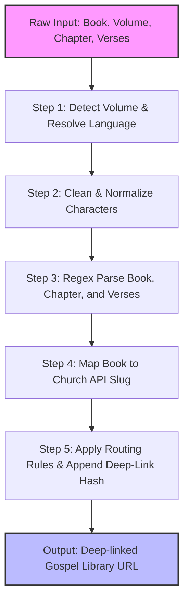

# Gospel Library URL Mapper: Technical Deep-Dive

The `Gospel Library Mapper` is a core utility engine in **scripture-habit** (`src/utils/gospel-library-mapper.ts`) designed to translate multi-lingual user inputs, scripture citations, volumes, and topics into official study URLs on the Church of Jesus Christ of Latter-day Saints website.

It acts as a smart router that handles normalizations, resolves verse selections to deep-links (complete with highlight and scroll parameters), and supports a wide range of global languages.

---

## 🏗️ Technical Pipeline & Data Flow

The mapper processes inputs through a 5-step pipeline to transform raw, language-specific user strings into targeted, deep-linked URLs:



---

## ⚙️ Core Logic & Utility Functions

The module exports three main functions:

### 1. `getGospelLibraryUrl(...)`
The primary routing engine. Given a volume, chapter/scripture text, and a language, it builds the correct URL.
```typescript
getGospelLibraryUrl(
  volume: string | null | undefined,
  chapterInput: string | null | undefined,
  language: string = 'en'
): string | null
```

### 2. `getCategoryFromScripture(...)`
Infers the structural scripture category (e.g., "Book of Mormon", "General Conference") from a raw string.
```typescript
getCategoryFromScripture(scriptureText: string | null | undefined): string
```

### 3. `getScriptureInfoFromText(...)`
An extraction helper that scans markdown-like notes for structural lines (`**Chapter:**` / `**Title:**` and `**Scripture:**`) and constructs the appropriate Gospel Library study URL.
```typescript
getScriptureInfoFromText(text: string | null | undefined): string | null
```

---

## 🛠️ Step-by-Step Implementation Details

### Step 1: Volume Detection & Language Mapping
- **Multi-Lingual Matching**: Detects the volume from user inputs (such as "Old Testament", "モルモン書", "Velho Testamento") in English, Japanese, Portuguese, Chinese, Spanish, Vietnamese, Thai, Korean, Tagalog, and Swahili.
- **Language Code Resolution**: Maps internal two-letter application codes to the Church's official three-letter query parameters:
  - `'en'` $\rightarrow$ `?lang=eng`
  - `'ja'` $\rightarrow$ `?lang=jpn`
  - `'pt'` $\rightarrow$ `?lang=por`
  - `'zho'` $\rightarrow$ `?lang=zho`
  - `'es'` $\rightarrow$ `?lang=spa`
  - `'vi'` $\rightarrow$ `?lang=vie`
  - `'th'` $\rightarrow$ `?lang=tha`
  - `'ko'` $\rightarrow$ `?lang=kor`
  - `'tl'` $\rightarrow$ `?lang=tgl`
  - `'sw'` $\rightarrow$ `?lang=swa`
  
> [!NOTE]
> **Vietnamese Fallback Rule**: For Old Testament (`ot`) and New Testament (`nt`) volumes, Vietnamese query params are overridden to English (`?lang=eng`) due to structural variations or non-availability of Vietnamese translations for those volumes on the official web portal.

---

### Step 2: Normalization & Character Sanitization
To handle diverse keyboards, mobile inputs, and copy-paste anomalies, the mapper normalizes strings before parsing:
- **Full-Width to Half-Width Conversion**: Maps full-width Japanese/Chinese numbers (`０-９`) to standard half-width numbers (`0-9`).
- **Punctuation Alignment**:
  - Colons: `：` $\rightarrow$ `:`
  - Commas: `，` or `、` $\rightarrow$ `,`
  - Ideographic Spaces: `\u3000` $\rightarrow$ ` ` (Standard Space)
  - Dashes: `－`, `—`, or `―` $\rightarrow$ `-`
- **Suffix Removal**: Converts localized suffixes like Japanese `"章"` (Chapter) followed by numbers to standard colon notation, and strips standalone `"章"` and `"節"` (Verse) characters.

---

### Step 3: Regex Parsing
A powerful regular expression extracts book names, chapter numbers, and verse boundaries:
```typescript
const match = cleanChapterInput.match(/(.*?)\s*(\d+)(?::([\d\s,-]+))?\s*$/);
```

#### Parsed Components:
- **Book Name** (`match[1]`): Cleaned of dots, converted to lowercase, and strips the Japanese prefix `"第"` if followed by a digit.
- **Chapter Number** (`match[2]`): Re-formatted to half-width integer string.
- **Verses** (`match[3]`): Captures ranges (e.g. `3-5`), single verses, or comma-separated lists.

---

### Step 4: Multi-Language Dictionary Mapping
The mapper houses a massive dictionary containing over **150+ mappings** representing every scripture book across **10 different languages**.

#### Example Book Mapping Triggers:
- **1 Nephi**: `"1 nephi"`, `"1 néfi"`, `"1 nefi"`, `"1ニーファイ"`, `"第1ニーファイ"`, `"尼腓一書"`, `"1 นีไฟ"`, `"니파이전서"`.
- **Doctrine and Covenants**: `"doctrine and covenants"`, `"教義と聖約"`, `"doutrina e convênios"`, `"doctrina y convenios"`, `"giáo lý và giao ước"`, `"d&c"`, `"dc"`.

#### Volume Derivation Fallback:
If a user inputs a book citation without specifying the volume, the mapper performs a lookup against a derived `slugToVolume` map (e.g. mapping `gen` $\rightarrow$ `ot`, `1-ne` $\rightarrow$ `bofm`, `dc` $\rightarrow$ `dc-testament`) to determine the volume segment automatically.

---

### Step 5: Routing Rules & Deep-Linking

The URL is compiled according to the resolved category:

#### 1. Standard Scriptures
Formatted as:
`https://www.churchofjesuschrist.org/study/scriptures/{volumeUrlPart}/{bookUrlPart}/{chapterNum}{urlSuffix}`

#### 2. Doctrine & Covenants (Edge Case)
Doctrine & Covenants requires a double nested path representation:
`https://www.churchofjesuschrist.org/study/scriptures/dc-testament/dc/{chapterNum}{urlSuffix}`

#### 3. General Conference Links
- **Full URLs**: If the chapter input contains a full `churchofjesuschrist.org` URL, it rewrites the language query parameter (`?lang=...`) in-place to align with the user's active session.
- **Shortcodes**: Supports formats like `YYYY/MM/DD` or `YYYY/MM` and compiles them into:
  `https://www.churchofjesuschrist.org/study/general-conference/{chapterInput}{langParam}`

#### 4. Ordinances & Proclamations
Maps specific localized terms to dedicated Gospel Library URLs:
- **Sacrament** keywords $\rightarrow$ `/study/scriptures/sacrament`
- **Baptism** keywords $\rightarrow$ `/study/scriptures/baptism`
- **The Family Proclamation** keywords $\rightarrow$ `/study/scriptures/the-family-a-proclamation-to-the-world`
- **The Living Christ** keywords $\rightarrow$ `/study/scriptures/the-living-christ-the-testimony-of-the-apostles`
- **The Restoration Proclamation** keywords $\rightarrow$ `/study/scriptures/the-restoration-of-the-fulness-of-the-gospel-of-jesus-christ`
- **Default Category Landing** $\rightarrow$ `/study/scriptures/ordinances-and-proclamations`

#### 5. BYU Speeches Passthrough
Treats BYU Speeches input as an external reference and returns the `chapterInput` string directly without modifications.

---

## 🎯 Deep-Link Verse Highlighting & Auto-Scrolling

To provide deep-links, the mapper parses the verses captured in **Step 3** to build dual HTML hash attributes:

1.  **Selection Highlight (`id` Parameter)**:
    Converts digits in the verse string into `p`-prefixed parameters expected by the Church website.
    -   *Input*: `"3-5"` $\rightarrow$ `&id=p3-p5`
    -   *Result*: Highlights verses 3 through 5 in the browser.
2.  **Auto-Scroll Anchor (`#` Hash)**:
    Extracts the first digit from the verse selection and appends it as an anchor hash.
    -   *Input*: `"3-5"` $\rightarrow$ `#p3`
    -   *Result*: Automatically scrolls the browser viewport down to the target starting verse.

### Example Generation:
*   **Input**: `getGospelLibraryUrl("Book of Mormon", "Alma 32:21", "es")`
*   **Output**: `https://www.churchofjesuschrist.org/study/scriptures/bofm/alma/32?lang=spa&id=p21#p21`
