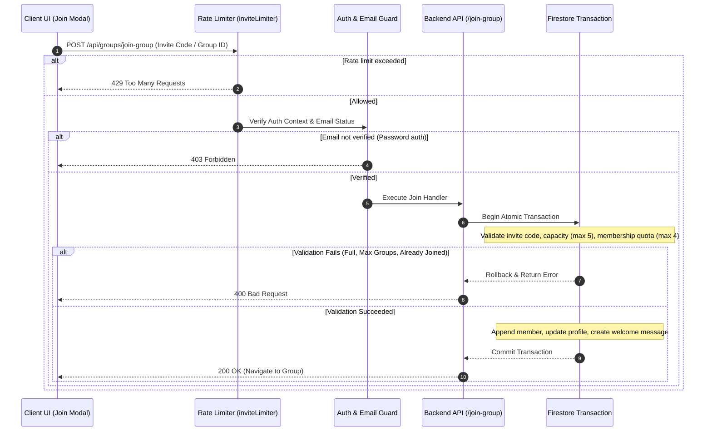

# Group Invites & Joining Pipeline

> [!TIP]
> **Interactive Architecture Tour**: [Open Live Tour (Invite Links & Redirects)](https://htmlpreview.github.io/?https://github.com/ScriptureHabit/scripture-habit/blob/main/docs/public/architecture-tour.html?tour=tour-invite&lang=en)

This document details the group invite lifecycle, join validation flows, historical code compatibility, and security boundaries in Scripture Habit.

---

## 1. Join Pipeline Overview

Group join operations execute through rate-limiting filters, verified email guards, and atomic Firestore transactions:

### Join Sequence Breakdown

1. **Rate Limiting & Authentication Guards**  
   Protects endpoints from automated brute-force scans (max 15 attempts/hour) and verifies verified email tokens.

2. **Transactional Validation**  
   Atomically verifies group capacity (max 5 members) and user group quotas (max 4 groups) within a Firestore transaction.

3. **Atomic Commit & Welcome Message**  
   Appends the user to the roster, updates the user's `groupIds` array, and writes an official welcome announcement into the chat feed simultaneously.

---

## 2. Invite Link Architecture

### ① Ambiguity-Free Character Set
To prevent visual transcription errors (`O` vs. `0`, `I` vs. `1`), codes use 32 high-contrast alphanumeric characters:
`ABCDEFGHJKLMNPQRSTUVWXYZ23456789`
- **Length**: 6 characters
- **Namespace Capacity**: Over 1 billion combinations

### ② Permanent Invites (Zero Friction)
To avoid link expiration friction across messaging apps, invite codes remain active indefinitely by default (`inviteCodeExpiresAt: null`).

### ③ Historical Code Compatibility (`previousInviteCodes`)
When an invite code is regenerated, previous codes are preserved in the `previousInviteCodes` history array. Previously shared links continue to resolve seamlessly.

### ④ Boundary Enforcement
- **Hard Capacity Cap**: Capped at 5 members (`maxMembers: 5`).
- **User Membership Limit**: Capped at 4 groups per account (`MAX_GROUPS_PER_USER = 4`).
- **Rate Limiting**: Enforces strict IP-level rate limits on join attempts.

---

## 3. Backend API Endpoints (`api_internal/routes/groups.ts`)

### 1. Group Preview (`GET /api/groups/group-preview/:inviteCode`)
Public endpoint returning group metadata and member counts before joining.
- **Two-Stage Lookup**: Evaluates the active `inviteCode`, falling back to `previousInviteCodes`.
- **Localization**: Delivers localized group names and descriptions based on client headers.

### 2. Code Regeneration (`POST /api/groups/regenerate-invite-code`)
Generates a new 6-character code and archives the active code to history.

### 3. Join Group (`POST /api/groups/join-group`)
Executes transactional capacity and membership checks before committing updates.

---

## 4. Related Documentation

- [Small Group Dynamics (Max 5) & Peer Accountability](./ux-small-groups-and-peer-accountability.md)
- [Inactivity & Auto-Kick Engine](./inactivity-and-autokick.md)
- [Group Chat Architecture & Implementation](./groupchat-construction-guide.md)
