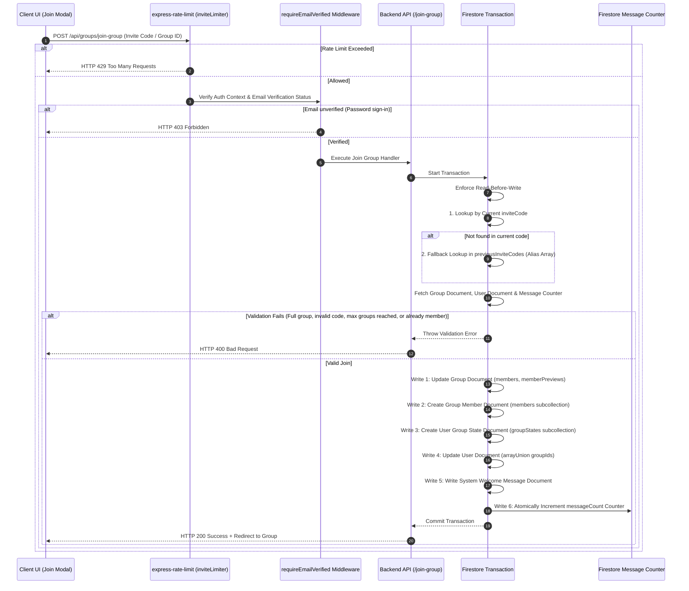

# Group Invitation & Membership Join Pipeline

This document explains the group invitation and joining process. It ensures database consistency, prevents brute-force attempts on invite codes, supports localized previews, and implements a zero-expiration model with backward-compatible aliases.

---

## Pipeline Overview

The join pipeline validates requests using rate-limiting, authentication status, code alias resolution, and Firestore transactional writes:

---

## Invite Code Security & Architecture

Invite codes grant access to study groups. The system balances accessibility with safety using a human-centered design:

### 1. Easy-to-Read Codes
To prevent user errors (like confusing `O` and `0` or `I` and `1`), invite codes use a 32-character alphabet:
`ABCDEFGHJKLMNPQRSTUVWXYZ23456789`
- **Length**: 6 characters.
- **Combinations**: Over 1 billion unique codes.

### 2. Uniqueness Checks
When creating a group or regenerating a link, the system generates a random code and queries Firestore inside a transaction. If the code is already in use, it generates a new one (up to 10 attempts).

### 3. Zero-Expiration Model (Permanent Invites)
- **Design Philosophy**: Scripture study groups are small, trust-based circles. Short expiration windows (e.g., 24 hours) cause friction when invitations are shared via messaging apps over weekends.
- **Permanent Validity**: Invite codes do not expire by default (`inviteCodeExpiresAt: null`). Users can join at their convenience.

### 4. Backward Compatibility via Code Aliases (`previousInviteCodes`)
- When a group member or owner regenerates an invite code, the previous code is automatically saved into the `previousInviteCodes` array.
- Both `/api/groups/group-preview/:inviteCode` and `/api/groups/join-group` query `inviteCode` first, then fall back to `previousInviteCodes` with `array-contains`.
- **Zero Broken Links**: Existing invite links sent to friends remain functional even if another member regenerates the code.

### 5. Multi-Layer Protection Model
Instead of relying on fragile time limits, safety is enforced through multiple structural safeguards:
- **Capacity Limits**: Strictly capped at 5 members (`maxMembers: 5`).
- **User Group Limits**: Users cannot join more than 4 groups concurrently (`MAX_GROUPS_PER_USER: 4`).
- **Flat Member Governance**: All group members have permissions to view, copy, and regenerate invite codes, as well as manage group membership (kick inactive members).
- **Authentication**: Requires verified email accounts or dedicated demo sandbox accounts.

### 6. Rate Limiting (`inviteLimiter`)
To prevent automated brute-force scans:
- **Window**: 60 Minutes.
- **Production Limit**: Max 15 join attempts per hour per IP.
- **Development Limit**: 1000 attempts per hour to support automated E2E testing.

---

## Backend API Endpoints (`api_internal/routes/groups.ts`)

### 1. Group Preview (`GET /api/groups/group-preview/:inviteCode`)
Shows the Group Name, Description, and Member count in a preview card before the user joins.

* **Public Access**: This endpoint is public (unauthenticated) so users can preview a group before logging in.
* **Dual Resolution**: Checks the primary `inviteCode` first; if not found, checks the `previousInviteCodes` array.
* **Localization**: Reads `req.query.language` or `req.query.lang` to return localized group names and descriptions from `groupData.translations[lang]`.

### 2. Regenerate Code (`POST /api/groups/regenerate-invite-code`)
Allows group members to generate a new primary invite code while preserving past links.

* **Member Guard**: Verifies that the caller's UID is in `members` or matches `ownerUserId`.
* **Alias Archival**: Appends the current `inviteCode` to `previousInviteCodes` before setting the new code.
* **Permanent Expiry**: Sets `inviteCodeExpiresAt: null`.

---

## Concurrency-Safe Group Joining (`POST /api/groups/join-group`)

To prevent database race conditions (like exceeding group capacity during simultaneous joins), joining a group runs inside a Firestore transaction:

### 1. Strict Validation
- **Code Resolution**: Resolves group via `groupId`, `inviteCode`, or `previousInviteCodes`.
- **Capacity Limit**: Rejects with `GROUP_FULL` if the group size is >= `maxMembers` (default 5).
- **User Group Limit**: Rejects with `MAX_GROUPS_LIMIT` if the user has reached `MAX_GROUPS_PER_USER` (4).
- **Duplicate Guard**: Rejects with `ALREADY_MEMBER` if the user is already in the group's `members` list.
- **Sandbox Isolation**: Demo users can only join demo groups; real users cannot join demo sandboxes.
- **Email Verification**: Rejects unverified password-based accounts.

### 2. Transaction Writes
These writes occur atomically to ensure complete data consistency:

1. **Group Updates**: Appends user UID to `members`, increments `membersCount`, and updates `memberPreviews` (limited to 15 recent members).
2. **Member Subcollection**: Creates `/groups/{groupId}/members/{uid}` with `joinedAt`, `lastActiveAt`, and user settings.
3. **User Group State**: Creates `/users/{uid}/groupStates/{groupId}` to track unread badge status.
4. **User Document**: Appends `groupId` to the user's `groupIds` array via `arrayUnion`.
5. **System Welcome Message**: Writes a localized welcome message (`userJoined` type) to `/groups/{groupId}/messages`.
6. **Message Counter**: Atomically increments the group's `messageCount` counter.
