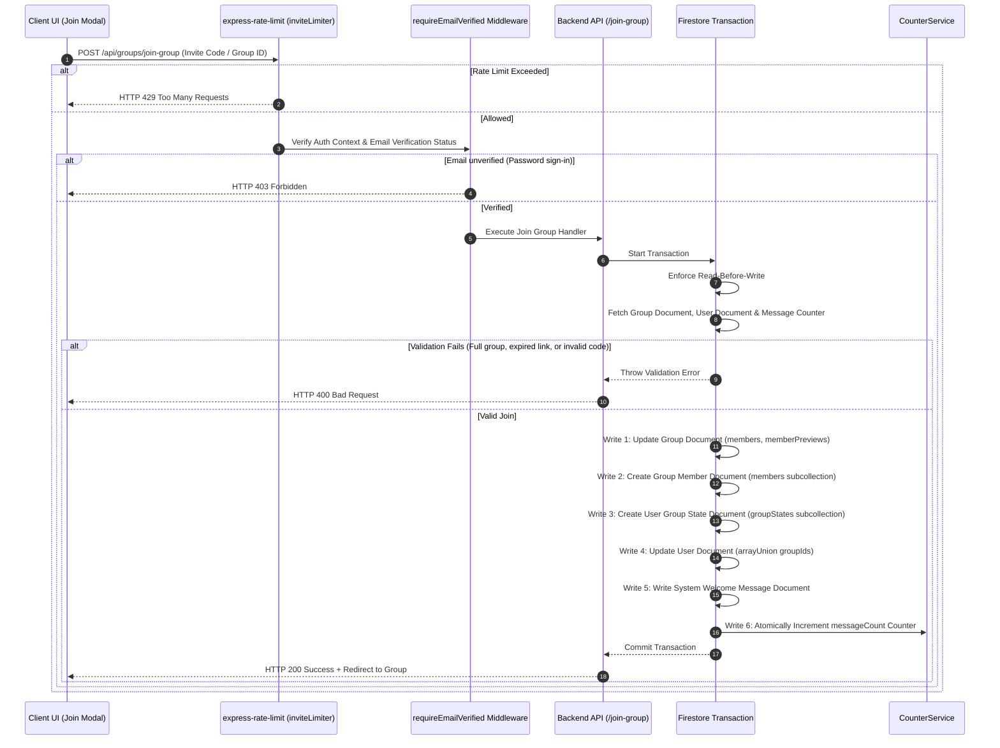

# Group Invitation & Membership Join Pipeline: Technical Deep-Dive

To allow users to form close-knit study groups securely and easily, **scripture-habit** utilizes a robust group invitation and atomic joining framework. This system ensures clean concurrency control during membership updates, prevents brute-force guessing of invite codes, supports localized previews, and automatically cleans up stale or expired invite tokens.

---

## 🏗️ Architecture & Flow Overview

The join pipeline coordinates secure verification across the rate-limiter, authentication headers, database validation, and transactional writes:

---

## 🔒 Invite Code Security & Defense-in-Depth

Invite codes act as capability tokens for private groups, demanding strong protective measures:

### 1. Ambiguity-Free Code Generation
To prevent user transcription errors (such as confusing the letter `O` with `0` or `I` with `1`), invite codes are generated using a restricted 32-character alphabet:
`ABCDEFGHJKLMNPQRSTUVWXYZ23456789`
-   **Length**: 6 characters.
-   **Entropy**: $32^6 \approx 1,073,741,824$ unique combinations.

### 2. Transactional Uniqueness Check
Alphanumeric collisions are prevented by running a query within a database transaction during group creation or link regeneration. The algorithm generates a random code and queries Firestore. If the code is already assigned to an active group, it drops the code and retries (up to 10 attempts).

### 3. Expiration Mechanism
Invite codes are protected by temporary lifetimes:
-   **Default Lifetime**: 7 days (customizable upon generation).
-   **Storage**: Persisted as a Firestore timestamp in `inviteCodeExpiresAt`.
-   **Verification**: The join transaction fetches the group, parses the Firebase Timestamp, and rejects requests where `expiresAt < new Date()`.

### 4. Brute-Force Rate Limiting (`inviteLimiter`)
To block malicious scripts attempting to scan or brute-force code combinations:
-   **Window**: 60 Minutes.
-   **Production Limit**: Max 15 invite attempts per hour.
-   **Development Limit**: Raised to 1000 attempts per hour to support automated integration testing.

---

## 📡 Backend API Endpoints (`api_internal/routes/groups.ts`)

### 1. Group Preview Endpoint (`GET /api/groups/group-preview/:inviteCode`)
Allows the frontend to show a descriptive landing card (showing Group Name, Description, and Member count) before a user commits to joining.

*   **No Authentication Guard**: This endpoint is intentionally public (unauthenticated) so that anonymous web visitors can preview a group before logging in.
*   **Safety Limits**: Validates that the invite code has not expired. If expired, it returns an `HTTP 410 Gone` error.
*   **Localization Support**: Inspects `req.query.language` and pulls translated group metadata from `groupData.translations[lang]` before responding, ensuring the user sees the preview card in their native language.

### 2. Regenerate Code Endpoint (`POST /api/groups/regenerate-invite-code`)
Allows the group owner to instantly revoke the active invite code and generate a fresh link with a new expiration date.

*   **Authorization Guard**: Asserts that the calling UID matches `ownerUserId` on the group document within an isolated Firestore transaction.
*   **Revocation Effect**: Overwriting `inviteCode` instantly invalidates the previous invite code, immediately blocking anyone attempting to use the old link.

---

## 🤝 Concurrency-Safe Transaction Joining

When a user joins a group, multiple database documents must be updated simultaneously. To prevent database race conditions (e.g. exceeding maximum membership limits during simultaneous joins), the entire operation is wrapped inside a Firestore transaction:

### 1. Rigid Strict Validation
-   **Capacity Checks**: Rejects if the group membership size exceeds `maxMembers` (default 500).
-   **User Group Ceiling**: Asserts the user is not exceeding `MAX_GROUPS_PER_USER` (preventing single users from bloating database references).
-   **Duplicate Guards**: Checks if the user is already present in the group's `members` array.
-   **Email Verification Guard**: Rejects the request if the user signed in with a password but has not verified their email address (`requireEmailVerified` middleware).

### 2. Multi-Document Transactional Writes
To keep the UI responsive and maintain total data consistency, the following writes occur atomically:

1.  **Group OGP & Cache Updates**:
    Appends the user UID to the group `members` list, increments `membersCount`, and appends the user to the `memberPreviews` list (capped to the 15 most recent members to keep index reads small).
2.  **Member Metadata Document**:
    Writes a new document `groups/{groupId}/members/{uid}` holding the member's specific joined timestamps, status tracking, and personal kick threshold settings.
3.  **User State Document**:
    Writes a document `users/{uid}/groupStates/{groupId}` recording the user's initial read message index, allowing immediate unread badges synchronization.
4.  **User Profile Reference**:
    Adds the `groupId` to the user's personal profile document, mapping active group memberships.
5.  **Welcome Message**:
    Creates a new system document `groups/{groupId}/messages/{msgId}` containing the welcome alert: `✨ **${nickname}** joined the group! Welcome!`.
6.  **Atomic Counter Sync**:
    Invokes `CounterService.increment` to increment the group's message count by `1`, capturing the welcome message and preserving synchronized unread badges.
