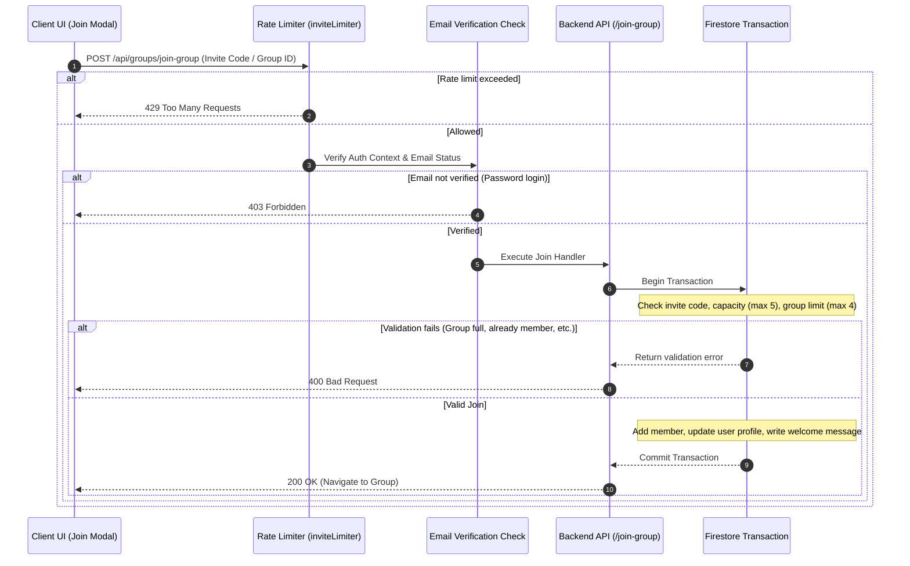

# Group Invites & Joining Pipeline

This document describes the group invite lifecycle, join validation flows, and the mechanisms ensuring link compatibility and security.

---

## 1. Join Pipeline Overview

Joining a group is processed through rate-limiting guards, email verification checks, and Firestore transactions:

---

## 2. Invite Link Design

### ① Ambiguity-Free Character Set
To prevent user input errors (e.g., confusing `O` with `0` or `I` with `1`), codes use 32 distinct alphanumeric characters:
`ABCDEFGHJKLMNPQRSTUVWXYZ23456789`
- **Length**: 6 characters
- **Combinations**: Over 1 billion distinct codes

### ② Permanent Invites (No Expiration Friction)
Scripture study groups are trust-based circles. Hard 24-hour expiration windows create communication friction when links are opened late in messaging apps. Therefore, invite codes are permanent by default (`inviteCodeExpiresAt: null`).

### ③ Historical Link Compatibility (`previousInviteCodes`)
When members regenerate a group's invite code, the old code is saved into the `previousInviteCodes` history array.
Old invite links previously shared via messaging apps continue to work without breaking.

### ④ Structural Safeguards
Rather than relying on short expiration windows, safety is maintained through structural rules:
- **Capacity Limits**: Capped at 5 members (`maxMembers: 5`).
- **Group Membership Limit**: Users may join up to 4 groups (`MAX_GROUPS_PER_USER = 4`).
- **Rate Limiting**: Rate-limits join attempts per IP (production: max 15 attempts per hour) to prevent automated scanning.

---

## 3. Backend API Endpoints (`api_internal/routes/groups.ts`)

### 1. Group Preview (`GET /api/groups/group-preview/:inviteCode`)
Public endpoint that returns the group name, description, and member count prior to joining.
- **Two-Stage Lookup**: Checks the active `inviteCode` first, then falls back to `previousInviteCodes`.
- **Localization**: Resolves translated group metadata based on client language.

### 2. Regenerate Code (`POST /api/groups/regenerate-invite-code`)
Generates a new active code while preserving past codes in the `previousInviteCodes` history.

### 3. Join Group (`POST /api/groups/join-group`)
Executed in a Firestore transaction to prevent race conditions:
- **Capacity Check**: Rejects if member count is $\ge 5$ (`GROUP_FULL`).
- **Limit Check**: Rejects if user belongs to $\ge 4$ groups (`MAX_GROUPS_LIMIT`).
- **Atomic Updates**: Concurrently updates member arrays, user state subcollections, and writes the welcome announcement message.

---

## 4. Related Documentation

- [Small Group Dynamics (Max 5) & Peer Accountability](./ux-small-groups-and-peer-accountability.md)
- [Inactivity & Auto-Kick Engine](./inactivity-and-autokick.md)
- [Group Chat Architecture & Implementation](./groupchat-construction-guide.md)
