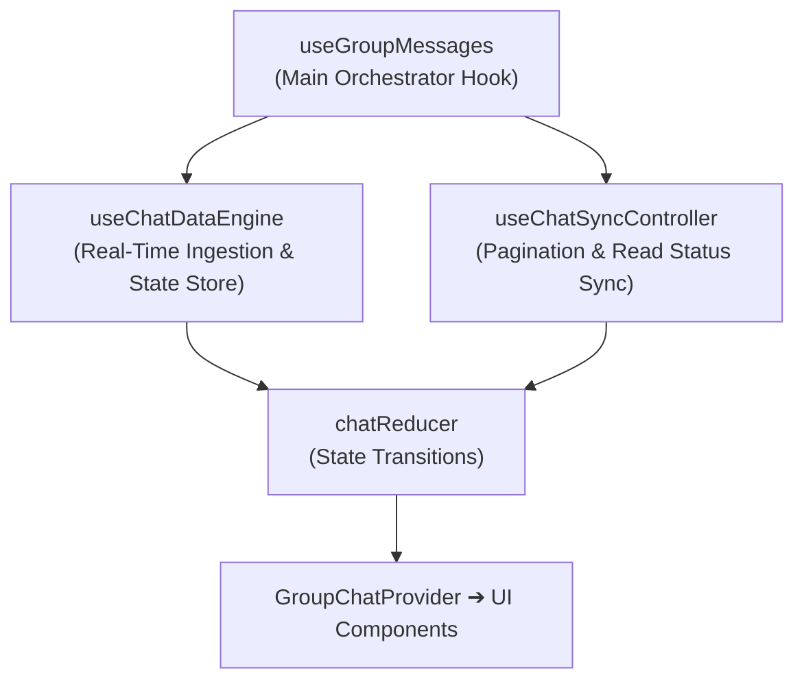

# Group Chat (`GroupChat`) Architecture & Implementation

This document outlines the architecture, state management patterns, and subcomponents of the `src/components/groupchat` module.

---

## 1. High-Level Architecture

`GroupChat` coordinates real-time messaging, Unity score tracking, cheer interactions, and modal dialogs.

```
                       ┌─────────────────────────┐
                       │   GroupChatProvider     │
                       └────────────┬────────────┘
                                    │
    ┌──────────────────┬────────────┴─────────────┬──────────────────┐
    ▼                  ▼                          ▼                  ▼
ChatDataContext   ChatMessageActionsContext   ChatGroupActionsContext   ChatUIActionsContext
  (State Data)       (Message Actions)          (Group/Member Actions)    (UI/Scroll)
    │                  │                          │                  │
    └──────────────────┴────────────┬─────────────┴──────────────────┘
                                    ▼
                         ┌───────────────────────┐
                         │   GroupChatContent    │
                         └──────────┬────────────┘
                                    │
          ┌─────────────────────────┼─────────────────────────┐
          ▼                         ▼                         ▼
    ChatHeader             MessageListContainer           GroupChatFooter
  (Header/Unity)        (Scrollable Messages)          (Reply/Input Area)
```

### Context Isolation Pattern
To avoid unnecessary re-renders across the entire chat component during typing or scrolling, context is isolated into 4 distinct stores:
1. **`ChatDataContext`**: Holds message arrays, member rosters, loading states, and group metadata.
2. **`ChatMessageActionsContext`**: Handlers for sending, editing, deleting, reacting to, and translating messages.
3. **`ChatGroupActionsContext`**: Handlers for updating group settings, leaving, and deleting groups.
4. **`ChatUIActionsContext`**: UI helpers for scroll management and localization.

---

## 2. Core Hooks Hierarchy & Data Flow

Hooks in `src/components/groupchat/hooks/core` follow a unidirectional data flow:



- **`useChatDataEngine`**: Ingests real-time events from Firestore `onSnapshot` and dispatches state updates to `chatReducer`.
- **`useChatSyncController`**: Manages older message pagination and periodic read status synchronization.
- **`useGroupMessages`**: Combines state and operations to supply `GroupChatProvider`.

---

## 3. Key Feature Implementations

### ① Unity Score & Celebration (`useUnityScore`)
- Dynamically computes the group's daily study completion rate.
- When 100% completion is reached, a confetti animation (`canvas-confetti`) triggers, and a notification request is sent to `/api/groups/announce-unity`.

### ② Cheer System (`useCheerSystem`)
- Allows members to send 1-tap encouragement pushes to peers who have not yet posted today.

### ③ Scripture Deep-Linking (`GospelLink`)
- Uses regular expressions to detect scripture references (e.g. "Mosiah 3:7", "1 Nephi 3:7") in message text and converts them into direct links to the official Gospel Library app or website.

### ④ Unified Modal Manager (`group-chat-modals.tsx`)
- Centralized router managing 11 modal types (member list, invite code, group settings, report dialogs, etc.).

---

## 4. Related Documentation

- [Chat & Dashboard Synchronization](./feature-chat-dashboard.md)
- [Unity Participation Architecture](./unity-participation.md)
- [Gospel Library Scripture Mapper](./gospel-library-mapper.md)
