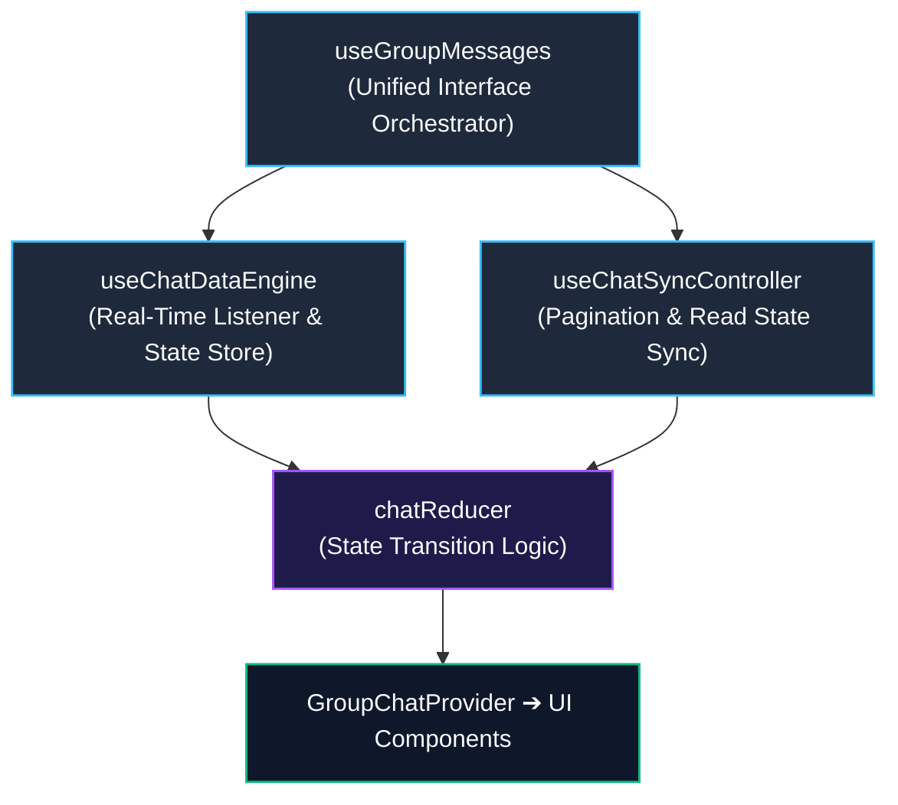

# Group Chat (`GroupChat`) Architecture & Implementation

This document outlines the component architecture, state management patterns, 4-tier Context isolation, and core feature implementations in `src/components/groupchat`.

---

## 1. High-Level Architecture

`GroupChat` is a composite component coordinating real-time messaging, Unity meter progress, peer encouragement cheers, and modal workflows.

```
                       ┌─────────────────────────┐
                       │   GroupChatProvider     │
                       └────────────┬────────────┘
                                    │
    ┌──────────────────┬────────────┴─────────────┬──────────────────┐
    ▼                  ▼                          ▼                  ▼
ChatDataContext   ChatMessageActionsContext   ChatGroupActionsContext   ChatUIActionsContext
  (State Data)       (Message Actions)          (Group/Member Actions)    (UI/Scroll)
    │                  │                          │                  │
    └──────────────────┴────────────┬─────────────┴──────────────────┘
                                    ▼
                         ┌───────────────────────┐
                         │   GroupChatContent    │
                         └──────────┬────────────┘
                                    │
          ┌─────────────────────────┼─────────────────────────┐
          ▼                         ▼                         ▼
    ChatHeader             MessageListContainer           GroupChatFooter
  (Header/Unity)        (Scrollable Messages)          (Reply/Input Area)
```

### Context Isolation Pattern

To eliminate unnecessary re-renders during high-frequency typing or scroll events, state and action handlers are partitioned into 4 distinct contexts:

1. **`ChatDataContext`**: Message arrays, active member rosters, Unity metrics, and loading indicators.
2. **`ChatMessageActionsContext`**: Mutations for creating, editing, deleting, reacting to, and translating messages.
3. **`ChatGroupActionsContext`**: Handlers for updating group metadata, leaving, and disbanding groups.
4. **`ChatUIActionsContext`**: UI helpers for scroll positioning and translation toggles.

---

## 2. Core Hooks Hierarchy & Data Flow

Hooks residing in `src/components/groupchat/hooks/core` enforce unidirectional data flow:



### Hook Hierarchy Breakdown

1. **`useChatDataEngine` (Real-Time Ingestion)**  
   Subscribes to Firestore `onSnapshot` events for new messages and roster updates, dispatching raw events directly to `chatReducer`.

2. **`useChatSyncController` (Synchronization Controller)**  
   Manages cursor-based pagination for older messages (infinite scroll) and dispatches debounced read state updates to the server.

3. **`useGroupMessages` (Orchestrator)**  
   Aggregates the data engine and sync controller, exposing a consolidated state interface to `GroupChatProvider`.

---

## 3. Key Feature Implementations

### ① Unity Score & Celebration (`useUnityScore`)
- Computes group study completion rate dynamically based on daily active members.
- On 100% completion, triggers confetti animations (`canvas-confetti`) and broadcasts celebratory system announcements via `/api/groups/announce-unity`.

### ② Peer Encouragement (`useCheerSystem`)
- Enables members to send 1-tap push notifications (cheers) to peers who have not yet published a note today.

### ③ Scripture Deep-Linking (`GospelLink`)
- Parses scripture references (e.g., "Mosiah 3:7", "1 Nephi 3:7") via regular expressions, generating deep-links to the Gospel Library app or website with verse highlights.

### ④ Unified Modal Manager (`group-chat-modals.tsx`)
- Coordinates 11 distinct modal dialogs (roster, invite code, group settings, reporting) via centralized state.

---

## 4. Related Documentation

- [Chat & Dashboard Synchronization](./feature-chat-dashboard.md)
- [Unity Participation Architecture](./unity-participation.md)
- [Gospel Library Scripture Mapper](./gospel-library-mapper.md)
