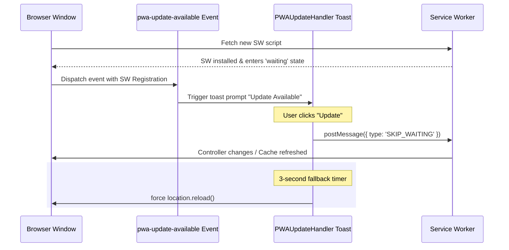
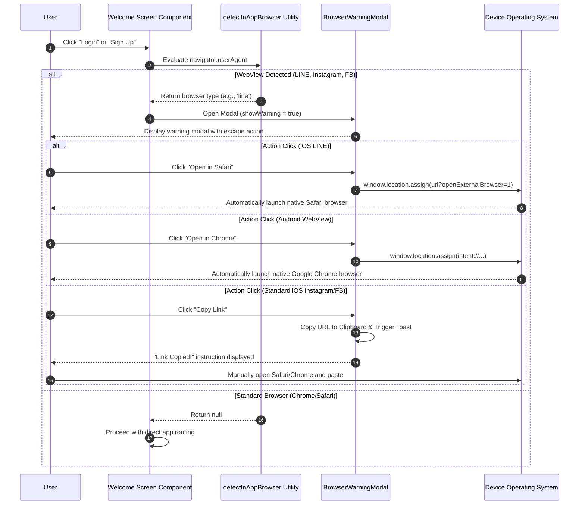

# PWA & Capacitor Hybrid Mobile Lifecycle

This document describes how the **scripture-habit** application transitions seamlessly between standard Web PWA features and Native Mobile environments (configured via Capacitor). It details the client-side lifecycle hooks, platform-adaptive installation prompts, updating mechanisms, and configuration details.

---

## 1. PWA Update Lifecycle (`PWAUpdateHandler`)

To prevent application crashes or data corruption from outdated client assets, the application employs a background Service Worker caching strategy combined with an interactive user-facing update trigger.

### Service Worker Update Trigger Flow
1. **Detection**: During compilation/bundling, standard service workers run in the background. If a new hash bundle is deployed on Vercel, the browser fetches the new worker.
2. **Transition State**: The new Service Worker enters a `waiting` state (it does not automatically take control of active tabs to prevent interrupting user actions).
3. **Dispatch**: The app dispatches a custom `pwa-update-available` global window event, sending the Service Worker registration object as details.
4. **Toast Notification**: `PWAUpdateHandler` captures this event and shows a non-dismissible custom toast notification via `react-toastify`.
5. **Execution**: When the user clicks the "Update" button:
   - The button transitions into a disabled loading state.
   - The app sends a `SKIP_WAITING` message directly to the waiting/installing service worker.
   - A fallback timeout of **3 seconds** is registered to force-reload the window if the worker controller fails to change instantly.



---

## 2. Platform-Adaptive Install Prompt (`InstallPrompt`)

To optimize PWA installs, the application automatically branches its onboarding based on user operating systems and screen contexts.

### Rules of Visibility
To prevent intrusive overlays, the installation prompt **only** appears under the following conditions:
* The user is rendering the `/dashboard` route.
* The application is **not** already running in standalone mode (checked via CSS `display-mode: standalone` media queries or `navigator.standalone`).
* No active modal overlays are currently open (tracked via the `data-dashboard-modal-open` HTML body attribute).
* A **7-day dismissed cooldown** has expired (persisted in `localStorage` as `pwaInstallPromptDismissedAt`).

### Adaptive Strategies (Android vs. iOS)

```
                     [ InstallPrompt Mounted ]
                                │
                 ┌──────────────┴──────────────┐
                 ▼                             ▼
        [ Platform = Android ]        [ Platform = iOS ]
                 │                             │
    Capture BeforeInstallPromptEvent     Wait 4-sec delay (UI anti-overlap)
                 │                             │
     Render Native Prompt button          Show Custom Instructional Overlay
                 │                             │
    deferredPrompt.prompt() trigger      Pointer points to Bottom Share bar
```

#### A. Android/Chrome Flow (Native Event Capture)
1. In `main.tsx`, the global native window event `beforeinstallprompt` is intercepted and bound to `window.deferredPWAPrompt`.
2. The React hook checks this binding every second until active.
3. Once captured, a clean prompt modal appears showing a simple button with an app icon.
4. Clicking it triggers `deferredPrompt.prompt()`, letting Chrome manage the native system dialog.
5. The promise resolves user choice (accepted/dismissed), clears the deferred prompt memory, and sets the 7-day cooldown.

#### B. iOS/Safari Flow (Instructional Overlay)
Because Safari does not support the native `BeforeInstallPromptEvent`, the app triggers a manual fallback UI.
1. The hook waits for a **4-second delay** to avoid layout shifts or overlapping with Cookie Consents.
2. A specialized iOS prompt renders, describing exactly how to install:
   - **Step 1**: Press the Safari standard **Share** icon (rendered as an aligned `UilShare` blue vector icon).
   - **Step 2**: Scroll down and press **Add to Home Screen** (rendered as the grey `UilPlusSquare` icon).
3. The prompt displays a downward-facing visual pointer (`.triangle-pointer`) positioned to point toward Safari's bottom system bar.

---

## 3. Capacitor Native Android Config

For users deploying the app as a packaged native shell, Capacitor anchors Android resources, handles native sign-in integrations, and overrides CORS boundaries.

### Capacitor Configuration (`capacitor.config.ts`)
```typescript
import type { CapacitorConfig } from '@capacitor/cli';

const config: CapacitorConfig = {
  appId: 'com.scripturehabit.app',
  appName: 'Scripture Habit',
  webDir: 'dist',
  plugins: {
    GoogleAuth: {
      scopes: ['profile', 'email'],
      serverClientId: '346318604907-7su40hveemp8e6vi0b9hnqrhvvtpsb9j.apps.googleusercontent.com',
      forceCodeForRefreshToken: true,
    },
  },
};
export default config;
```

### Essential Native Setup Steps (Android)
To compile and execute successfully, developers must adhere to the following configurations inside the Android platform folder (`/android`):

1. **Google Auth SHA-1 Integration**:
   - The native Google Sign-in flow verifies the app's signature.
   - Developers must register the **Debug keystore SHA-1 fingerprint** and the **Release keystore SHA-1 fingerprint** inside the Firebase Console under the Android App settings.
   - The client ID used under `serverClientId` in `capacitor.config.ts` must match the Web Client ID generated by Google Cloud Console for the project.

2. **Localhost & Emulator Cleartext Permissibility**:
   - For local development where the frontend connects to a local backend API (e.g., `http://10.0.2.2:5001/`), Android's strict Network Security Config must be customized.
   - A custom `network_security_config.xml` configuration should be declared under `android/app/src/main/res/xml/` allowing traffic over local loops and developmental domains:
     ```xml
     <?xml version="1.0" encoding="utf-8"?>
     <network-security-config>
         <domain-config cleartextTrafficPermitted="true">
             <domain includeSubdomains="true">localhost</domain>
             <domain includeSubdomains="true">10.0.2.2</domain>
         </domain-config>
     </network-security-config>
     ```
   - This prevents the standard `ERR_CLEARTEXT_NOT_PERMITTED` execution errors.

---

## 4. In-App WebView Safeguards & Escape Protocols

To protect users navigating from social networks or messaging applications, the client implements custom in-app browser WebView protections.

### The Sandbox WebView Problem
Sandboxed WebViews embedded in popular social applications (Facebook, Instagram, LINE, Telegram, FB Messenger, WhatsApp) restrict native browser capabilities, frequently causing silent failures during Service Worker registration, blocking dynamic IndexedDB caching, and preventing push notification permission dialogs from triggering.

### 1. Dynamic WebView Detection
Detection is handled inside `src/utils/browser-detection.ts` by evaluating the browser User Agent string:
- **LINE**: Scanned using `/Line\//i` regex.
- **Instagram**: Scanned using `/Instagram/i` regex.
- **Facebook / FB Messenger**: Scanned using `/FBAN|FBAV/i` (iOS) and `/FB_IAB/i` (Android) regexes, separating standard Facebook from Messenger where applicable.
- **WhatsApp**: Scanned using `/WhatsApp/i` regex.
- **Testing Override**: QA engineers and developers can bypass native user-agents by adding the URL parameter `?debugBrowser=[type]` (e.g., `?debugBrowser=instagram`) to rapidly verify modal designs.

### 2. Manual Warning Flow (UX Decision)
Automatically forcing redirect sequences without warning often causes browser hangs, empty white screens, or total app freezes (particularly inside iOS LINE's WebView). To optimize user experience:
- The app disables automatic redirects (returning `false` in `handleInAppBrowserRedirect`).
- Instead, when a user is in a WebView and clicks "Login" or "Sign Up" on the Welcome screen, the app intercepts the action, captures the path target, and renders the high-performance `BrowserWarningModal`.

### 3. Native Escape Redirection Protocols
Based on the detected platform and OS, the warning modal presents optimized options to escape the WebView sandbox:

#### A. LINE on iOS (Direct Safari Launch)
- **Algorithm**: Appends `?openExternalBrowser=1` to the current URL.
- **Effect**: When LINE's internal browser on iOS encounters this query parameter, it natively intercepts the command and automatically launches the URL in the standard system browser (Safari), escaping the WebView sandbox instantly.

#### B. Android Intent Scheme (Direct Chrome Launch)
- **Algorithm**: Strips the HTTP/HTTPS protocol from the current URL and wraps it inside a native Android Intent scheme:
  `intent://[host_and_path]#Intent;scheme=https;action=android.intent.action.VIEW;end`
- **Effect**: Calling `window.location.assign()` with this URI triggers the Android OS to launch the default system browser (usually Google Chrome) directly, passing the URL and carrying over the user session.

#### C. Clipboard Fallback
- **Algorithm**: Copies the URL to the clipboard via `navigator.clipboard.writeText()` and fires an animated toast confirmation.
- **Effect**: Provides a graceful fallback for sandboxes that block custom intent/redirect actions, instructing the user to paste and open the link manually in standard Chrome/Safari.

---

## 🚦 WebView Escape Interaction Sequence


