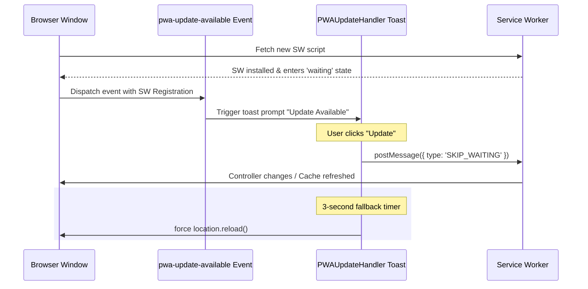
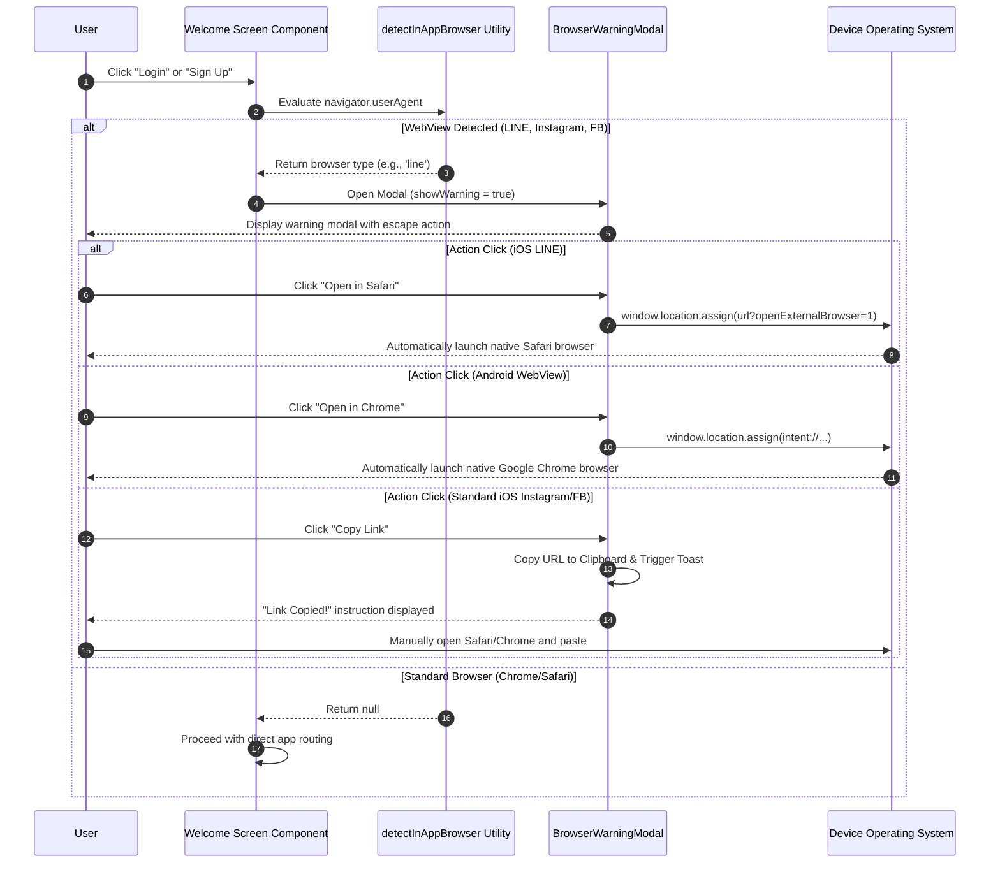

# PWA & Capacitor Mobile Lifecycle

This document explains how the **scripture-habit** app handles PWA updates, platform installation prompts, Capacitor configuration, and WebView settings.

---

## 1. PWA Update Lifecycle (`PWAUpdateHandler`)

To keep client assets up to date and prevent errors, the app uses a Service Worker caching strategy combined with an update notification.

### Update Flow
1. **Detection**: When a new version is deployed, the browser detects the new Service Worker.
2. **Waiting**: The new Service Worker enters a `waiting` state so it does not interrupt the active session.
3. **Event**: The app triggers a custom `pwa-update-available` event.
4. **Notification**: A non-dismissible notification is shown to the user.
5. **Apply Update**: When the user clicks the "Update" button:
   - The button is disabled and shows a loading state.
   - The app sends a `SKIP_WAITING` message to the Service Worker.
   - A 3-second fallback timer is set to force-reload the page if the update takes too long.



---

## 2. Platform-Specific Install Prompt

The app displays custom PWA installation prompts based on the user's operating system.

### Visibility Rules
To avoid bothering users, the prompt only appears when:
* The user is on the `/dashboard` route.
* The app is not already running in standalone mode (installed mode).
* No modals are currently open.
* It has been more than 7 days since the user dismissed the last prompt (tracked via `localStorage`).

### Adaptive Strategies (Android vs. iOS)

```
                      [ InstallPrompt Mounted ]
                                 │
                  ┌──────────────┴──────────────┐
                  ▼                             ▼
         [ Platform = Android ]        [ Platform = iOS ]
                  │                             │
     Capture BeforeInstallPromptEvent     Wait 4-sec delay (UI anti-overlap)
                  │                             │
      Render Native Prompt button          Show Custom Instructional Overlay
                  │                             │
     deferredPrompt.prompt() trigger      Pointer points to Bottom Share bar
```

### 2.1 Android (Chrome) Flow
1. The browser's native `beforeinstallprompt` event is captured.
2. Once the event is available, the app shows a clean installation banner.
3. Clicking the button calls `deferredPrompt.prompt()` to show the native installation dialog.
4. After the user responds, the app resets the prompt reference and starts the 7-day cooldown.

### 2.2 iOS (Safari) Flow
Since iOS Safari does not support native installation events, the app shows custom instructions:
1. The prompt appears after a 4-second delay to prevent UI overlap.
2. An overlay instructs the user to:
   - Tap the **Share** icon in Safari.
   - Select **Add to Home Screen**.
3. A visual pointer points to Safari's bottom action bar.

---

## 3. Capacitor Android Configuration

For native mobile setups, Capacitor controls configuration settings and permissions on Android.

### Capacitor Configuration (`capacitor.config.ts`)
```typescript
import type { CapacitorConfig } from '@capacitor/cli';

const config: CapacitorConfig = {
  appId: 'com.scripturehabit.app',
  appName: 'Scripture Habit',
  webDir: 'dist',
  plugins: {
    GoogleAuth: {
      scopes: ['profile', 'email'],
      serverClientId: '346318604907-7su40hveemp8e6vi0b9hnqrhvvtpsb9j.apps.googleusercontent.com',
      forceCodeForRefreshToken: true,
    },
  },
};
export default config;
```

### 3.1 Android Requirements
To build and run the app successfully, follow these steps in the `/android` directory:

1. **Google Authentication**:
   - You must register both the Debug and Release SHA-1 fingerprints in the Firebase Console.
   - The `serverClientId` in `capacitor.config.ts` must match the Web Client ID generated in the Google Cloud Console.

2. **Localhost & Emulator HTTP Access**:
   - To connect to local development APIs (e.g., `http://10.0.2.2:5001/`), configure a custom `network_security_config.xml` under `android/app/src/main/res/xml/`:
     ```xml
     <?xml version="1.0" encoding="utf-8"?>
     <network-security-config>
         <domain-config cleartextTrafficPermitted="true">
             <domain includeSubdomains="true">localhost</domain>
             <domain includeSubdomains="true">10.0.2.2</domain>
         </domain-config>
     </network-security-config>
     ```
   - This prevents `ERR_CLEARTEXT_NOT_PERMITTED` network errors.

---

## 4. In-App WebView Safety

To support users who open the app from inside social networks or messaging apps, the app includes safety checks for in-app WebViews.

### 4.1 The In-App Browser Problem
In-app browsers in apps like Facebook, Instagram, LINE, and WhatsApp restrict web features. They often block Service Workers, IndexedDB, and notification permissions.

### 4.2 Detecting In-App Browsers
The app detects in-app browsers in `src/utils/browser-detection.ts` using user-agent checks:
- **LINE**: Checks for `/Line\//i`.
- **Instagram**: Checks for `/Instagram/i`.
- **Facebook & Messenger**: Checks for `/FBAN|FBAV/i` (iOS) and `/FB_IAB/i` (Android).
- **WhatsApp**: Checks for `/WhatsApp/i`.
- **Testing Override**: You can test these modes by adding `?debugBrowser=instagram` to the URL.

### 4.3 Redirection Warning
Forcing redirects inside in-app browsers can cause crashes or freezes. Instead:
- Automatic redirection is disabled.
- When a user in an in-app browser clicks "Login" or "Sign Up", the app shows a `BrowserWarningModal` with instructions on how to open the link in a standard browser.

### 4.4 Escaping In-App Browsers
The warning modal offers different options depending on the device:

#### iOS LINE
- Appends `?openExternalBrowser=1` to the URL.
- LINE iOS intercepts this parameter and automatically opens the URL in Safari.

#### Android (All In-App Browsers)
- Replaces the URL protocol with a native Android Intent:
  `intent://[host_and_path]#Intent;scheme=https;action=android.intent.action.VIEW;end`
- This forces the Android OS to open the link in the default browser (like Chrome).

#### Clipboard Fallback
- Copies the URL to the clipboard using `navigator.clipboard.writeText()`.
- Useful as a backup when automatic browser launch is blocked by the host app.

---

## 5. WebView Escape Sequence


