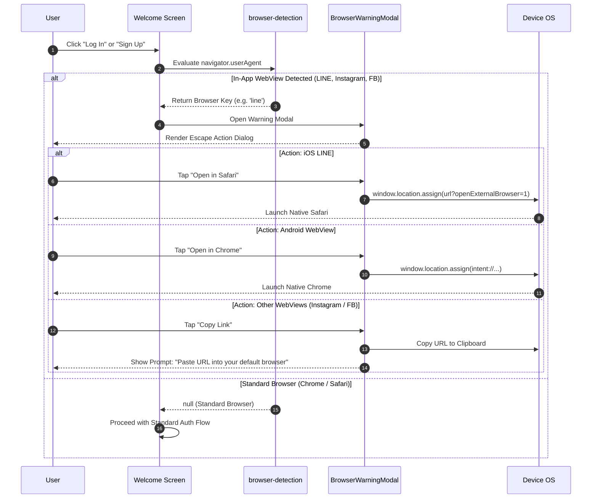

# PWA & Mobile Lifecycle Management

::: tip Interactive Architecture Tour
Explore the live data-flow blueprint and guided walkthrough for this feature:
- **Online (GitHub Browser Preview)**: [Open Interactive Tour (PWA Offline & Lifecycle)](https://htmlpreview.github.io/?https://github.com/ScriptureHabit/scripture-habit/blob/main/docs/public/architecture-tour.html?tour=tour-pwa&lang=en)
- **VitePress / Local**: [Open PWA Offline & Lifecycle Tour](/architecture-tour.html?tour=tour-pwa&lang=en)
:::

This document details Service Worker updates, platform-adaptive install prompts, and in-app WebView escape mechanisms in Scripture Habit.

---

## 1. PWA Update Lifecycle (`PWAUpdateHandler`)

To preserve asset integrity and prevent stale cache errors, the client coordinates Service Worker standby queues with non-intrusive update banners:

```mermaid
sequenceDiagram
    autonumber
    participant Browser as Client Browser
    participant Event as pwa-update-available Event
    participant UI as PWAUpdateHandler Toast
    participant SW as Service Worker

    Browser->>SW: Fetch Updated Service Worker Script
    SW-->>Browser: Install Complete (Standby in 'waiting' state)
    Browser->>Event: Dispatch Custom Event with Registration
    Event->>UI: Render "Update Available" Toast Banner
    Note over UI: User Clicks "Update" Button
    UI->>SW: postMessage({ type: 'SKIP_WAITING' })
    SW->>Browser: Controller Swap & Cache Switch
    rect rgb(30, 41, 59)
        Note over UI: 3-Second Fallback Safety Timer
        UI->>Browser: Enforce location.reload()
    end
```



### Lifecycle Breakdown

1. **Background Standby Registration**  
   Upon detecting an updated bundle, the new Service Worker installs in the background, pausing in the `waiting` state to avoid interrupting active user workflows.

2. **User-Driven Activation**  
   Captures `pwa-update-available` to display an update banner. Clicking "Update" dispatches `SKIP_WAITING` to activate the new cache.

3. **Safe Reload Fallback**  
   Swaps the active controller and reloads the page, backed by a 3-second fallback timer in case controllerchange events are delayed.

---

## 2. Platform-Adaptive Install Prompts

Adapts installation guidance to the user's OS runtime (Android vs. iOS).

### Display Pre-conditions
- Currently on the `/dashboard` route.
- Not running in standalone PWA mode.
- No other modal dialogs active.
- Cooldown period has elapsed (7 days since last dismissal via `localStorage`).

### Adaptive Flow (Android vs. iOS)

```
                     [ InstallPrompt Mounted ]
                                 │
                  ┌──────────────┴──────────────┐
                  ▼                             ▼
         [ Android / Chrome ]            [ iOS / Safari ]
                  │                             │
       Capture beforeinstallprompt       4-Second Delay (Avoid UI Stacking)
                  │                             │
        Render Install Action Button     Display Visual Share Pointer Overlay
                  │                             │
       Invoke deferredPrompt.prompt()    Guide: "Share Icon ➔ Add to Home Screen"
```

- **Android (Chrome)**: Captures `beforeinstallprompt`, launching the native install dialog on user tap.
- **iOS (Safari)**: Due to lack of native install APIs, renders a visual pointer overlay after a 4-second delay directing the user to the Share sheet.

---

## 3. In-App WebView Detection & Escape

In-app browsers (LINE, Instagram, Facebook) often restrict Service Workers, push notifications, and IndexedDB storage.

### ① WebView Detection (`src/utils/browser-detection.ts`)
Inspects `navigator.userAgent` to identify restricted environments:
- **LINE**: `/Line\//i`
- **Instagram**: `/Instagram/i`
- **Facebook & Messenger**: `/FBAN|FBAV/i` (iOS), `/FB_IAB/i` (Android)
- **WhatsApp**: `/WhatsApp/i`

### ② Escape Sequence



### Escape Sequence Breakdown

1. **Pre-Auth Interception**  
   Evaluates userAgent before auth routes mount, intercepting in-app WebViews with a clear escape dialog.

2. **Platform-Specific Deep-Links**  
   - iOS LINE: Dispatches `?openExternalBrowser=1` to launch Safari.
   - Android: Uses the `intent://` scheme to open default system browsers.
   - Other Platforms: Copies the URL to the clipboard with guidance to paste into standard browsers.

---

## 4. Related Documentation

- [Architecture Overview](./architecture.md)
- [SEO & Metadata Management](./seo-and-meta-management.md)
- [Network & Performance Optimization](./network-performance-optimization.md)
