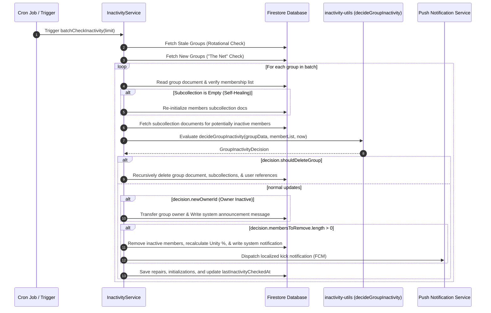

# Inactivity & Auto-Kick Engine: Self-Healing Membership and Ownership Transfers

To maintain vibrant, active scripture-reading groups, **scripture-habit** features an automated inactivity and auto-kick system. The system runs in the background, scanning groups, evaluating member engagement against customized thresholds, automatically healing database inconsistencies, and transferring ownership or deleting empty groups if the owner goes dormant.

---

## 🏗️ Architectural Core

The engine is built on two core components:
1.  **`InactivityService` (`api_internal/services/inactivity-service.ts`)**: Handles database operations, I/O, transaction batching, push notifications, and scheduling.
2.  **`inactivity-utils` (`api_internal/lib/inactivity-utils.ts`)**: A pure-functional calculation engine containing zero I/O side effects, enabling reliable behavior and unit testing.



---

## ⏰ Scheduler Rotational Strategy

To prevent Firestore execution timeouts and manage database read/write costs, the engine implements a dual-fetching strategy:

1.  **The Rotational Queue**:
    Fetches the `limit` number of groups sorted by `lastInactivityCheckedAt` in ascending order. This guarantees that all groups are visited sequentially over time.
2.  **"The Net"**:
    Concurrently queries the 20 most recently created groups (`createdAt` descending) that do not yet have a `lastInactivityCheckedAt` field. This prevents brand new groups from being neglected during long rotational queue cycles.

---

## 🛠️ Auto-Kick Threshold Resolution

A member's status (Active vs. Inactive) is evaluated by determining their **most recent activity timestamp** against a dynamic threshold hierarchy.

### 1. Activity Determination
The system gathers activity dates from five different fields across the group schema and user-member subcollection:
-   `joinedAt`: The date the member entered the group.
-   `lastActiveAt` / `memberLastActive`: Recorded whenever a user interacts.
-   `lastPostAt` / `lastNoteAt`: Recorded when a user posts a study note.
-   `lastReadAt` / `memberLastReadAt`: Recorded when a user reads group messages.

The maximum value of these timestamps is defined as the user's `lastActiveTime`.

### 2. Multi-Tiered Threshold Hierarchy
The kick window (in days) is resolved by checking configurations in the following descending priority order:

```
[Priority 1] User-Specific Override (memberData.kickThreshold)
     │
     └──> [Priority 2] Group-Specific Member Override (groupData.memberKickThresholds[uid])
              │
              └──> [Priority 3] Group Global Pace (groupData.pace)
                       │
                       └──> [Priority 4] System Default (3 Days)
```

### 3. "Never Kick" Override (0 Days)
If the resolved threshold is exactly **`0`**, auto-kick is completely disabled. The member is permanently considered `active`, and they will never be purged regardless of inactivity duration.

---

## 🩹 Database Self-Healing & Repair

The engine automatically heals data corruption or sync issues during its evaluation sweep:

### 1. Subcollection Restoration
If a group document's `members` array contains users but the `members` subcollection in Firestore is empty (due to batch failures, legacy migrations, or testing resets), the service detects this using a fast `limit(1)` check. It automatically runs a Firestore batch to write missing member documents using default joined/active timestamps.

### 2. JoinedAt Timestamp Repair
A known server-timestamp initialization bug can cause a user's `joinedAt` date to be set to a future value compared to their document creation time, or to be reset to the document's creation date even if they had older activity.
The engine compares the member's `joinedAt` date against their database document `createTime` and historical activity maps:
-   If `joinedAt` is after `createTime` (impossible) or if active timestamps exist that are older than the recorded `joinedAt`, the engine automatically repairs `joinedAt` to the earliest available activity date.

---

## 👑 Ownership Transfer & Group Dissolution

If the group owner becomes inactive, the group is protected from immediate deletion if other active members exist:

*   **Ownership Transfer**:
    If the owner is marked for kick, the service scans the active members list. Ownership is automatically transferred to the **longest-standing active member** (`activeMemberIds[0]`). A multilingual system announcement is posted to the group: `notifications.ownership_transferred`.
*   **Group Dissolution**:
    If the owner is inactive and **no other active members remain**, the entire group is dissolved. The service executes a clean recursion delete on the group, removing user-side `groupIds` array references and deleting personal `groupStates` documents.

---

## 🔔 Member Kick Notification Flow

When a member is removed due to inactivity, the system ensures a clean exit:
1.  Removes the member's UID from the group's `members` list and deletes their document in the `members` subcollection.
2.  Deletes the group reference in the user's `groupIds` and `groupStates`.
3.  Posts a system message to the remaining members, notifying them of the departure.
4.  Retrieves the kicked user's FCM push tokens and dispatches a localized notification in their preferred language (`notifications.kick_title` / `notifications.kick_body`) explaining that they were removed due to inactivity, allowing them to re-join if they choose to resume their habit.
