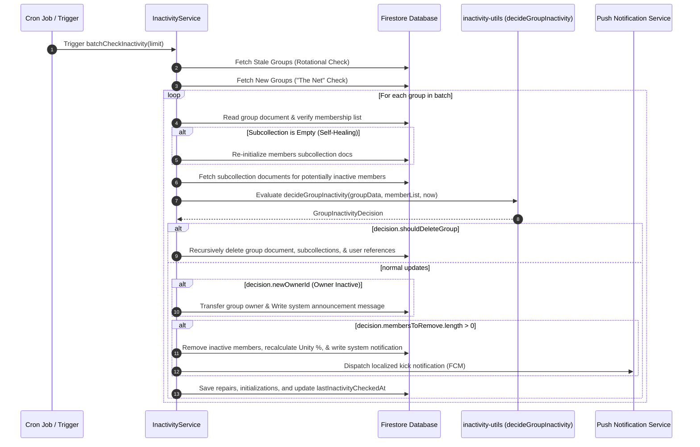

# Inactivity & Auto-Kick Engine

This document explains the automated inactivity and auto-kick system. The system runs in the background to keep groups active, clean up empty groups, and transfer group ownership if owners become inactive.

---

## 🏗️ Architecture Overview

The inactivity engine consists of two parts:
1.  **`InactivityService` (`api_internal/services/inactivity-service.ts`)**: Handles database queries, batch updates, notifications, and task scheduling.
2.  **`inactivity-utils` (`api_internal/lib/inactivity-utils.ts`)**: A helper file containing calculation logic with no database side effects. This makes unit testing reliable.



---

## ⏰ Scheduler Strategy

To avoid Firestore timeouts and reduce database costs, the system uses two search methods:

1.  **Rotational Queue**:
    Queries a limited number of groups sorted by `lastInactivityCheckedAt` in ascending order. This ensures all groups are checked periodically.
2.  **"The Net"**:
    Queries the 20 most recently created groups that do not have a `lastInactivityCheckedAt` field. This ensures new groups are checked quickly.

---

## 🛠️ Auto-Kick Threshold Resolution

The system checks if a member is active by finding their **latest activity timestamp** and comparing it to a threshold.

### 1. Defining Activity
The system gathers activity dates from five fields:
-   `joinedAt`: The date the member joined the group.
-   `lastActiveAt` / `memberLastActive`: The last time the user opened the group.
-   `lastPostAt` / `lastNoteAt`: The last time the user posted a study note.
-   `lastReadAt` / `memberLastReadAt`: The last time the user read chat messages.

The latest of these dates is used as `lastActiveTime`.

### 2. Threshold Priority Order
The number of days allowed before a user is kicked is decided by checking these settings in order:

```
[Priority 1] User-Specific Override (memberData.kickThreshold)
     │
     └──> [Priority 2] Group-Specific Member Override (groupData.memberKickThresholds[uid])
              │
              └──> [Priority 3] Group Global Pace (groupData.pace)
                       │
                       └──> [Priority 4] System Default (3 Days)
```

### 3. Disabling Auto-Kick
If the threshold is set to **`0`**, auto-kick is disabled for that member. They are always treated as active and will never be kicked.

---

## 🩹 Database Self-Healing

The engine automatically repairs inconsistent data during checks:

### 1. Subcollection Recovery
If a group document has members in its `members` array but the `members` subcollection in Firestore is empty (due to batch errors or testing resets), the system detects this and automatically writes the missing member documents.

### 2. joinedAt Timestamp Repair
If a member's `joinedAt` date is set to the future or contains an error, the system compares it against the document's creation date and historical activity. It automatically repairs `joinedAt` to the earliest recorded activity date.

---

## 👑 Ownership Transfer & Group Deletion

If the group owner becomes inactive:

*   **Ownership Transfer**:
    If the owner is inactive but other active members exist, the system transfers ownership to the **longest-standing active member** (`activeMemberIds[0]`). A notification message (`notifications.ownership_transferred`) is posted to the group.
*   **Group Deletion**:
    If the owner is inactive and **no other active members remain**, the group is deleted. The system deletes the group document, its subcollections, and removes group references from the users' documents.

---

## 🔔 Member Kick Notification Flow

When a member is removed for inactivity:
1.  The system removes their UID from the group's `members` list and deletes their document in the `members` subcollection.
2.  Deletes the group reference in the user's `groupIds` and `groupStates`.
3.  Posts a system message to the remaining group members.
4.  Retrieves the kicked user's FCM push tokens and sends a localized notification (`notifications.kick_title` / `notifications.kick_body`) explaining they were removed for inactivity. This allows them to re-join later.
