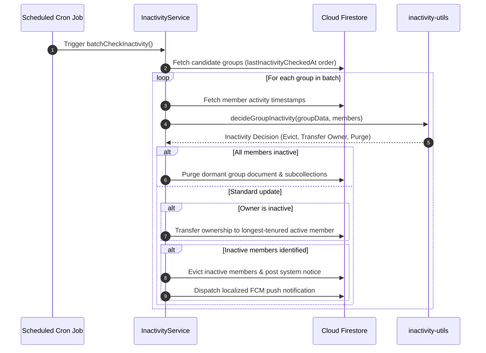

# Inactivity & Auto-Kick Engine

> [!TIP]
> **Interactive Architecture Tour**: [Open Live Tour (Group Settings & Auto-kick)](https://htmlpreview.github.io/?https://github.com/ScriptureHabit/scripture-habit/blob/main/docs/public/architecture-tour.html?tour=tour-groupoptions&lang=en)

This document details the automated inactivity evaluation algorithm, member eviction pipeline, owner succession protocol, and dormant group purging in Scripture Habit.

---

## 1. Architecture Overview

The inactivity engine separates database orchestration from pure decision logic:
1. **`InactivityService` (`api_internal/services/inactivity-service.ts`)**: Manages queries, batch updates, FCM push notifications, and execution scheduling.
2. **`inactivity-utils` (`api_internal/lib/inactivity-utils.ts`)**: Pure deterministic evaluation functions (enabling straightforward unit testing).

### Batch Execution Breakdown

1. **Rotational Candidate Selection**  
   Scheduled cron triggers `batchCheckInactivity()`, querying groups ordered by oldest `lastInactivityCheckedAt` timestamps.

2. **Pure Evaluation Logic**  
   `inactivity-utils` compares each member's latest interaction timestamp against active thresholds, generating eviction, transfer, or dissolution decisions.

3. **Atomic Commit & Notification**  
   Updates the group document and subcollections on Firestore, dispatching a localized push notification to evicted users.

---

## 2. Scanning Strategy

To manage query costs and database load, groups are indexed via two passes:

1. **Rotational Queue**: Scans groups ordered by `lastInactivityCheckedAt` ascending, ensuring equitable evaluation across the fleet.
2. **Unchecked Queue**: Indexes newly created groups that have not yet undergone their initial scan.

---

## 3. Activity Evaluation & Thresholds

A member's status is determined by comparing their **most recent activity timestamp** against the resolved threshold.

### ① Activity Timestamp Definition
The most recent timestamp among the following fields is evaluated:
- Join timestamp (`joinedAt`)
- Last view timestamp (`lastActiveAt`)
- Last note submission (`lastPostAt`)
- Last message read (`lastReadAt`)

### ② Threshold Precedence
The grace period before automatic eviction resolves in priority order:
1. User-specific setting
2. Group-level member override
3. Group pace setting
4. **System default (3 days)**

*(A threshold value of `0` disables auto-kick for that specific member.)*

---

## 4. Ownership Succession & Group Purging

- **Owner Succession**:  
  If the group owner becomes inactive while active members remain, ownership transfers automatically to the **longest-tenured active member**.
- **Dormant Group Purging**:  
  If all members (including the owner) become inactive, the group is purged to prevent orphaned data.

---

## 5. Member Eviction & Notifications

When an inactive member is evicted:
1. The user UID is removed from the group member array and subcollections.
2. A system notice is published to the chat stream.
3. A localized FCM push notification is sent explaining the removal and clarifying that rejoining remains open.

---

## 6. Related Documentation

- [Small Group Dynamics (Max 5) & Peer Accountability](./ux-small-groups-and-peer-accountability.md)
- [Maintenance & Batch Jobs (Cron)](./maintenance-cron.md)
- [Group Invites & Joining Pipeline](./group-invites.md)
