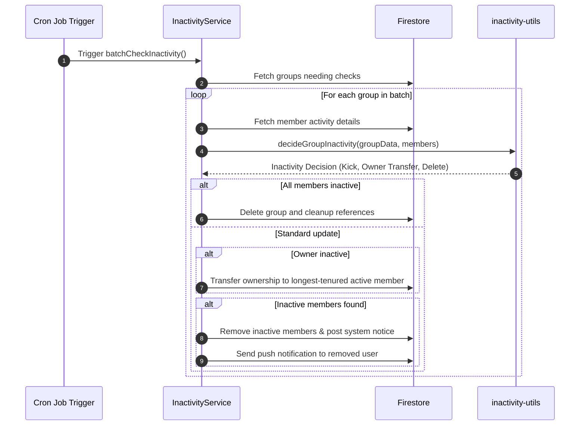

# Inactivity & Auto-Kick Engine

This document explains the automated inactivity detection, member cleanup, group owner succession, and ghost group deletion mechanisms.

---

## 1. Architecture Overview

The inactivity engine consists of two parts:
1. **`InactivityService` (`api_internal/services/inactivity-service.ts`)**: Manages database queries, batch updates, push notifications, and job scheduling.
2. **`inactivity-utils` (`api_internal/lib/inactivity-utils.ts`)**: Pure evaluation helper functions without side effects (allowing comprehensive unit testing).

---

## 2. Scheduler Strategy

To avoid database timeouts and keep read costs predictable, groups are scanned using two complementary passes:

1. **Rotational Queue**: Queries groups ordered by `lastInactivityCheckedAt` ascending, ensuring every group is periodically evaluated.
2. **"The Net" Queue**: Queries newly created groups that have not yet undergone their initial check.

---

## 3. Activity Evaluation & Thresholds

A member's status is determined by comparing their **most recent activity timestamp** against configured thresholds.

### ① Definition of Activity
The most recent timestamp among the following fields is used:
- Join date (`joinedAt`)
- Last time opening the group (`lastActiveAt`)
- Last note posted (`lastPostAt`)
- Last message read (`lastReadAt`)

### ② Threshold Priority Order
The grace period before automatic removal is resolved in order:
1. User-specific setting
2. Group-level member override
3. Group pace setting
4. **System default (3 days)**

*(A threshold value of `0` disables auto-kick for that member.)*

---

## 4. Ownership Handoff & Group Dissolution

- **Owner Transfer**:
  If the group owner becomes inactive while other active members remain, ownership is automatically transferred to the **longest-tenured active member**.
- **Ghost Group Deletion**:
  If all members (including the owner) become inactive, the group is cleanly deleted to prevent orphaned records.

---

## 5. Member Removal & Notifications

When an inactive member is removed:
1. They are removed from the group's member list.
2. A system notification message is posted in the group chat.
3. A gentle, localized push notification is sent explaining that they were removed due to inactivity and can rejoin at any time.

---

## 6. Related Documentation

- [Small Group Dynamics (Max 5) & Peer Accountability](./ux-small-groups-and-peer-accountability.md)
- [Maintenance & Batch Jobs (Cron)](./maintenance-cron.md)
- [Group Invites & Joining Pipeline](./group-invites.md)
