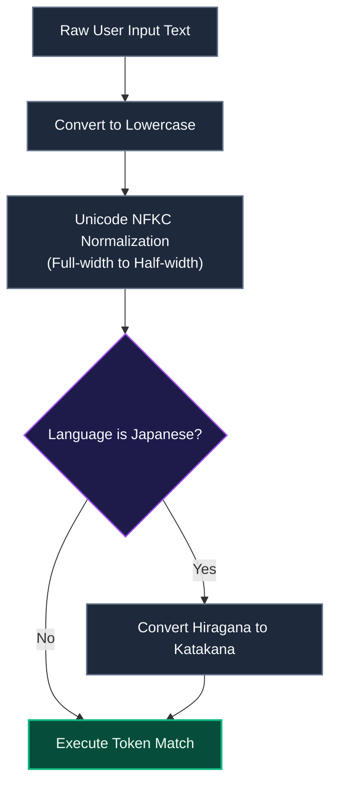
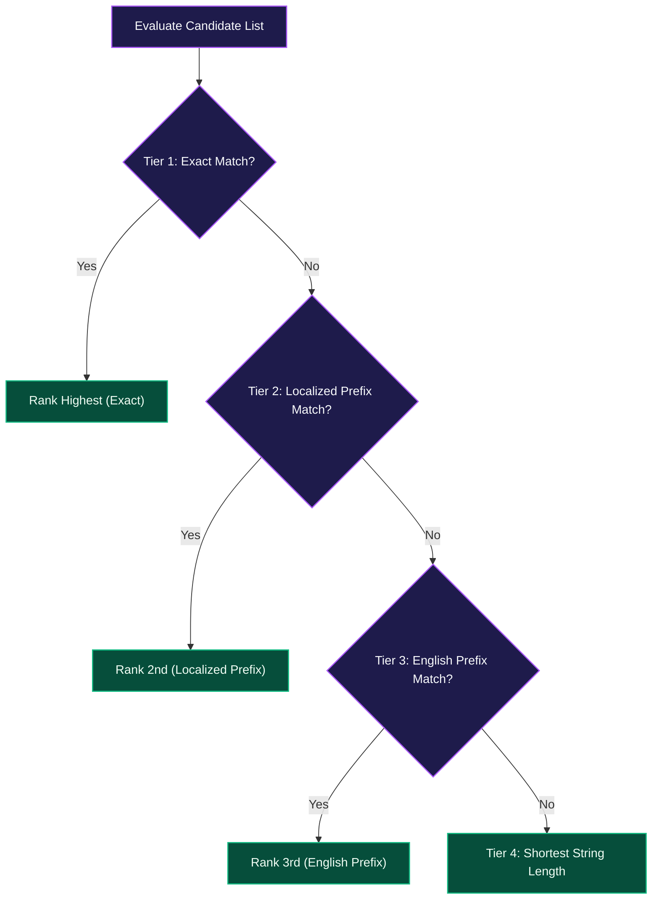

# Incremental Book Suggestion Engine

This document details the search matching, text normalization, and priority sorting algorithms of the book autocomplete engine (`src/utils/suggestion-utils.ts`) in Scripture Habit.

---

## 1. Input Text Normalization

To ensure consistent matching regardless of letter casing, character widths, or phonetic input variations:

### Normalization Pipeline Breakdown

1. **Unicode NFKC Standard**  
   Converts full-width numbers and Latin characters to half-width equivalents and standardizes case.
2. **Japanese Phonetic Shift**  
   Converts Hiragana code points (`あるま`) to Katakana (`アルマ`) dynamically, removing input mode switching friction on mobile keyboards.
3. **Kanji Phonetic Lookup**  
   Consults reading maps (`KANJI_BOOK_READINGS`) to resolve phonetic matches against Kanji book titles (e.g., 創世記, 信仰箇条).

---

## 2. 4-Tier Priority Sorting Algorithm

Filtered candidate books are sorted through a 4-tier cascade to present the most relevant selections first:

### Priority Cascade Breakdown

- **Tier 1 (Exact Match)**: Identical title matches receive first priority.
- **Tier 2 (Localized Prefix Match)**: Books starting with the localized input string.
- **Tier 3 (English Prefix Match)**: Matches against canonical English book slugs, supporting multilingual search and common abbreviations.
- **Tier 4 (Shortest String Length)**: Shorter titles (e.g., `Mark` vs. `1 Thessalonians`) rank ahead of longer titles to optimize touch selection.

---

## 3. Candidate Result Limits

Candidate results are capped at **10 suggestions** (`.slice(0, 10)`), preventing mobile viewport overflow and preserving rendering performance.

---

## 4. Related Documentation

- [Note Creation (NewNote) Guide](./newnote-construction-guide.md)
- [Gospel Library Scripture Mapper](./gospel-library-mapper.md)
