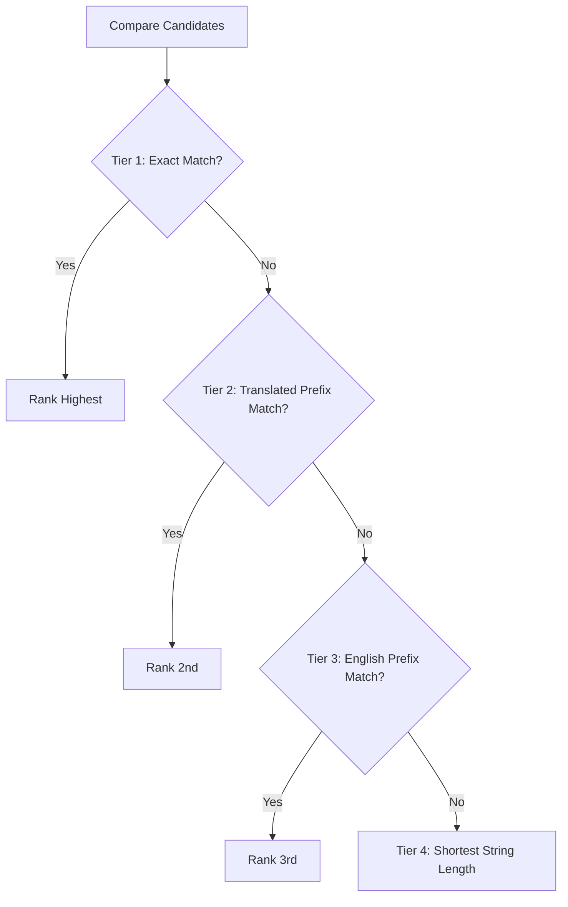

# Incremental Book Suggestion Engine

This document details the search matching, text normalization, and sorting logic of the book autocomplete engine (`src/utils/suggestion-utils.ts`).

---

## 1. Input Text Normalization

To ensure smooth matching regardless of case, character width, or phonetic scripts, input strings are normalized before evaluation:

```mermaid
flowchart TD
    Input[Raw Input Text] --> Lower[Convert to Lowercase]
    Lower --> NFKC[Unicode NFKC Normalization<br/>(Full-width to Half-width)]
    NFKC --> IsJa{Language is Japanese?}
    IsJa -- Yes --> HiraToKata[Convert Hiragana to Katakana]
    IsJa -- No --> Search[Match Search Tokens]
    HiraToKata --> Search
```

### ① Unicode & Width Normalization
Applies `normalize('NFKC')` and `toLowerCase()` to standardize full-width numbers and alphabetic characters into half-width.

### ② Japanese Phonetic Mapping
Official Japanese scripture names use Katakana (e.g. `アルマ`, `ニーファイ`), whereas users often type in Hiragana (`あるま`, `にーふぁい`).
When the active language is Japanese (`'ja'`), the engine shifts character code points to automatically convert Hiragana to Katakana in memory.

### ③ Kanji Phonetic Readings
For books containing Kanji characters (e.g. 創世記, 信仰箇条), the engine checks a reading dictionary (`KANJI_BOOK_READINGS`) so users can match books by typing pure Hiragana/Katakana without converting to Kanji.

---

## 2. 4-Tier Priority Sorting Algorithm

Filtered candidates are sorted through a 4-tier cascade so the most relevant matches appear first:



1. **Tier 1: Exact Match**: Exact name matches appear at the top.
2. **Tier 2: Translated Prefix Match**: Books starting with the user's localized input.
3. **Tier 3: English Prefix Match**: Books starting with the user's English input (assisting bilingual typing and abbreviations).
4. **Tier 4: Shortest String Length**: Prefers shorter names (e.g. `Mark` over `1 Thessalonians`) to optimize touch selection on mobile screens.

---

## 3. Suggestion Capping

The output list is capped at **10 suggestions** (`.slice(0, 10)`), preventing viewport overflow and keeping the interface responsive on mobile devices.

---

## 4. Related Documentation

- [Note Creation (NewNote) Guide](./newnote-construction-guide.md)
- [Gospel Library Scripture Mapper](./gospel-library-mapper.md)
