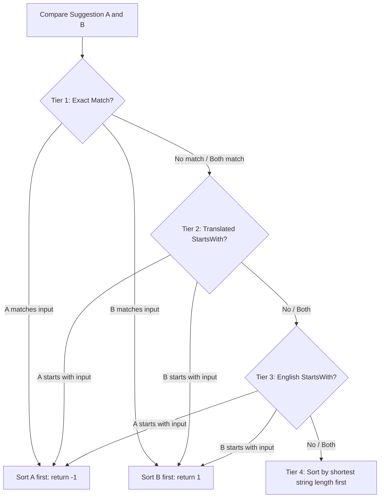

# Incremental Book Suggestion Engine

This document details the search matching, text normalization, and sorting logic for the **Book Suggestion Engine** located in `src/utils/suggestion-utils.ts`.

The engine provides fast, real-time typing suggestions (autocomplete) when users input scripture references.

---

## 1. Volume Scopes & Dictionary

Search suggestions are filtered based on the selected scripture volume. The engine organizes books under specific paths:

* **Book of Mormon**: 15 books (1 Nephi to Moroni)
* **Old Testament**: 39 books (Genesis to Malachi)
* **New Testament**: 27 books (Matthew to Revelation)
* **Pearl of Great Price**: 5 books (Moses to Articles of Faith)
* **Doctrine and Covenants**: Standard abbreviation ("D&C")
* **Ordinances and Proclamations**: Specific custom documents (The Family Proclamation, The Living Christ, etc.).

---

## 2. Multi-Lingual Text Normalization

To ensure search matches work regardless of case, character width, or regional spellings, inputs are normalized using standard NFKC rules.

```
       [ Raw Text Input ]
               │
               ▼
   [ Lowercase Conversion ]
               │
               ▼
  [ NFKC Unicode Normalization ]
   (Resolves full-width/half-width)
               │
               ▼
     [ Language == 'ja'? ]
          ┌────┴────┐
        Yes        No
          ▼         │
  [ Hiragana-to-Katakana ]  │
   (Shifts character codes) │
          └────┬────┘
               ▼
    [ Normalized Search Token ]
```

### Unicode & Case Normalization
All input strings and target book names are cleaned using:
```typescript
let res = str.toLowerCase().normalize('NFKC');
```
* **`NFKC` Normalization**: Standardizes full-width Roman characters, double-byte numbers, and punctuation into standard single-byte characters.

### Japanese-Specific Phonetic Mapping
A common challenge in Japanese search is that users type book names using Hiragana (e.g. `あるま`, `にーふぁい`), while official scriptures use Katakana (e.g. `アルマ`, `ニーファイ`).

To solve this, if the active language is Japanese (`'ja'`), the engine uses a regex transformation to **automatically convert Hiragana directly into Katakana**:
```typescript
if (language === 'ja') {
    res = res.replace(/[\u3041-\u3096]/g, m => String.fromCharCode(m.charCodeAt(0) + 0x60));
}
```
* **Mechanism**: Hiragana characters (Unicode block `U+3041` to `U+3096`) are shifted in memory to map directly onto the Katakana Unicode block. This enables instant autocomplete matching.

---

## 3. Four-Tier Priority Sorting Algorithm

Once books are filtered, they are sorted using a **4-Tier Priority Cascade** to show the most relevant options first:



### Priority Tiers:
1. **Tier 1: Exact Match**
   * If a book's translated name matches the user's input exactly, it is placed at the top of the list.
2. **Tier 2: Translated Prefix Match**
   * Books whose translated names *start* with the user's input are placed next.
3. **Tier 3: English Prefix Match**
   * Books whose English names *start* with the user's input are prioritized next. This helps bilingual users or those typing English abbreviations.
4. **Tier 4: Shortest String Length First**
   * If two books match at the same level, the **shorter translated name** is placed first.
   * *Example*: Searching for `Ma` will sort shorter books like `Mark` or `Matthew` higher than `1 Thessalonians`, making it easier to select on mobile screens.

---

## 4. Search Results Capping

After sorting, the suggestion list is cut off using `.slice(0, 10)`.

Capping the list to a **maximum of 10 suggestions** keeps the interface clean and improves rendering performance on slow mobile devices.
