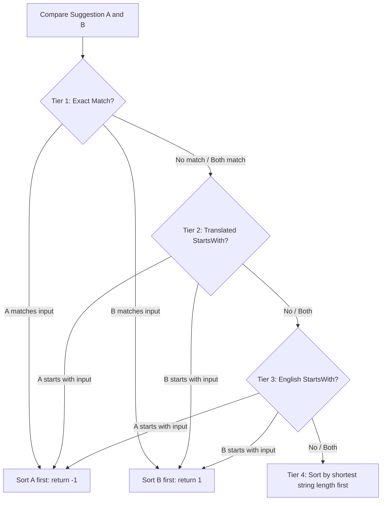

# Incremental Book Suggestion Engine

This document details the architecture, text normalization formulas, and multi-tiered search matching priorities of the **Incremental Book Suggestion Engine** located in `src/utils/suggestion-utils.ts`. 

The suggestion engine provides high-performance, locale-aware, real-time typing autocomplete when users input scripture references.

---

## 1. Volume Scopes & Dictionary Structure

The search scope is dynamically filtered by selecting a canonical scripture volume. The engine holds a dictionary map (`volumeBooks`) classifying books under specific structural paths:

* **Book of Mormon**: 15 books (1 Nephi to Moroni)
* **Old Testament**: 39 books (Genesis to Malachi)
* **New Testament**: 27 books (Matthew to Revelation)
* **Pearl of Great Price**: 5 books (Moses to Articles of Faith)
* **Doctrine and Covenants**: Formatted standard abbreviation ("D&C")
* **Ordinances and Proclamations**: Specific custom documents (The Family Proclamation, The Living Christ, Restoration Proclamation).

---

## 2. Multi-Lingual Text Normalization

To ensure search matches are resilient to casing, width, and localized character forms, inputs go through standard NFKC normalization and regional translation mappings.

```
       [ Raw Text Input ]
               │
               ▼
   [ Lowercase Conversion ]
               │
               ▼
  [ NFKC Unicode Normalization ]
   (Resolves full-width/half-width)
               │
               ▼
     [ Language == 'ja'? ]
          ┌────┴────┐
        Yes        No
          ▼         │
  [ Hiragana-to-Katakana ]  │
   (Shifts character codes) │
          └────┬────┘
               ▼
    [ Normalized Search Token ]
```

### Unicode & Case Normalization
Every input string and target translation book string is cleaned via:
```typescript
let res = str.toLowerCase().normalize('NFKC');
```
* **`NFKC` Normalization**: Standardizes full-width Roman characters, double-byte numbers, and punctuation into their single-byte canonical forms.

### Japanese-Specific Phonetic Mapping
A common challenge in Japanese searching is that users type book names using Hiragana (e.g. `あるま`, `にーふぁい`), while official scriptures use Katakana (e.g. `アルマ`, `ニーファイ`). 

To solve this, the engine checks if the user's active locale is Japanese (`'ja'`). If yes, it runs a regex unicode transformation to **automatically shift Hiragana characters directly into Katakana**:
```typescript
if (language === 'ja') {
    res = res.replace(/[\u3041-\u3096]/g, m => String.fromCharCode(m.charCodeAt(0) + 0x60));
}
```
* **Mechanism**: Hiragana characters (Unicode block `U+3041` to `U+3096`) are shifted by exactly `0x60` (96 in decimal) to map directly onto the Katakana Unicode block, enabling instant, transparent fuzzy matches.

---

## 3. Four-Tier Priority Sorting Algorithm

Once targets are normalized, they are filtered to include only books where the normalized user input matches either the **local translated name** or the **original English name**. 

To present the most intuitive options first, the filtered list is sorted using a strict **4-Tier Priority Cascade**:



### Priority Breakdown:
1. **Tier 1: Exact Match**
   * If a book's normalized translated name perfectly matches the normalized user input, it is instantly pushed to the top of the list.
2. **Tier 2: Translated Prefix Match**
   * Books whose translated names *start* with the user's input are prioritized over mid-word substring matches.
3. **Tier 3: English Prefix Match**
   * Books whose original English names *start* with the user's input are prioritized next. This helps bilingual users or those accustomed to English abbreviations.
4. **Tier 4: Shortest String Length First**
   * If two books are matched at the same level (e.g., both contain the query), the **shorter translated name** is sorted first. 
   * *Example*: If searching `Ma`, shorter books like `Mark` or `Matthew` will sort higher than longer entries like `1 Thessalonians` or subheadings, improving mobile accessibility.

---

## 4. Search Results Capping

After sorting, the returned array is capped via `.slice(0, 10)`.

Limiting results to a **maximum of 10 suggestions** reduces DOM rendering payloads on slow mobile devices and avoids cluttering the interface, matching mobile-first UX paradigms.
