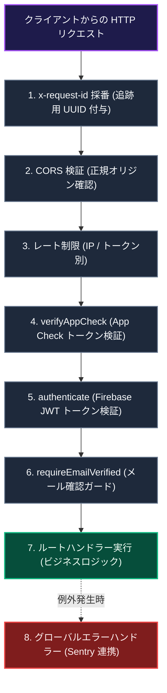
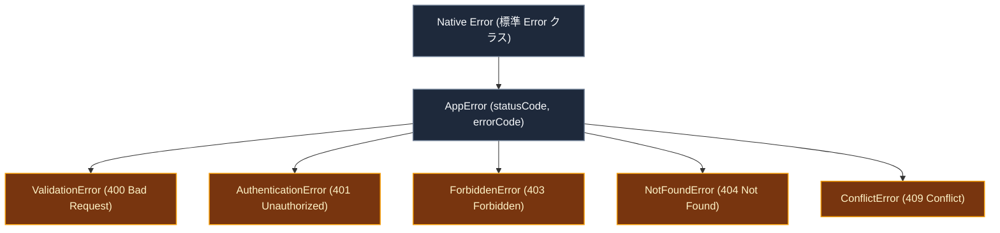

# API 設計 ＆ エラーハンドリング

このドキュメントでは、バックエンド（`api_internal/`）における Express ミドルウェアパイプライン、CORS ポリシー、認証・レート制限、標準化されたエラー階層、および Sentry によるエラー監視体制について解説します。

---

## 1. ミドルウェアパイプラインの構成

バックエンド API は、受信したリクエストを以下のパイプラインを通じて安全に処理します。

### パイプラインの解説

1. **追跡識別子とセキュリティの初期検証**  
   リクエスト受信直後に一意の `x-request-id` を付与してログ追跡を可能にし、CORS によるオリジン確認と IP / ユーザー別のレート制限を実施します。

2. **多重防御による認証と認可**  
   App Check による正規クライアントの確認、Firebase Auth による JWT トークンの署名検証、およびメール確認完了の有無を順次確認します。

3. **例外の捕捉と一元処理**  
   コントローラー内部で発生した同期・非同期の例外はすべてグローバルエラーハンドラーへ集約され、Sentry へのエラー送信とクライアントへの標準エラー応答を執り行います。

---

## 2. セキュリティ & 認証ミドルウェア

1. **`x-request-id` による分散トレーシング**  
   すべてのリクエストに UUID を割り当て、クライアント・サーバー・Sentry ログ間で同一リクエストを正確に照合します。
2. **レート制限 (`express-rate-limit`)**  
   - **全体制限**: 15 分間に最大 300 リクエスト。
   - **招待・参加制限**: 1 時間に最大 15 回（総当たり攻撃防止）。
   - **AI リクエスト制限**: 1 時間に最大 100 回。
3. **App Check 検証 (`verifyAppCheck`)**  
   正規の Web / モバイルクライアントからのアクセスであることを検証します。
4. **Firebase JWT 認証 (`authenticate`)**  
   `Authorization: Bearer <token>` を検証し、認証済みユーザー情報を `req.user` に注入します。
5. **メール確認ガード (`requireEmailVerified`)**  
   パスワード認証ユーザーのメール確認状況を検証します（Google 認証およびテスト環境では自動バイパス）。

---

## 3. 標準化されたエラー階層 (`AppError`)

場当たり的な例外返却を廃止し、HTTP ステータスコードとエラーコードを内包する `AppError` 階層を通じて一貫したレスポンスを返却します。

### エラー階層の解説

- **`ValidationError` (400)**: Zod によるスキーマ検証失敗時に、不正なフィールド名と理由を詳細に返却。
- **`AuthenticationError` (401)**: トークンの期限切れや未サインイン状態を通知。
- **`ForbiddenError` (403)**: 他ユーザーのリソースへのアクセス試行やメール未確認を拒絶。
- **`NotFoundError` (404)**: 指定されたグループやノートが存在しない場合に返却。
- **`ConflictError` (409)**: トランザクション競合や定員オーバー時の整合性不一致を通知。

---

## 4. エラー情報のマスキングと Sentry 監視

- **内部情報のマスキング**  
  予期せぬ内部エラー（500）が発生した場合、スタックトレースやデータベース接続情報などの機密ログを秘匿し、安全なエラーメッセージと `requestId` のみをクライアントへ返却します。
- **Sentry との連携**  
  本番環境での例外発生時には、スタックトレース、実行コンテキスト、ユーザー識別子（`req.user.uid`）、および `requestId` を Sentry へ即時送信し、迅速な原因究明を可能にします。

---

## 5. 関連ドキュメント

- [全体アーキテクチャ](./architecture.md)
- [App Check & API 保護](./security-architecture.md)
- [監視 & エラー追跡](./monitoring-observability.md)
