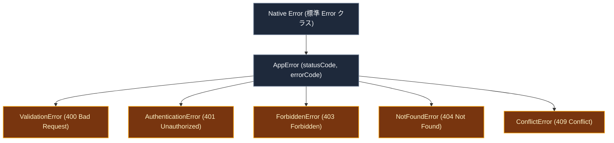

# API 設計 ＆ エラーハンドリング

このドキュメントでは、バックエンド（`api_internal/`）の Express ミドルウェア構成、CORS ポリシー、認証・レート制限、標準化されたエラー階層、および Sentry によるエラー監視について解説します。

---

## 1. ミドルウェアパイプラインの構成

バックエンド API は、リクエストを以下の順序で安全に処理します：

---

## 2. セキュリティ & 認証ミドルウェア

1. **`x-request-id` による追跡**:
   すべてのリクエストに一意の ID（UUID）を割り当て、エラー発生時に Sentry やサーバーログと照合できるようにします。
2. **レート制限 (`express-rate-limit`)**:
   - **全体制限**: 15分間に最大300回。
   - **招待・参加制限**: 1時間に最大15回（総当たり攻撃防止）。
   - **AIリクエスト制限**: 1時間に最大100回。
3. **App Check 検証 (`verifyAppCheck`)**:
   正規のアプリ（Web/モバイル）からのリクエストであることを検証。
4. **Firebase JWT 認証 (`authenticate`)**:
   `Authorization: Bearer <token>` を検証し、ログインユーザー情報を `req.user` にセット。
5. **メール確認ガード (`requireEmailVerified`)**:
   パスワード認証ユーザーがメール確認を完了しているかチェック（Google認証やテスト用アカウントは自動バイパス）。

---

## 3. 標準化されたエラー階層 (`AppError`)

場当たり的なエラー返却を避け、統一された `AppError` クラスを使用してクライアントへ分かりやすいレスポンスを返します：

- **`ValidationError` (400)**: 入力データのバリデーション（Zod）失敗。
- **`AuthenticationError` (401)**: ログインが必要、またはトークンが無効。
- **`ForbiddenError` (403)**: アクセス権限がない、またはメール未確認。
- **`NotFoundError` (404)**: 対象のグループやノートが存在しない。
- **`ConflictError` (409)**: トランザクション競合（重複データなど）。

---

## 4. エラー情報のマスキングと Sentry 監視

- **本番環境での安全なエラー応答**:
  予期せぬサーバーエラー（500）が発生した場合、データベースの接続情報などの内部ログを隠蔽し、クリーンなエラーメッセージと `requestId` のみをクライアントに返します。
- **Sentry 連携**:
  エラー発生時に自動でスタックトレースとユーザー情報（`req.user.uid`）、および `requestId` を Sentry に送信し、迅速なトラブル対応を可能にします。

---

## 5. 関連ドキュメント

- [全体アーキテクチャ](./architecture.md)
- [App Check & API 保護](./security-architecture.md)
- [監視 & エラー追跡](./monitoring-observability.md)
