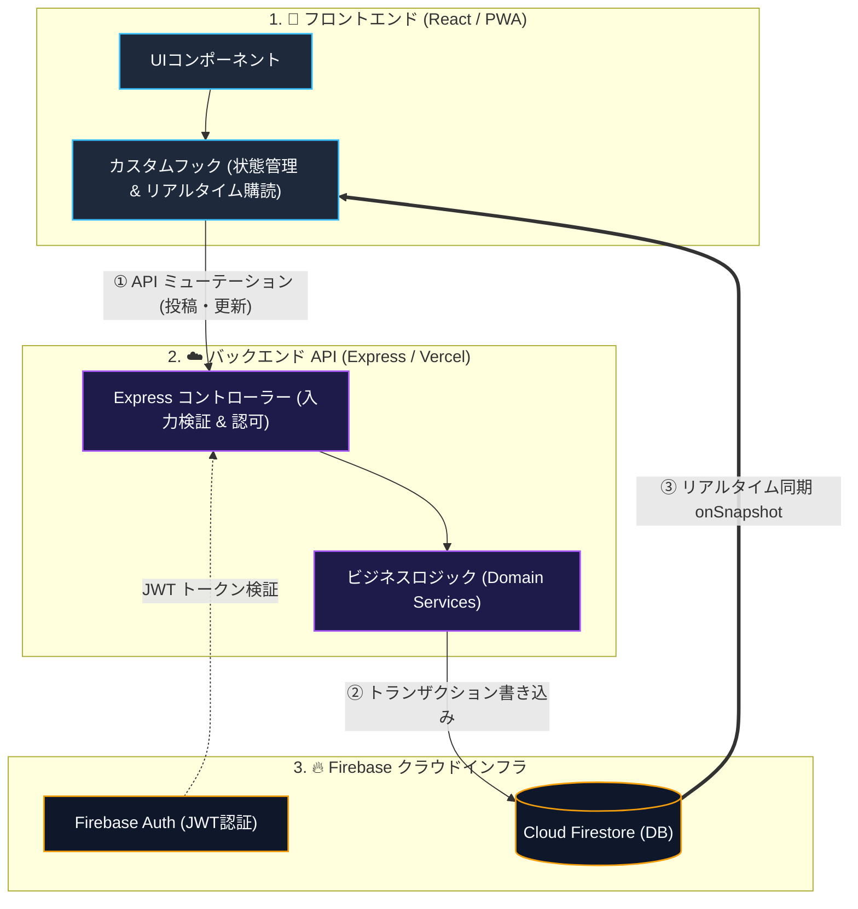

# 全体アーキテクチャ ＆ 構成リファレンス

> [!TIP]
> **インタラクティブ・アーキテクチャツアー**: [ブラウザでツアーを開く (アプリ起動 & 全体配線)](https://htmlpreview.github.io/?https://github.com/ScriptureHabit/scripture-habit/blob/main/docs/public/architecture-tour.html?tour=tour-root&lang=ja)

このドキュメントでは、Scripture Habit を支える技術基盤、ディレクトリの構造、データの流れ、および状態管理の設計方針について解説いたします。

---

## 1. 技術スタック

現代のWeb標準に根ざし、高速な応答性と心地よい開発体験を両立する技術を選定しております。

| レイヤー | 採用技術 | 役割と選定の理由 |
| :--- | :--- | :--- |
| **フロントエンド** | **React 19** + **Vite 8** | 高速なビルドとコンポーネント設計 |
| **画面遷移・ルーティング** | **React Router 7** | SPA における画面遷移とディープリンクの管理 |
| **状態管理・データ取得** | **Zustand 5** / **TanStack Query 5** | 軽量なUI状態管理と、効率的なAPIキャッシュの制御 |
| **リアルタイム通信** | **Firebase Client SDK 12** | Firestore の WebSocket リスナーによる即時の対話同期 |
| **バックエンド API** | **Node.js >= 22 (LTS 24)** + **Express 5** | Vercel Serverless 上で動作する堅牢なAPIゲートウェイ |
| **データベース** | **Cloud Firestore** | 柔軟で即時性に優れたリアルタイム NoSQL データベース |
| **認証基盤** | **Firebase Authentication** | サインイン（Google / メール）と JWT 検証 |
| **AI サービス** | **Gemini 3.1 Flash-Lite** | 多言語の自然な自動翻訳、問いかけの生成、振り返りレターの執筆 |

---

## 2. ディレクトリ構成と役割

役割の境界を明確にし、どこに何があるのかが直感的に見通せる構造を保っています。

```
scripture-habit/
├── api/                  # Vercel サーバーレス関数のエントリーポイント
├── api_internal/         # バックエンドのコアロジック（ルート・サービス・通知・Cron）
├── backend/              # ローカル開発用の Express サーバーラッパー (Port: 5000)
├── src/                  # フロントエンド（React 19 + Vite アプリケーション）
└── types/                # フロント／バックエンド共通の TypeScript 型定義・スキーマ
```

---

## 3. レイヤー設計と状態管理の分類

### ① 画面の表現とロジックの分離 (Logic-Component Split)
- **UIコンポーネント (`src/components/`)**: 画面の描画、スタイリング（Vanilla CSS）、およびレイアウトの構築に専念します。
- **カスタムフック (`src/hooks/`)**: サーバー通信、データの同期、およびビジネスロジックの処理を担います。

### ② 状態管理の役割分担
- **リアルタイムデータ（チャット・未読・ストリーク）**: Firestore の `onSnapshot` により、常に最新の状態を即時受信します。
- **サーバーAPI状態（システム設定・静的情報）**: TanStack Query により、適切なキャッシュと再取得を管理します。
- **グローバルUI状態（モーダル・テーマ）**: Zustand により、画面全体で共有する状態を軽量に保持します。
- **認証状態**: `AuthContext` を通じて、利用者のログイン状態を一元管理します。

---

## 4. データフロー：書き込みとリアルタイム同期の分離

Scripture Habit では、データの書き込みとリアルタイム同期の経路を分離した設計を採用しています。



### データフローの仕組み

1. **書き込み処理（ミューテーション）**
   利用者がノートの保存やメッセージ送信を行うと、フロントエンドのカスタムフックからバックエンド API へリクエストが送られます。  
   サーバー側で JWT による認証と Zod による入力値の検証を行った後、学習日数の加算、チャットへの同期、レベルの更新を **Firestore のトランザクション** で一括してデータベースに書き込みます。

2. **リアルタイム同期（購読処理）**
   データベースが更新されると、Firestore の `onSnapshot` リスナーを通じて、画面の再読み込みを行うことなく変更がクライアントへ即座に反映されます。  
   自身の操作はもちろん、同じグループに所属する他のメンバーのノート投稿や団結度（Unity）の更新もリアルタイムに受信します。

3. **書き込みと読み取りの分離**
   「更新処理はバックエンド API を経由してトランザクションで完結させ、データの反映はリアルタイムリスナーで同期する」という役割分担により、クライアント間でのデータの不整合を防ぎ、高い整合性を保ちます。

---

## 5. 関連ドキュメント

- [ネットワークと通信の最適化](./network-performance-optimization.md)
- [データベースとセキュリティ](./database-security.md)
- [API 設計とエラー処理](./api-middleware-error-handling.md)
- [開発 & 環境構築ガイド](./development-guide.md)
