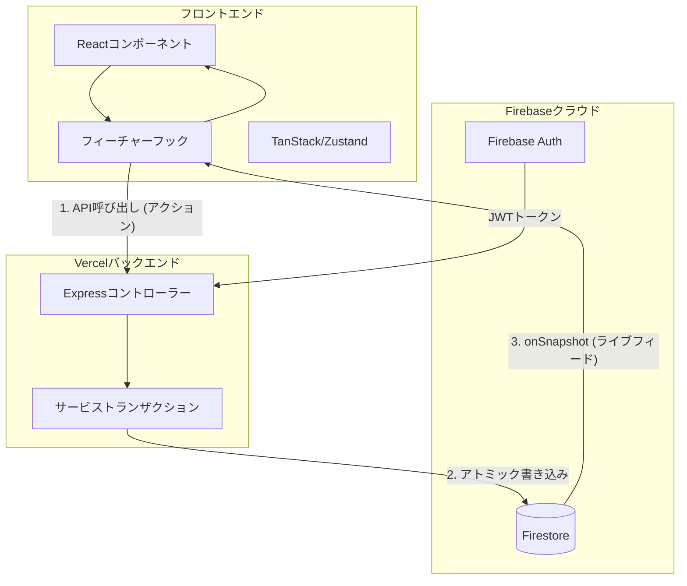

# 技術アーキテクチャ・リファレンス

このドキュメントでは、**scripture-habit** プロジェクトの技術的な構造について、技術スタック、コンポーネント設計、データフロー、およびモバイルアーキテクチャを網羅した詳細情報を提供します。

---

## 🛠️ 技術スタック

Webとモバイルの両方において、迅速な開発と優れたパフォーマンスを実現するために設計された、最新のタイプセーフなスタックを採用しています。

### フロントエンド
- **フレームワーク**: **React 19**（並行レンダリング、React Server Components 対応）。
- **ビルドツール**: **Vite 8**（高速なホットモジュールリプレースメント（HMR）と最適化されたビルドバンドル）。
- **ナビゲーション**: **React Router 7**（シングルページアプリのレイアウトおよびディープリンク）。
- **データ取得**: **TanStack Query 5**（クエリ状態管理、自動再取得、オフライン同期キャッシュ）。
- **状態管理**: **Zustand 5**（軽量なグローバルUIおよびレイアウト状態管理）。
- **リアルタイム**: **Firebase 12 Client SDK**（WebSocketリスナーを使用したFirestoreリアルタイム同期）。

### バックエンド
- **プラットフォーム**: **Node 22** + **Express 5**（Vercel Functions 上でサーバーレスとしてホスト）。
- **データベース**: **Cloud Firestore**（ドキュメント指向のリアルタイム NoSQL データベース）。
- **認証**: **Firebase Admin SDK 13**（サーバーサイドの JWT 検証およびユーザー管理）。
- **AIエンジン**: **Gemini 3.1 Flash-Lite Preview**（プロンプト処理、キャッシュされた翻訳エンジン）。

### モバイルブリッジ
- **プラットフォーム**: **Capacitor 8**（AndroidおよびiOSビルド用のWebViewラッパー）。
- **プラグイン**: Googleソーシャル認証、プッシュ通知、AppCheckネイティブ整合性、ローカルストレージ。

---

## 🏗️ アーキテクチャレイヤー

### 1. スキーマレイヤー (`/types`)
**中央集権化されたデータモデル**: すべてのFirestoreドキュメントモデルは、ルートの `types/` フォルダ内でTypeScriptインターフェースとして定義されています。これにより、バックエンド（Admin SDK）とフロントエンド（Client SDK）が常に同一のデータ構造を使用することが保証されます。

### 2. ロジックレイヤー（カスタムフック）
私たちは**「ロジックとコンポーネントの分離」**の哲学に従っています：
- **コンポーネント**: レイアウト、スタイリング（Vanilla CSS）、およびレンダリングを担当します。
- **フック**: API呼び出し、データ同期、およびビジネスロジックを担当します（例：`use-chat-sync-controller.ts`、`use-chat-data-engine.ts`、`useNoteSubmission`）。
- **メリット**: コンポーネントはシンプルかつテスト可能な状態を維持でき、ロジックは異なるビュー間で再利用可能になります。

### 3. バックエンドサービスレイヤー (`api_internal/services`)
ルートはシンプルなコントローラーです。すべての主要な処理（トランザクション、ストリーク計算、通知）は**サービス**内で処理されます：
- **`NoteService`**: ノート投稿のトランザクションを処理します。
- **`StreakEngine`**: 36時間の猶予期間を計算する内部ロジック。
- **`ArchiveService`**: バケットベースのメッセージアーカイブを管理します。

---

## 💾 状態管理の分類 (Taxonomy)

冗長なレンダリングを避けるため、状態をそのソースと永続性に基づいて分類しています。

| 状態カテゴリ | ツール | 目的 |
| :--- | :--- | :--- |
| **サーバー状態** | TanStack Query | APIレスポンスのキャッシュ、メタデータの読み込み/エラー状態の処理。 |
| **リアルタイム状態** | Firestore SDK | 同期されたチャットメッセージ、未読数、およびグループのアクティビティ。 |
| **グローバルUI状態** | Zustand | モーダル、サイドバーの表示状態、およびテーマ設定の管理。 |
| **認証状態** | AuthContext | すべてのコンポーネントにわたる `currentUser` オブジェクトの標準化。 |

---

## 🔄 データフロー: 同期ループ

私たちのアーキテクチャでは、**ミューテーション**（API）と**クエリ**（データベースの直接リスナー）を分離しています。

---

## 🌎 クロスプラットフォームブリッジ (Capacitor)

モバイルアプリケーションは、Viteビルドを実行するWebViewです。

- **ブリッジ通信**: 安全なネットワークアクセスのため、標準 of JS `fetch` 呼び出しはCapacitorブリッジによって処理されます。
- **ネイティブストレージ**: 初期起動を高速化するため、キャッシュされたユーザー設定にはネイティブストレージを使用します。
- **LiveReloadワークフロー**: 開発中、Android/iOSアプリはVite開発サーバー（`http://[ローカルIP]:5173`）を直接指すため、実機上で即座に変更を反映させることができます。

---

## 🛡️ 信頼性とセキュリティ
- **タイプガード**: `firestoreConverters.ts` は Zod を使用して、Firestore 内の不正な形式のデータがUI内でエラーを引き起こす前に検出され、クリーンアップされることを保証します。
- **エラー境界 (Error Boundaries)**: コンポーネントレベルのバウンダリにより、チャットメッセージのエラーがダッシュボード全体をクラッシュさせるのを防ぎます。
- **Sentry統合**: すべてのレイヤーは、パフォーマンスの問題や未処理の例外を中央の Sentry ダッシュボードに報告します。
