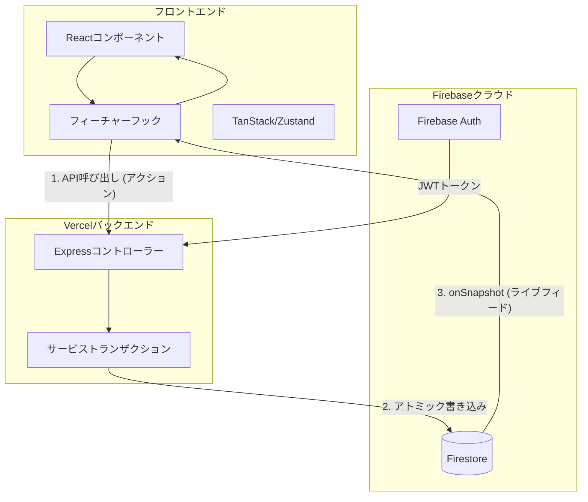

# 技術アーキテクチャ・リファレンス

このドキュメントでは、**scripture-habit** プロジェクトの技術的な構造について、技術スタック、コンポーネント設計、データフロー、およびモバイルアーキテクチャを網羅した詳細情報を提供します。

---

## 技術スタック

Webとモバイルの両方において、迅速な開発と優れたパフォーマンスを実現するために設計された、最新のタイプセーフなスタックを採用しています。

### フロントエンド
- **フレームワーク**: **React 19**（並行レンダリング、React Server Components 対応）。
- **ビルドツール**: **Vite 8**（高速なホットモジュールリプレースメント（HMR）と最適化されたビルドバンドル）。
- **ナビゲーション**: **React Router 7**（シングルページアプリのレイアウトおよびディープリンク）。
- **データ取得**: **TanStack Query 5**（クエリ状態管理、自動再取得、オフライン同期キャッシュ）。
- **状態管理**: **Zustand 5**（軽量なグローバルUIおよびレイアウト状態管理）。
- **リアルタイム**: **Firebase 12 Client SDK**（WebSocketリスナーを使用したFirestoreリアルタイム同期）。

### バックエンド
- **プラットフォーム**: **Node 22** + **Express 5**（Vercel Functions 上でサーバーレスとしてホスト）。
- **データベース**: **Cloud Firestore**（ドキュメント指向のリアルタイム NoSQL データベース）。
- **認証**: **Firebase Admin SDK 13**（サーバーサイドの JWT 検証およびユーザー管理）。
- **AIエンジン**: **Gemini 3.1 Flash-Lite Preview**（プロンプト処理、キャッシュされた翻訳エンジン）。

---

## ディレクトリ構成 & 物理レイヤー

プロジェクトは以下の主要なディレクトリで構成されており、それぞれ役割が分かれています。

```
scripture-habit/
├── api/                  # 1. APIレイヤー (Vercelサーバーレス関数エントリーポイント)
├── api_internal/         # 2. 内部レイヤー (ビジネスロジック、ルート、各種サービス)
├── backend/              # 3. バックエンドレイヤー (ローカル開発用サーバーラッパー)
├── src/                  # 4. フロントエンドレイヤー (Vite + React 19 アプリケーション)
└── types/                # 5. スキーマレイヤー (フロントエンド/バックエンド共有の型定義)
```

### 各物理レイヤーの役割

#### 1. APIレイヤー (`api/`)
Vercelサーバーレス環境上のエントリポイント（`api.ts`など）です。外部からのリクエストを受信し、内部レイヤー（`api_internal`）のExpressルーターへと仲介します。

#### 2. 内部レイヤー (`api_internal/`)
バックエンドの実際の処理の核となるレイヤーです。Expressのルート定義、コントローラー、ミドルウェア、データベース操作を行うサービス、およびメールやプッシュ通知の配信エンジンが配置されています。

#### 3. バックエンドレイヤー (`backend/`)
ローカル環境で開発・テストを行う際に、サーバーをローカルポート（5000）で動作させるためのExpressラッパーと開発用ユーティリティです。

#### 4. フロントエンドレイヤー (`src/`)
React 19 と Vite 8 を用いたクライアントアプリケーションです。UIコンポーネント（Vanilla CSSによるスタイリング）や、Zustand、TanStack Query、およびFirebase Client SDKを使用したステート管理/データ取得ロジックが含まれます。

---

## アーキテクチャレイヤー

### 1. スキーマレイヤー (`/types`)
**中央集権化されたデータモデル**: すべてのFirestoreドキュメントモデルは、ルートの `types/` フォルダ内でTypeScriptインターフェースとして定義されています。これにより、バックエンド（Admin SDK）とフロントエンド（Client SDK）が常に同一のデータ構造を使用することが保証されます。

### 2. ロジックレイヤー（カスタムフック）
私たちは**「ロジックとコンポーネントの分離」**の哲学に従っています：
- **コンポーネント**: レイアウト、スタイリング（Vanilla CSS）、およびレンダリングを担当します。
- **フック**: API呼び出し、データ同期、およびビジネスロジックを担当します（例：`use-chat-sync-controller.ts`、`use-chat-data-engine.ts`、`useNoteSubmission`）。
- **メリット**: コンポーネントはシンプルかつテスト可能な状態を維持でき、ロジックは異なるビュー間で再利用可能になります。

### 3. バックエンドサービスレイヤー (`api_internal/services`)
ルートはシンプルなコントローラーです。すべての主要な処理（トランザクション、ストリーク計算、通知）は**サービス**内で処理されます：
- **`NoteService`**: ノート投稿のトランザクションを処理します。
- **`StreakEngine`**: 36時間の猶予期間を計算する内部ロジック。

---

## 状態管理の分類 (Taxonomy)

冗長なレンダリングを避けるため、状態をそのソースと永続性に基づいて分類しています。

| 状態カテゴリ | ツール | 目的 |
| :--- | :--- | :--- |
| **サーバー状態** | TanStack Query | APIレスポンスのキャッシュ、メタデータの読み込み/エラー状態の処理。 |
| **リアルタイム状態** | Firestore SDK | 同期されたチャットメッセージ、未読数、およびグループのアクティビティ。 |
| **グローバルUI状態** | Zustand | モーダル, サイドバーの表示状態, およびテーマ設定の管理。 |
| **認証状態** | AuthContext | すべてのコンポーネントにわたる `currentUser` オブジェクトの標準化。 |

> [!IMPORTANT]
> **状態の競合防止と単一情報源 (Single Source of Truth) の確保**:
> TanStack Query と Firestore ライブストリーミングの競合を防ぐため、TanStack Query は静的なサーバー状態（`systemStatus` 等）の取得に限定されています。その他のすべての動的・コラボレーションデータ（チャット、未読、プロフィール、ストリーク等）は、Firestore SDK の `onSnapshot` 経由でのみリアルタイム同期され、フロントエンドでの状態の重複やチラつきが発生しないように設計されています。

---

## データフロー: 同期ループ

私たちのアーキテクチャでは、**ミューテーション**（API）と**クエリ**（データベースの直接リスナー）を分離しています。



---

## データベース・スキーマ設計図

Scripture Habit はリレーショナルでゲーム化されたデータ構造を Firestore に保存します。以下は簡略化されたコレクション階層です：

```
Firestore ルート
├── users/ (コレクション)
│   └── {uid}/ (ドキュメント)
│       ├── nickname: string
│       ├── timeZone: string
│       ├── lastPostDate: string (YYYY-MM-DD)
│       ├── level: number
│       ├── streakDays: number
│       ├── hasFcmToken: boolean
│       └── private/ (サブコレクション)
│           └── tokens/ (ドキュメント)
│               └── fcmTokens: string[]
│       └── groupStates/ (サブコレクション)
│           └── {groupId}/ (ドキュメント)
│               └── readMessageCount: number
├── groups/ (コレクション)
│   └── {groupId}/ (ドキュメント)
│       ├── name: string
│       ├── inviteCode: string
│       ├── ownerId: string
│       ├── messageCount: number
│       ├── unityScore: number
│       ├── members/ (サブコレクション)
│       │   └── {uid}/ (ドキュメント)
│       │       └── joinedAt: Timestamp
│       ├── messages/ (サブコレクション)
│       │   └── {messageId}/ (ドキュメント)
│       │       └── content: string
│       └── messages_latest/ (サブコレクション)
│           └── latest/ (ドキュメント)
│               └── messages: Message[] (最新25件に厳格にスライスされた高性能キャッシュ。これによりFirestoreの1MBドキュメントサイズ上限によるクラッシュを防止します)
```

---

## ローカルエミュレータ・シードシステム

クリーンな開発者ワークスペースを空のエミュレータに接続するとUIテストが非常に困難になります。このため、自動化されたシードパイプラインを用意しています：

- **実行コマンド**: `npm run db:seed:existing`（または `npm run db:seed`）/ `npm run db:seed:new`
- **実行スクリプト**: [`seed-existing-user.ts`](../../scripture-habit/scripts/seed-existing-user.ts) / [`seed-new-user.ts`](../../scripture-habit/scripts/seed-new-user.ts)
- **処理ライフサイクル**:
  1. **パージ（初期化）**: 冪等性（繰り返し実行しても状態が変わらないこと）を保証するため、一致する既存のテスト用ユーザーやアクティブなグループを事前に削除します。
  2. **Auth アカウント生成**: ローカル Firebase Auth エミュレータ上にダミーアカウントを自動生成します。
  3. **ユーザープロファイル構築**: ユーザープロファイル、ダミーの学習継続日数（ストリーク）、レベル情報、および FCM トークンフラグを設定します。
  4. **グループとチャットの組み立て**: 共有学習グループを作成し、招待関係をマッピングし、模擬チャット履歴を生成し、キャッシュ用最新プレビューデータを注入します。

---

## CodeTours による実地ガイド

新しい開発者をコードベース内で案内するため、ワークスペースには **22個のインタラクティブな CodeTour**（`.tours/` 内）が用意されています。VS Code のコマンドパレットから以下を実行して開始できます：
1. `CodeTour: Start Tour`
2. 実行したいツアーを選択（例：React フックの実装を学ぶには **Tour 1: Frontend Core Mechanics**、エミュレータ設定を学ぶには **Tour 13: Local Development & Setup** を選択）。

---

## 信頼性とセキュリティ
- **タイプガード**: `firestoreConverters.ts` は Zod を使用して、Firestore 内の不正な形式のデータがUI内でエラーを引き起こす前に検出され、クリーンアップされることを保証します。
- **データ整合性の自動同期**: メンバーメタデータ（ニックネームなど）は複数の場所に非正規化されていますが、`ProfileService.syncProfileToChats` バックグラウンドスイープタスクがアトミックバッチ処理（`db.batch()`）を用いて変更情報を関連チャット、プレビュー配列、過去メッセージ、リアクションプレビュー等へ漏れなく同期し、多重管理の不整合を防ぎます。
- **エラー境界 (Error Boundaries)**: コンポーネントレベルのバウンダリにより、チャットメッセージのエラーがダッシュボード全体をクラッシュさせるのを防ぎます。
- **Sentry統合**: すべてのレイヤーは、パフォーマンスの問題や未処理の例外を中央の Sentry ダッシュボードに報告します。
- **モノレポワークスペース設計 (将来のロードマップ)**: フロントエンドとバックエンドの境界を物理的に隔離し、ビルド構成の依存汚染を防ぐため、`pnpm workspaces`を用いたマルチパッケージ構成への移行を計画しています：
  - `packages/types`: 共通の Firestore スキーマ、Zod バリデーション、および DTO 型定義。
  - `packages/api-internal`: バックエンドのビジネスロジック、および Firestore トランザクション処理サービス。
  - `apps/web`: React SPA フロントエンドワークスペース（Vite）。
  - `apps/serverless`: Vercel Serverless Functions 用の Express ハンドラーラッパー。
