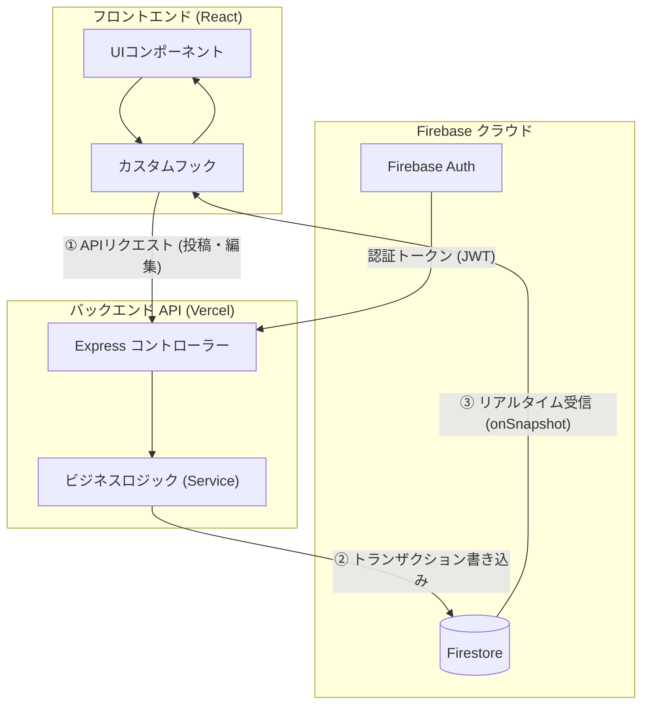

# 全体アーキテクチャ ＆ 構成リファレンス

このドキュメントでは、Scripture Habit の技術スタック、ディレクトリ構造、データフロー、および状態管理の設計方針について解説します。

---

## 1. 技術スタック

| レイヤー | 技術 | 採用理由・役割 |
| :--- | :--- | :--- |
| **フロントエンド** | **React 19** + **Vite 8** | 高速なビルド・開発体験、モダンなコンポーネント設計 |
| **ルーティング** | **React Router 7** | SPA の画面遷移・ディープリンク管理 |
| **状態管理・データ取得** | **Zustand 5** / **TanStack Query 5** | 軽量なUI状態管理とAPIキャッシュ管理 |
| **リアルタイム通信** | **Firebase Client SDK 12** | Firestore の WebSocket リスナーによるチャット同期 |
| **バックエンド API** | **Node.js >= 22 (LTS 24)** + **Express 5** | Vercel Serverless 上で動作するAPIゲートウェイ |
| **データベース** | **Cloud Firestore** | リアルタイム NoSQL データベース |
| **認証** | **Firebase Authentication** | メール・パスワード / Google 認証、JWT検証 |
| **AI サービス** | **Gemini 3.1 Flash-Lite** | ノートの動的翻訳、質問生成、振り返りレター |

---

## 2. ディレクトリ構成と役割

```
scripture-habit/
├── api/                  # Vercel サーバーレス関数のエントリーポイント
├── api_internal/         # バックエンドのコアロジック（ルート・サービス・通知・Cron）
├── backend/              # ローカル開発用の Express サーバーラッパー (Port: 5000)
├── src/                  # フロントエンド（React 19 + Vite アプリケーション）
└── types/                # フロント/バックエンド共通の TypeScript 型定義・スキーマ
```

---

## 3. レイヤー設計と状態管理の分類

### ① ロジックとコンポーネントの分離 (Logic-Component Split)
- **コンポーネント (`src/components/`)**: UIの描画、スタイリング（Vanilla CSS）、レイアウトに集中。
- **カスタムフック (`src/hooks/`)**: API呼び出し、データ同期、ビジネスロジックを担当。

### ② 状態管理の役割分担
- **リアルタイムデータ（チャット・未読・ストリーク）**: Firestore の `onSnapshot` で同期。
- **サーバーAPI状態（システム設定・静的情報）**: TanStack Query でキャッシュ・再取得。
- **グローバルUI状態（モーダル・テーマ）**: Zustand で管理。
- **認証状態**: `AuthContext` で一元管理。

---

## 4. データフロー: 書き込みとライブ受信の分離



- **書き込み**: バックエンド API を経由して整合性を保ちながら一括トランザクションで書き込みます。
- **読み取り**: Firestore のリアルタイムリスナー（`onSnapshot`）を通じて画面へ即時反映されます。

---

## 5. 関連ドキュメント

- [ネットワーク・通信の最適化](./network-performance-optimization.md)
- [データベース & セキュリティ](./database-security.md)
- [API 設計 & エラーハンドリング](./api-middleware-error-handling.md)
- [開発 & 環境構築ガイド](./development-guide.md)
