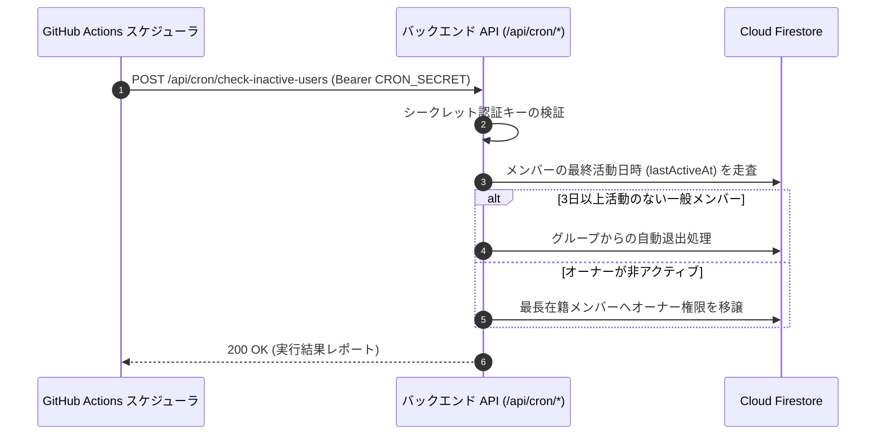

# CI/CD ＆ メンテナンス自動化

このドキュメントでは、GitHub Actions による自動テスト・継続的デプロイ（CI/CD）パイプライン、および定期実行メンテナンスジョブの自動化体制について解説します。

---

## 1. 継続的インテグレーション ＆ デプロイ (CI/CD)

GitHub Actions (`.github/workflows/ci.yml`) により、`main` ブランチへのプッシュやプルリクエスト作成時に自動で品質検証とデプロイが実行されます。

### 1.1 実行環境
- **OS**: `ubuntu-latest`
- **コンテナ**: `mcr.microsoft.com/playwright:v1.59.1-noble` (E2E テスト用ブラウザ同梱)
- **Node.js**: `24.x` (最低要件: `>= 22.0.0`)
- **Java**: `JDK 21` (Firebase Emulator 実行用)

### 1.2 パイプラインのステップ
1. **静的解析**: ESLint による構文・スタイル検証 (`npm run lint`)
2. **品質・整合性チェック**: i18n 翻訳網羅率およびバックエンド型定義整合性 (`npm run check:all`)
3. **単体テスト**: Vitest によるフロントエンド・フック・ユーティリティテスト (`npm test`)
4. **統合テスト**: Firebase Emulator 上での API およびセキュリティルールテスト (`npm run test:internal`, `npm run test:rules`)
5. **E2E テスト**: Playwright によるブラウザ自動テスト (`npm run test:e2e:ci`)
6. **Vercel 自動デプロイ**: `main` ブランチの検証成功時に本番環境へ自動反映

---

## 2. 定期メンテナンスタスク

### 非アクティブユーザーの定期スキャン (`check-inactive-users.yml`)
毎日 00:00 UTC（日本時間 午前 9:00）に GitHub Actions からサーバーレスエンドポイントを呼び出し、休眠メンバーの自動退出やオーナー権限の自動移譲を実行します。

### シーケンスの解説

1. **セキュアな定期トリガー**  
   GitHub Actions から `CRON_SECRET` ベアラートークンを付与してエンドポイントを呼び出します。
2. **アクティビティの走査と判定**  
   データベースから最終活動日時を照合し、退出対象および権限移譲先を決定します。
3. **アトミック更新とレポート返答**  
   メンバー退出と権限交代を Firestore 上で確定させ、実行ログを CI レポートとして返却します。

---

## 3. シークレット管理

GitHub リポジトリの `Settings > Secrets and variables > Actions` で以下の環境変数を管理します。

| シークレット名 | 用途 |
| :--- | :--- |
| `VERCEL_TOKEN` | Vercel への自動デプロイ用 API トークン |
| `VERCEL_ORG_ID` | Vercel 組織 ID |
| `VERCEL_PROJECT_ID` | Vercel プロジェクト ID |
| `CRON_SECRET` | 定期ジョブの呼び出しを保護するための認証キー |

---

## 4. 関連ドキュメント

- [テストガイド](./testing-guide.md)
- [定期メンテナンス & Cron ジョブ](./maintenance-cron.md)
- [非アクティブ自動退出ロジック](./inactivity-and-autokick.md)
