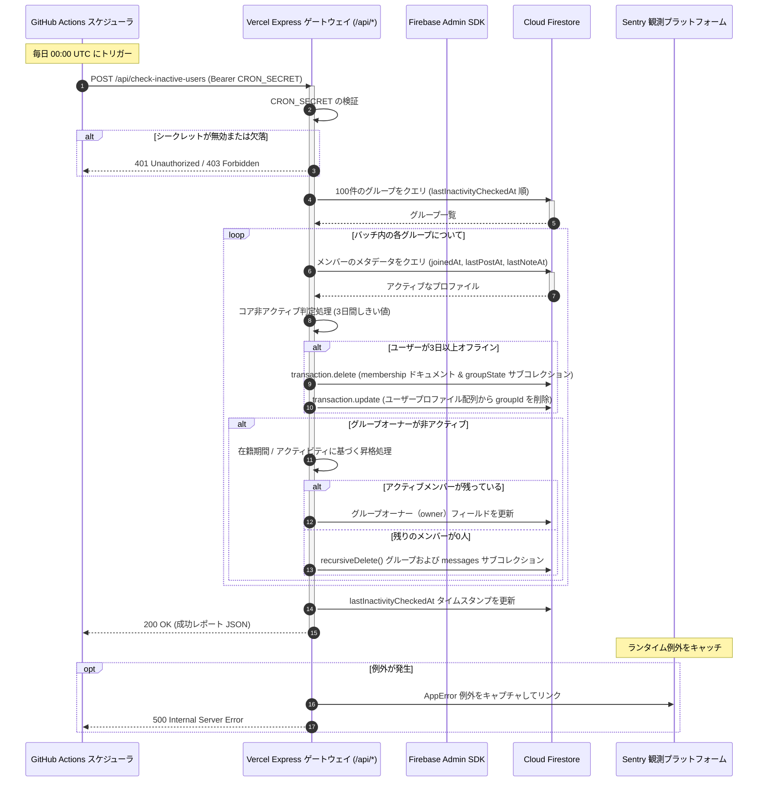

# CI/CD & メンテナンスの自動化

このガイドでは、**scripture-habit** プラットフォームにおける継続的インテグレーション/継続的デリバリー（CI/CD）パイプライン、およびスケジュールされたバックグラウンドジョブについて説明します。

---

## 1. 継続的インテグレーション & デリバリー (CI/CD)

私たちの CI パイプラインは **GitHub Actions** (`.github/workflows/ci.yml`) で動作します。これは `main`、`master`、または `develop` ブランチへのプッシュまたはプルリクエストによってトリガーされます。

### 1.1 ランナー環境のセットアップ
ランナー環境は以下の設定を使用します：
*   **オペレーティングシステム**: `ubuntu-latest`
*   **コンテナ**: `mcr.microsoft.com/playwright:v1.59.1-noble` (E2E テスト用のブラウザバイナリを含みます)。
*   **Node.js**: `22.x`
*   **Java ランタイム (JDK)**: `21` (Firestore および Firebase Auth エミュレータに必要です)。

### 1.2 パイプラインステップ
1. **依存関係のインストール (`npm ci`)**: 高速な実行のためにキャッシュを利用して、正確なパッケージバージョンをインストールします。
2. **リンターチェック (`npm run lint`)**: React フックの依存関係および TypeScript のルールをチェックします。
3. **ユニットテスト (`npm test`)**: Vitest を介してユニットテストおよびロジックテストを実行します。
4. **統合テスト (`npm run test:internal`)**: ローカルの Firebase エミュレータ内で Firestore ルールおよび REST API のテストを実行します。
5. **E2E テスト (`npm run test:e2e`)**: Playwright エンドツーエンドテストを実行します。
6. **アーティファクトの取得**: 失敗時に Playwright の HTML トレースレポートをアップロードします（30 日間保持されます）。

### 1.3 Vercel への CD (継続的デリバリー)
`main` または `master` ブランチでビルドが成功すると、自動的に Vercel にデプロイされます：
```bash
npm install --global vercel@latest
vercel pull --yes --environment=production --token=$VERCEL_TOKEN
vercel deploy --prod --token=$VERCEL_TOKEN
```
これにより、フロントエンドがデプロイされ、Vercel Serverless Functions (`api/api.ts`) が更新されます。

---

## 2. デイリー Cron ジョブ & スケジュールされたメンテナンス

当プラットフォームでは、データベースレコードをクリーンに保ち、非アクティブなユーザーを処理するために、スケジュールされた毎日のバックグラウンドジョブを実行します。

### 2.1 デイリー非アクティブチェック (`check-inactive-users.yml`)
このワークフローは、GitHub Actions を介して毎日 **00:00 UTC（日本時間 午前 9:00）**に実行されます。サーバーレスエンドポイントをトリガーして、非アクティブなグループメンバーをスキャンし、グループ所有権の更新を処理します。

*   **セキュリティプロトコル**: GitHub Secrets に安全に設定された共有ベアラシークレット（`CRON_SECRET`）を使用します。
*   **ターゲット URI**: `https://scripturehabit.app/api/check-inactive-users/`
*   **実行コマンド**:
    ```bash
    curl -L -X POST "https://scripturehabit.app/api/check-inactive-users/" \
      -H "Authorization: Bearer ${{ secrets.CRON_SECRET }}" \
      -H "Content-Type: application/json"
    ```

### 2.2 非アクティブチェックのシーケンス図
以下のシーケンス図は、非アクティブチェックジョブがどのように実行されるかを示しています：



---

## 3. リポジトリのシークレット & 設定

GitHub (`Settings > Secrets and variables > Actions`) に以下のシークレットが登録されていることを確認してください。

| シークレット名 | スコープ | 用途 |
| :--- | :--- | :--- |
| `VERCEL_TOKEN` | 継続的デリバリー | CLI デプロイをトリガーするために Vercel アカウント設定から生成された API アクセストークン。 |
| `VERCEL_ORG_ID` | 継続的デリバリー | 企業または個人のスコープに一致する Vercel 組織（Organization）ID。 |
| `VERCEL_PROJECT_ID` | 継続的デリバリー | scripture-habit のデプロイに関連付けられたターゲット Vercel プロジェクト ID。 |
| `CRON_SECRET` | 運用 & Cron | 外部からの呼び出しに対してサーバーレスエンドポイントを保護するための、長いランダムな文字列（共有シークレット）。 |

> [!WARNING]
> 本番環境のシークレットを絶対に Git にコミットしないでください。CI/CD には GitHub Secrets を使用し、ローカル開発には `.env.local` を使用してください。
