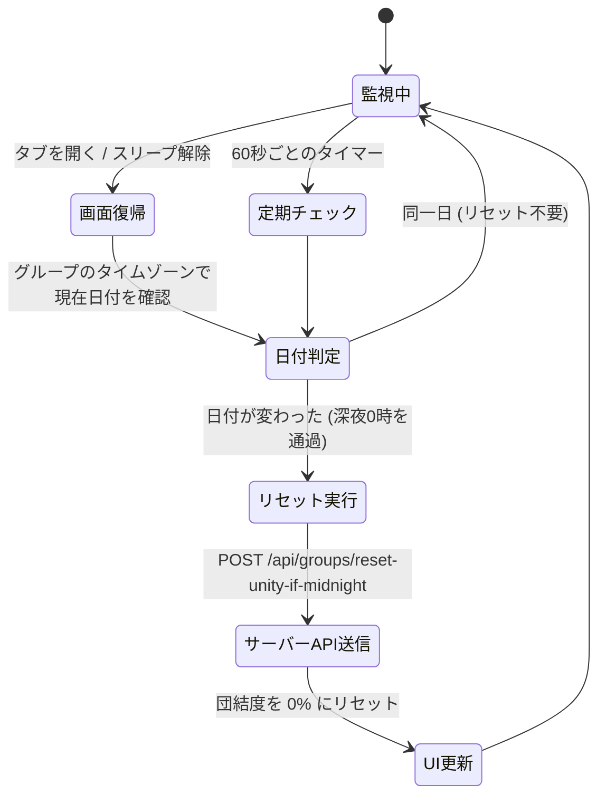

# 団結度（Unity）深夜リセットフック

このドキュメントでは、グループのタイムゾーンにおける深夜0時（日付変更）を検知し、当日の団結度（Unity）をリセットする React フック（`src/hooks/use-unity-midnight-reset.ts`）について解説します。

---

## 1. 処理の流れ

端末の復帰時（画面フォーカス時）や定期タイマー（60秒ごと）で日付変更を検知し、安全にバックエンド API を呼び出して団結度をリセットします。

---

## 2. コア機能と工夫

### ① デバイス復帰（フォーカス）の監視
スマホなどのスリープ中は JavaScript のタイマーが停止するため、アプリを開いた瞬間（`window.focus` イベント）に日付変更を再チェックします。

### ② タイムゾーン別の正確な判定
グループ設定のタイムゾーン（`group.timeZone`）における今日の日付（`YYYY-MM-DD`）を割り出し、データベースに記録されている日付と比較します。

### ③ 重複リクエストの防止
短時間に複数回画面を開閉しても重複して API が呼ばれないよう、`useRef`（`isResettingRef`）を用いたロック機構を設けています。

---

## 3. 安全なリセット API (`/api/groups/reset-unity-if-midnight`)

リセット処理はバックエンドで安全に実行されます：
- **認証 & App Check**: ログインユーザーの JWT トークンと App Check トークンを検証。
- **UI の即時反映**: サーバーでリセット完了後、画面上の団結度メーターが即座に `0%` に更新されます。

---

## 4. 関連ドキュメント

- [団結度（Unity）の同期の仕組み](./unity-participation.md)
- [チャットとダッシュボードの同期](./feature-chat-dashboard.md)
