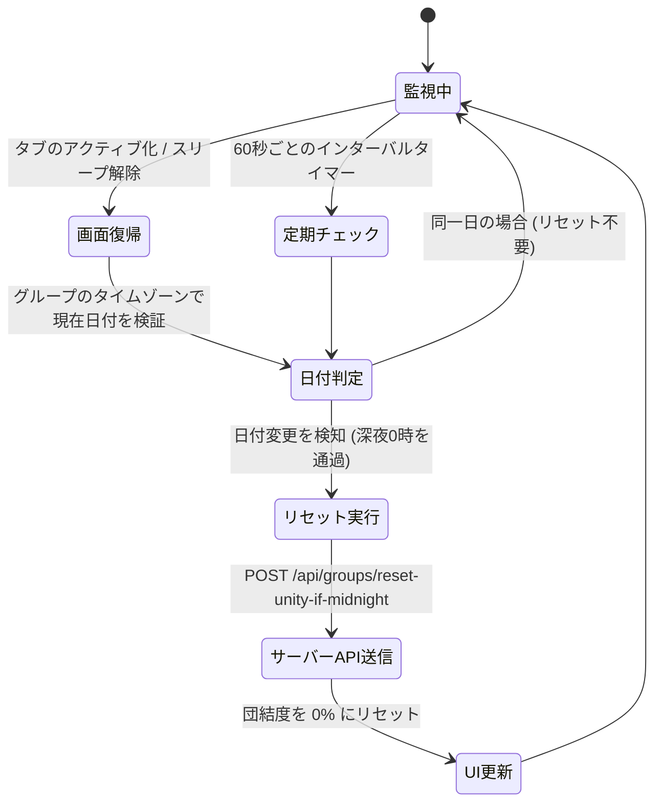

# 団結度（Unity）深夜リセットフック

::: tip インタラクティブ・アーキテクチャツアー
この機能のデータフローとステップ解説ツアーを体験できます：
- **オンライン（GitHubブラウザプレビュー）**: [インタラクティブツアーを開く (習慣ダッシュボード & 日次リセット)](https://htmlpreview.github.io/?https://github.com/ScriptureHabit/scripture-habit/blob/main/docs/public/architecture-tour.html?tour=tour-dashboard&lang=ja)
- **VitePress / ローカル**: [習慣ダッシュボード & 日次リセット の解説ツアーを開く](/architecture-tour.html?tour=tour-dashboard&lang=ja)
:::

このドキュメントでは、グループのタイムゾーンにおける深夜 0 時（日付変更）を検知し、当日の団結度（Unity）をリセットする React フック（`src/hooks/use-unity-midnight-reset.ts`）について解説します。

---

## 1. 処理の流れ

端末の復帰時（画面フォーカス時）および定期インターバル（60秒ごと）で日付変更を検知し、安全にバックエンド API を呼び出して団結度をリセットします。

### ステートマシンの解説

1. **画面復帰および定期トリガー**  
   スリープ解除時の `window.focus` イベントと 60 秒インターバルにより、バックグラウンドでの日付遷移を逃さず捕捉します。
2. **タイムゾーン別の日付評価**  
   グループ設定のタイムゾーン（`group.timeZone`）で今日の日付文字列を生成し、グループドキュメントの記録日付と比較します。
3. **アトミックリセットと状態確定**  
   日付変更が確認された場合、ミューテーションロックを掛けつつバックエンド API を呼び出し、ローカルおよびリモートの達成度を安全にリセットします。

---

## 2. コア機能と工夫

### ① デバイス復帰（フォーカス）の監視
モバイル端末のスリープ中は JavaScript タイマーが停止するため、アプリ再開時（`focus` イベント）に日付変更を即時再検証します。

### ② タイムゾーン別の正確な判定
グループの標準タイムゾーンに基づき `Intl` API で現地日付を割り出し、時差による誤動作を防ぎます。

### ③ 重複リクエストの排他制御
短時間の連続フォーカスによる過剰な API 呼び出しを防ぐため、`useRef`（`isResettingRef`）による実行ロックを適用しています。

---

## 3. 安全なリセット API (`/api/groups/reset-unity-if-midnight`)

- **認証 & App Check**: JWT 認証と App Check トークンを検証した上でリセットを実行。
- **UI の即時反映**: レスポンス受信に伴い、画面上の団結度メーターを即座に `0%` へ再計算。

---

## 4. 関連ドキュメント

- [団結度（Unity）の同期の仕組み](./unity-participation.md)
- [チャットとダッシュボードの同期](./feature-chat-dashboard.md)
