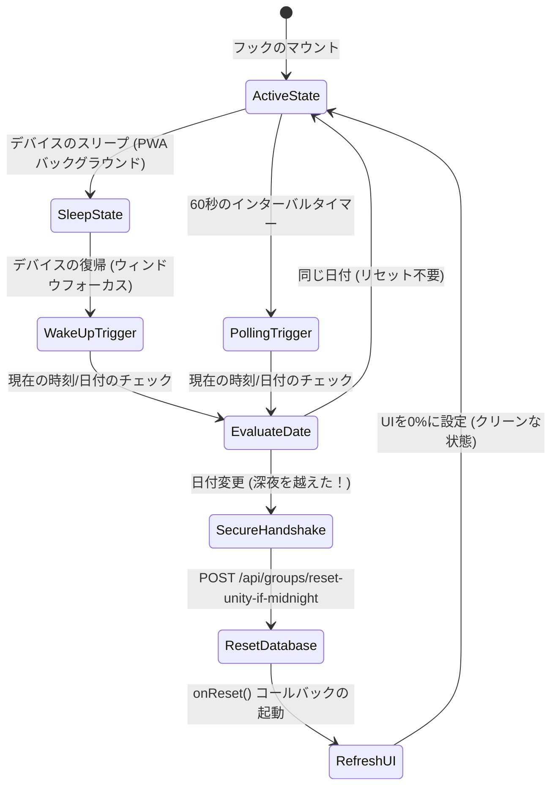

# グループアクティビティの日付変更（深夜）リセットフック

**scripture-habit** アプリは、様々なタイムゾーンにわたる日付変更（深夜）リセットを処理するために、**`useUnityMidnightReset`** React フック（`src/hooks/use-unity-midnight-reset.ts`）を使用しています。グループに設定されたタイムゾーンで午前0時（深夜）を過ぎると、フックはクライアント UI を更新し、バックエンドのデータベースを安全にトリガーして、グループの新しい日のアクティビティ統計情報をリセットします。

---

## 1. アーキテクチャの概要

フックは、定期的なチェック（ポーリング）、アプリのフォーカス監視（デバイスの復帰時）、およびセキュアな API 呼び出しを組み合わせて、深夜にグループの統計情報をリセットします。



---

## 2. コアメカニズム

### 2.1 アクティブフォーカス & デバイスの復帰
モバイルデバイスやプログレッシブ Web アプリ（PWA）では、ユーザーは携帯電話をロックしたり、アプリをバックグラウンドに置いたままにしたりすることがよくあります。これらのスリープ状態では、`setInterval` などの伝統的なタイマーは動作を停止します。これを処理するため、フックはアプリがフォーカスを取得したタイミングを監視（リスニング）します：
```typescript
window.addEventListener('focus', handleFocus);
```
ユーザーがアプリを開くか、タブに戻ると、`focus` イベントが起動し、日付のチェックがトリガーされます。アプリのスリープ中に新しい日が開始されていた場合、即座にリセット処理が実行されます。

### 2.2 タイムゾーンごとの日付計算
グローバルなユーザーをサポートするため、フックはクライアントの現在時刻をグループの特定のタイムゾーンに変換します：
1. グループに設定されているタイムゾーンを取得します（例：`Asia/Tokyo`、`America/Denver`）。
2. クライアントの現在時刻をそのタイムゾーンの形式にフォーマットします：
   ```typescript
   const todayStr = formatDateInTimeZone(new Date(), groupTimeZone);
   ```
3. フォーマットされた日付文字列を `YYYY-MM-DD` 形式に正規化します。
4. この日付文字列を、Firestore に保存されているグループの最後のアクティブ日付（`dailyActivity.date`）と比較します：
   ```typescript
   if (normalizedActivityDate && normalizedActivityDate !== normalizedToday) {
       // 深夜（日付変更）を越えた状態
   }
   ```

### 2.3 重複チェックのラッチング (同時実行制御)
深夜前後にアプリが複数回開かれた際に、冗長なネットワークリクエストが発生するのを防ぐため、フックは React の `useRef` を使用したバッファメカニズムを採用しています：
- **`lastCheckedDateRef`**: 最後にチェックした日付を保存します。日付が変更されていない場合、フックはリセットリクエストをスキップします。
- **`isResettingRef`**: API 呼び出しが既に実行されている間に、重複してリセットリクエストが送信されるのを防ぐ Boolean フラグです。

---

## 3. セキュアな API リセットハンドシェイク

データのセットアップ/リセットにはデータベースの書き込み操作が必要なため、バックエンドのエンドポイント（`/api/groups/reset-unity-if-midnight`）には検証（認証・認可）が必要です。クライアントのフックは、リセットリクエストを送信する際に2つの検証用ヘッダーを提供します：

```
┌────────────────────────────────────────────────────────┐
│                   セキュアな HTTP ヘッダー             │
├──────────────────────┬─────────────────────────────────┤
│ Authorization        │ Bearer <Firebase ID トークン>   │
├──────────────────────┼─────────────────────────────────┤
│ X-Firebase-AppCheck  │ <Firebase App Check JWT>        │
└──────────────────────┴─────────────────────────────────┘
```

1. **ユーザー認証**: フックは Firebase Auth から最新の ID トークンを取得し、ユーザーが該当グループのメンバーであることを検証します：
   ```typescript
   const idToken = await currentUser.getIdToken();
   ```
2. **アプリの完全性（App Integrity）**: アプリが本物であることを検証するため、フックは App Check トークンをリクエストします：
   ```typescript
   const tokenResponse = await getToken(appCheck, false);
   const appCheckToken = tokenResponse.token;
   ```
3. **バックエンドによる検証**: バックエンドは、Firestore 内のフィールドをリセットする前に、ユーザー認証トークンと App Check トークンの両方を検証します。
4. **UI の更新**: バックエンドが `{ reset: true }` を返すと、フックは `onReset()` を呼び出し、UI 上でグループの進捗バーを `0%` にリセットします。
