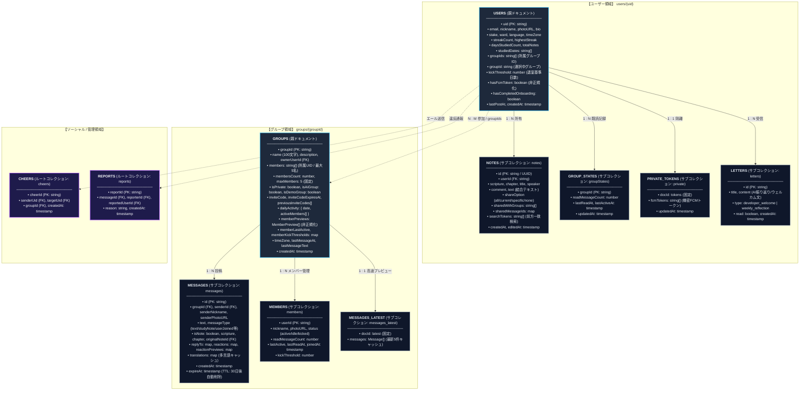
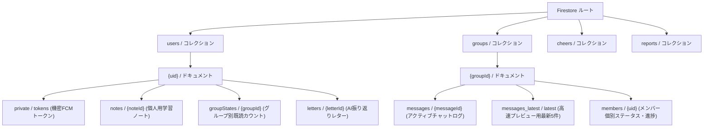

# データベース ＆ セキュリティ設計

このドキュメントでは、Cloud Firestore のデータ構造（ER図）、コレクション階層、非正規化による高速化、および機密データの保護方針について解説します。

---

## 1. エンティティ関係 (ER) モデル

Cloud Firestore の各コレクション・サブコレクション、フィールド構成、およびリレーションシップの詳細です：

---

## 2. Firestore の階層パス構造

---

## 3. データの非正規化と高速化設計

1. **グループドキュメントの工夫 (`groups/{groupId}`)**:
   - `memberPreviews`（参加者の名前とアイコン）を親ドキュメント内に保持することで、メンバー全員分のドキュメントを読み込まずに一覧を表示できます。
   - `dailyActivity`（本日投稿したメンバーID一覧）を持たせることで、過去のメッセージを全件走査せずに団結度を即時計算できます。
2. **ユーザードキュメントの工夫 (`users/{uid}`)**:
   - `groupIds` 配列を保持し、ユーザーが所属するグループ一覧を 1 回のクエリで取得可能にしています。

---

## 4. チャットメッセージの自動クリーンアップ (Firestore TTL)

チャット履歴の肥大化を防ぎ、リアルタイムリスナーを軽量に保つため、メッセージドキュメントには `expireAt`（30日後）が設定されています。
Google Cloud Firestore の **TTL（Time-to-Live）機能** により、期限切れのメッセージはバックグラウンドで自動削除されます。

---

## 5. 機密データの隔離とアクセス保護

FCM 通知トークンなどの機密情報は、通常のユーザードキュメントとは分離された `users/{uid}/private/tokens` サブコレクションに保存されます。
Firestore セキュリティルールにより、本人（`request.auth.uid == uid`）およびサーバー（Admin SDK）以外からのアクセスを制限しています。

---

## 6. 関連ドキュメント

- [Firebase セキュリティルール](./firebase-security-rules.md)
- [Firestore トランザクション & カウンター設計](./firestore-transactions-counters.md)
- [全体アーキテクチャ](./architecture.md)
