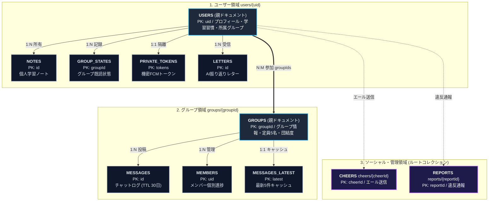
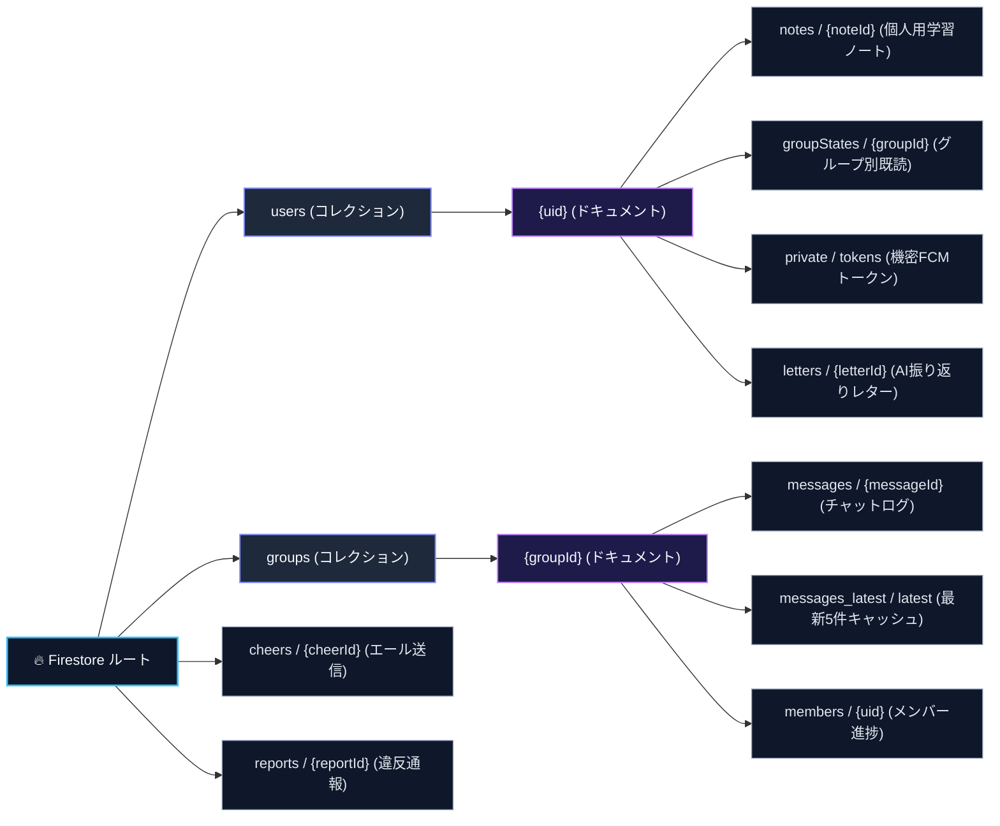

# データベース ＆ セキュリティ設計

::: tip インタラクティブ・アーキテクチャツアー
この機能のデータフローとステップ解説ツアーを体験できます：
- **オンライン（GitHubブラウザプレビュー）**: [インタラクティブツアーを開く (ユーザー認証・ログイン)](https://htmlpreview.github.io/?https://github.com/ScriptureHabit/scripture-habit/blob/main/docs/public/architecture-tour.html?tour=tour-login&lang=ja)
- **VitePress / ローカル**: [ユーザー認証・ログイン の解説ツアーを開く](/architecture-tour.html?tour=tour-login&lang=ja)
:::

このドキュメントでは、Cloud Firestore のデータ構造（ER モデル）、コレクション階層、非正規化によるパフォーマンス最適化、および機密データの保護方針について解説します。

---

## 1. エンティティ関係 (ER) モデル

Cloud Firestore における主要エンティティとリレーションシップの全体構造です。

### ER モデルの解説

1. **ユーザー領域 (`users/{uid}`)**
   利用者個人に属するエンティティです。プロフィールや学習メトリクスを保持する親ドキュメントの下に、学習ノート（`notes`）、グループ別の未読管理（`groupStates`）、AI から届く振り返り（`letters`）、および機密扱いのデバイストークン（`private/tokens`）をサブコレクションとして配置し、明確な所有境界を定めています。

2. **グループ領域 (`groups/{groupId}`)**
   最大 5 名のサークルを形成するエンティティです。グループ情報と団結度を管理する親ドキュメントの下に、対話ログ（`messages`）、メンバー別の参加進捗（`members`）、および初期読み込み高速化用の最新キャッシュ（`messages_latest`）を保持します。

3. **ソーシャル・管理領域 (`cheers`, `reports`)**
   ユーザー間のエール送信や違反通報など、特定のユーザーやグループを跨ぐ横断的なイベントを独立したルートコレクションとして管理します。

---

## 2. コレクション詳細スキーマ定義

### 2.1 ユーザー領域 (`/users/{uid}`)

| コレクション / パス | 主要フィールド | 型 | 説明・制約 |
| :--- | :--- | :--- | :--- |
| **`users/{uid}`** (親ドキュメント) | `uid` (PK) `nickname` `email` `photoURL` `bio` `stake` / `ward` `language` `timeZone` `streakCount` `highestStreak` `daysStudiedCount` `totalNotes` `studiedDates` `groupIds` `groupId` `kickThreshold` `hasFcmToken` `hasCompletedOnboarding` `lastPostAt` `createdAt` | string string string string string string string string number number number number string[] string[] string number boolean boolean timestamp timestamp | Firebase Auth UID 表示ニックネーム (最大50文字) メールアドレス プロフィールアイコン画像URL 自己紹介文 (最大500文字) 所属ステーク・ワード名 UI言語コード (`ja`, `en`, `es` 等) 標準タイムゾーン (IANA形式) 現在の連続学習日数 最高連続学習記録 累計学習日数 累計作成ノート数 学習日一覧 (YYYY-MM-DD) 所属グループID配列 (最大4グループ) アクティブ選択中のグループID 非アクティブによる自動退室基準日数 (1〜30日) FCMトークン保持有無フラグ (高速判定用) オンボーディング完了フラグ 最終ノート投稿日時 アカウント作成日時 |
| **`users/{uid}/notes/{noteId}`** (サブコレクション) | `id` (PK) `userId` (FK) `scripture` `chapter` `title` / `speaker` `comment` `text` `shareOption` `sharedWithGroups` `sharedMessageIds` `searchTokens` `createdAt` `editedAt` | string string string string string string string enum string[] map string[] timestamp timestamp | ノートID (UUID) 作成者 UID 聖典区分 (`Book of Mormon`, `New Testament` 等) 章・節の参照文字列 (例: `1 Nephi 1:1`) 総大会の題名 / 話者名 個人の学び・感想コメント 検索・表示用の結合テキスト 共有範囲 (`all`, `current`, `specific`, `none`) 共有先グループID配列 各グループのメッセージIDマップ (`groupId -> messageId`) 前方一致検索用トークン配列 作成日時 編集日時 |
| **`users/{uid}/groupStates/{groupId}`** (サブコレクション) | `groupId` (PK) `readMessageCount` `lastReadAt` `lastActiveAt` `updatedAt` | string number timestamp timestamp timestamp | 対象グループID 既読メッセージ数 (未読バッジ計算用) 最終閲覧日時 グループ内最終アクティブ日時 状態更新日時 |
| **`users/{uid}/private/tokens`** (機密サブコレクション) | `docId` (PK: `'tokens'`) `fcmTokens` `updatedAt` | string string[] timestamp | 固定ドキュメントID プッシュ通知用 FCM デバイストークン配列 トークン最終同期日時 |
| **`users/{uid}/letters/{letterId}`** (サブコレクション) | `id` (PK) `title` `content` `type` `read` `createdAt` | string string string string boolean timestamp | レターID 件名 AI生成の振り返り手紙 / 開発者レター本文 `developer_welcome` または `weekly_reflection` 開封済みフラグ 生成日時 |

---

### 2.2 グループ領域 (`/groups/{groupId}`)

| コレクション / パス | 主要フィールド | 型 | 説明・制約 |
| :--- | :--- | :--- | :--- |
| **`groups/{groupId}`** (親ドキュメント) | `groupId` (PK) `name` `description` `ownerUserId` (FK) `members` `membersCount` `maxMembers` `isPrivate` `isAiGroup` `isDemoGroup` `inviteCode` `inviteCodeExpiresAt` `previousInviteCodes` `dailyActivity` `memberPreviews` `memberLastActive` `memberLastReadAt` `memberKickThresholds` `timeZone` `lastMessageAt` `lastMessageText` `createdAt` | string string string string string[] number number boolean boolean boolean string timestamp string[] map array map map map string timestamp string timestamp | グループID (自動生成) グループ名 (最大100文字) グループ説明文 (最大1000文字) 作成者 UID 参加メンバーUID配列 (最大5名) 現在の参加メンバー数 定員上限 (固定5名) 非公開グループフラグ AIコンパニオン参加グループフラグ デモ体験用グループフラグ 6桁の招待コード 招待コード有効期限 (null = 無期限) 過去の有効招待コード履歴 本日投稿したメンバー一覧 `{ date: 'YYYY-MM-DD', activeMembers: [] }` 参加者のニックネームとアバター (`memberPreviews: MemberPreview[]`) メンバーごとの最終アクティブ日時 (`UID -> timestamp`) メンバーごとの最終閲覧日時 (`UID -> timestamp`) メンバーごとの退室基準日数 (`UID -> number`) グループの標準タイムゾーン 最新メッセージ投稿日時 最新メッセージのプレビュー本文 グループ作成日時 |
| **`groups/{groupId}/messages/{messageId}`** (サブコレクション) | `id` (PK) `groupId` (FK) `senderId` (FK) `senderNickname` `senderPhotoURL` `text` `messageType` `isNote` `scripture` `chapter` `originalNoteId` (FK) `replyTo` `reactions` `reactionPreviews` `translations` `createdAt` `expireAt` | string string string string string string enum boolean string string string map map map map timestamp timestamp | メッセージID 所属グループID 送信者 UID 送信者表示名 送信者アバターURL メッセージ本文 (最大2000文字) `text`, `studyNote`, `userJoined`, `unityAnnouncement` 等 ノート共有メッセージフラグ 聖典区分 (ノート時) 章節参照 (ノート時) 元の個人ノートID (ノート時) 返信先メッセージの引用メタデータ 絵文字リアクションマップ (`emoji -> string[]`) 絵文字リアクションアバターマップ 多言語翻訳キャッシュ (`language -> translatedText`) 投稿日時 **Firestore TTL 自動削除日時 (投稿から30日後)** |
| **`groups/{groupId}/members/{uid}`** (サブコレクション) | `userId` (PK) `nickname` `photoURL` `status` `readMessageCount` `lastActive` `lastReadAt` `joinedAt` `kickThreshold` | string string string enum number timestamp timestamp timestamp number | メンバー UID 非正規化ニックネーム 非正規化アバターURL `active`, `idle`, `kicked` 既読メッセージ数 最終アクション日時 最終閲覧日時 グループ参加日時 個別退室基準日数 |
| **`groups/{groupId}/messages_latest/latest`** (サブコレクション) | `docId` (PK: `'latest'`) `messages` | string Message[] | 固定ドキュメントID 最新5件のメッセージスナップショット配列 (Strategy B 高速取得用) |

---

### 2.3 ソーシャル & 管理領域 (ルートコレクション)

| コレクション / パス | 主要フィールド | 型 | 説明・制約 |
| :--- | :--- | :--- | :--- |
| **`cheers/{cheerId}`** | `cheerId` (PK) `senderUid` (FK) `targetUid` (FK) `groupId` (FK) `createdAt` | string string string string timestamp | エール送信ID 送信者 UID 受信者 UID 関連グループID 送信日時 |
| **`reports/{reportId}`** | `reportId` (PK) `messageId` (FK) `reporterId` (FK) `reportedUserId` (FK) `reason` `createdAt` | string string string string string timestamp | 通報ID 対象メッセージID 通報者 UID 被通報者 UID 通報理由 (最大1000文字) 通報日時 |

---

## 3. Firestore の階層パス構造

Cloud Firestore におけるコレクション、ドキュメント、およびサブコレクションの階層ツリーです。

### 階層パスの解説

1. **ユーザー配下のサブコレクション設計**
   `users/{uid}` ドキュメント配下にリソースを集約することで、セキュリティルールの記述を `request.auth.uid == uid` の単純な条件に統一し、他者による不正な読み書きを構造レベルで排除しています。
2. **グループ配下のサブコレクション設計**
   `groups/{groupId}` 配下に `messages` を配置し、グループメンバーのみがメッセージを購読できるスコープを形成しています。また、`messages_latest/latest` を分離することで、チャット画面初期表示時のドキュメント読み取りコストを削減しています。

---

## 4. データの非正規化と高速化設計

1. **グループドキュメントの非正規化 (`groups/{groupId}`)**
   - `memberPreviews`（参加者の名前とアバター情報）を親ドキュメント内に保持し、メンバー一覧表示時に個別ドキュメントの追加読み取りを発生させません。
   - `dailyActivity`（本日投稿したメンバーID一覧）を親ドキュメントに持たせることで、過去メッセージの全件走査を行わずに団結度（Unity）を即時計算します。
2. **ユーザードキュメントの非正規化 (`users/{uid}`)**
   - `groupIds` 配列を保持し、ユーザーが所属するグループ一覧を 1 回のクエリで取得します。

---

## 5. チャットメッセージの自動クリーンアップ (Firestore TTL)

チャット履歴の肥大化を防ぎ、リアルタイムリスナーの負荷を軽減するため、メッセージドキュメントには `expireAt`（投稿から30日後）が設定されています。
Google Cloud Firestore の **TTL（Time-to-Live）機能** により、期限切れとなったメッセージは自動的に削除されます。

---

## 6. 機密データの隔離とアクセス保護

FCM 通知トークンなどの機密情報は、通常のユーザードキュメントとは分離された `users/{uid}/private/tokens` サブコレクションに格納されます。
Firestore セキュリティルールにより、本人（`request.auth.uid == uid`）および管理者権限（Admin SDK）以外からの読み書きを制限しています。

---

## 7. 関連ドキュメント

- [Firebase セキュリティルール](./firebase-security-rules.md)
- [Firestore トランザクション & カウンター設計](./firestore-transactions-counters.md)
- [全体アーキテクチャ](./architecture.md)
