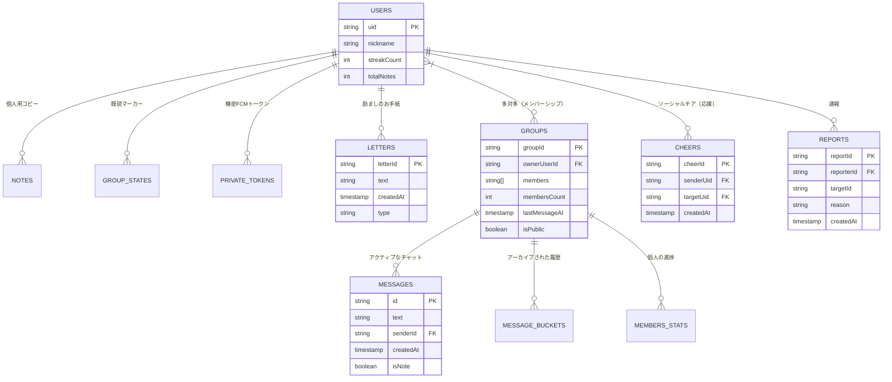
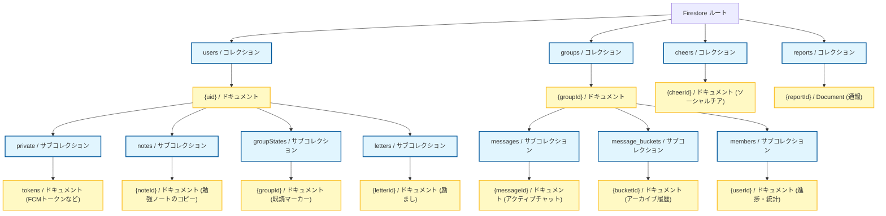

# データベースとスキーマの設計

このドキュメントでは、**scripture-habit** の安定したバックエンドを維持するために使用されているデータアーキテクチャ、エンティティ関係（ER）モデル、スキーマ計画、およびデータベースパターンについて定義します。

---

## 📂 エンティティ関係 (ER) モデル

当プロジェクトのデータモデルは、リアルタイム同期の必要性と長期的なデータ保存のバランスを取るために、階層構造を採用しています。



---

## 🌳 Firestore の階層パス構造

これらのコレクションとドキュメントが、Firestore の階層的なパスレイアウト（コレクション ➔ ドキュメント ➔ サブコレクション ➔ ドキュメント）内で物理的にどのように構成されているかをビジュアル化します。



---

## 🗺️ スキーマ計画と非正規化 (Denormalization)

### 1. `groups`
* **非正規化戦略**: `memberPreviews`（ニックネーム / 写真）と `lastMessageAt` をルートのグループドキュメントに直接保存します。これにより、クライアントのダッシュボードは二次的なドキュメントリクエストを行うことなく、アクティブなグループを即座に表示できます。
* **アクティビティ追跡**: メッセージコレクション全体をクエリすることなくグループのアクティビティを計算するために、`dailyActivity` にアクティブユーザー ID のリストを保存します。

### 2. `users`（プロファイル同期）
* **Shared ID**: 同期の問題を防ぐため、ドキュメント ID は Firebase Auth の UID と一致させます。
* **冗長性**: ユーザーのアクティブなグループを表示する際の検索を高速化するため、`groupIds`（配列）をユーザーオブジェクトに保存します。

### 3. サブコレクション（データの隔離）
* **`/messages`**: 軽量でリアルタイムなメッセージ更新のために最適化されています。
* **`/members`**: メインのグループドキュメントには大きすぎる、グループごとのメンバー統計情報（スタディポイント、個人の進捗）を保存します。

---

> [!IMPORTANT]
> ### 🛡️ セキュリティルールと書き込み権限
> 検証ルール（`isAuthenticated()`、`isAppCheckVerified()`）、メンバーシップのルックアップ、およびバックエンド専用の書き込み検証ポリシーの詳細については、**[Firebaseセキュリティルールと書き込み分離](firebase-security-rules.md)** を参照してください。
> すべてのクライアント更新およびトランザクションルーチンは、**[Firestoreトランザクションとカウンターサービスの設計](firestore-transactions-counters.md)** に記載されています。

---

## 📦 チャットのアーカイブ (バケットパターン)

Firestore のドキュメントサイズ制限（ドキュメントあたり 1MB）を回避し、クライアントのリアルタイム同期を軽量に保つため、アプリケーションはチャット履歴に対して **バケットパターン (Bucket Pattern)** を採用しています。

```
       [ クライアントチャットリスナー ] ─── 購読 (Subscribed) ───► [ groups/{id}/messages ] (アクティブ領域)
                                                                        │
                                                            (自動クローンスイープ)
                                                                        ▼
                                                       [ groups/{id}/message_buckets/{bucketId} ]
                                                                (アーカイブ・コールドストレージ)
```

### メカニズム:
* **アクティブコレクション**: アクティブなメッセージは `/messages` に保存され、サイズを小さく保ちます。
* **アーカイブのクローン**: 毎日実行されるクローンジョブ（`ArchiveService`）により、30日以上前の古いメッセージをバケット化されたサブコレクション `/message_buckets/{bucketId}` に移動します。
* **帯域幅の節約**: アクティブなチャットリスナーは軽量なままであり、クライアント同期が過剰なモバイルデータ通信やメモリを消費しないよう保証します。

---

## 🔐 プライベートデータの隔離

機密性の高いユーザーの認証情報や設定トークンは、一般的なクエリから切り離して保存されます：
`users/{uid}/private/tokens`

* **アクセスルール**: このサブコレクションへのアクセスはデータベースレベルで制限されています。グループのメンバーもグループのオーナーも、これらのドキュメントを表示することはできません。Admin SDK と該当するユーザー本人だけが、トークンを読み書きできます。
