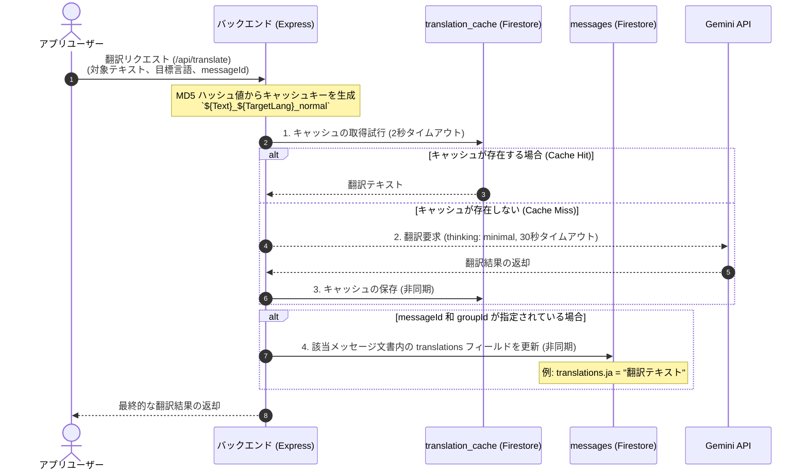
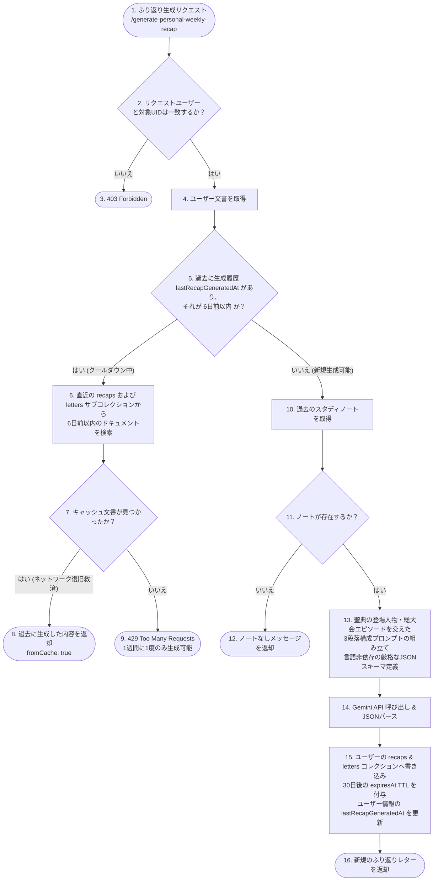

# 詳細解説：AI (Gemini) 統合と動的翻訳・週次ふり返りパイプライン

本ドキュメントでは、Scripture Habit の多言語対応を支える**「AI（Gemini）によるノート翻訳」**、学習習慣をパーソナライズする**「週次ふり返り（Weekly Recap）生成」**、およびコミュニティ活性化のための**「ディスカッショントピック自動生成」**のバックエンド実装とアーキテクチャについて詳細に解説します。

---

## Gemini API 共通呼び出し設計

AI の呼び出し処理は [ai.ts](../../../scripture-habit/api_internal/routes/ai.ts) の `callGemini` 関数に集約されています。

```typescript
const callGemini = async (prompt: string): Promise<string> => {
    if (!process.env.GEMINI_API_KEY) throw new Error('Gemini API Key missing');
    
    const apiUrl = `https://generativelanguage.googleapis.com/v1beta/models/gemini-3.1-flash-lite-preview:generateContent?key=${process.env.GEMINI_API_KEY}`;
    const response = await axios.post(apiUrl, { 
        contents: [{ parts: [{ text: prompt }] }],
        generationConfig: {
            thinkingConfig: {
                thinkingLevel: "minimal"
            }
        }
    }, { timeout: 30000 }); // 30秒タイムアウト設定

    const candidate = response.data?.candidates?.[0];
    if (candidate?.finishReason === 'SAFETY') {
        throw new Error('AI content blocked by safety filters');
    }

    const generatedText = candidate?.content?.parts?.[0]?.text;
    if (!generatedText) throw new Error('AI failed to generate a response');
    return generatedText.trim();
};
```

### 技術的な特徴と設計判断
1. **モデルの選択 (`gemini-3.1-flash-lite-preview`)**:
   モバイルアプリとチャット画面で動的に動作するため、**極めて高い応答速度と極限までの低コスト**を両立する Flash-Lite モデルを採用しています。
2. **`thinkingLevel: "minimal"` 設定**:
   Gemini 3.1 世代の推論プロセス（思考）を最小化する設定を明示的に指定しています。翻訳や定型要約など、深い推論ステップを必要としないタスクにおいて、**API レスポンス時間を半分以下に削減**するための重要なエンジニアリングです。
3. **安全フィルター（`finishReason === 'SAFETY'`）の検証**:
   聖句やユーザーの解釈内容を扱う特性上、Gemini 側の安全機構でコンテンツがブロックされた場合に、それを検知して適切なエラーハンドリングと Sentry へのイベント記録を行います。

---

## 動的翻訳パイプライン (Dynamic Translation)

他言語ユーザーがチャット画面で共有されたノートを読む際、リクエストに応じて翻訳が実行されます。サーバーは、不要な API コストを抑えるための **2段階のキャッシュ層** を備えています。

### 1. 翻訳処理のシーケンス図



---

### 2. バルク（一括）翻訳最適化: Batch Translation

複数のチャットメッセージを一括で翻訳する画面（チャットのスクロール時など）において、個別にリクエストを送ると「リクエスト過多（429エラー）」や「超高レイテンシ」を引き起こします。これに対処するため、**「一括取得 & 一括AI呼び出し & 一括キャッシュコミット」**を行う Batch 翻訳エンドポイント（`/api/translate-batch`）が実装されています。

#### 一括処理の3ステップ
1. **並列キャッシュチェック**:
   リクエストされたすべてのメッセージ ID に対応する MD5 キーを生成し、`Promise.all` を用いて Firestore から並行してキャッシュを読み込みます。
2. **単一プロンプトでのバッチAI推論**:
   キャッシュに存在しなかったメッセージ群をまとめ、**JSON マップ形式**で返すよう Gemini に指示する単一のプロンプトを構築して呼び出します。
   - プロンプト指示: `Format: {"msg_id": "translated_text", ...}`
3. **アトミックなバッチ書き込み (`db.batch()`)**:
   Gemini から返ってきた JSON をパースし、Firestore の **`db.batch()`（バッチコミット）** を用いて、「翻訳キャッシュ（`translation_cache`）」と「メッセージ文書（`messages`）」の両方に対して、一括でアトミックに書き込みを反映します。

---

## ふり返りレター（Reflection Letter / LetterBox）とスマート自己修復キャッシュ

ユーザーが日々の学習ノートを振り返り、AI から心温まるフィードバックレターを受け取る機能です。この機能には、**「聖典ストーリーテリングによる深い学び」**、**「言語非依存の構造化JSON出力」**、**「API 悪用防止」**、**「接続エラーからの優雅な回復」**、そして**「30日間の自動削除（TTL）」**が組み込まれています。

### 1. ふり返りレター生成フローチャート



### 2. 賢い「6日間クールダウン」と「復旧キャッシュ」の設計思想
AI レターの生成にはトークン数が多くかかるため、本来は「週に1度」に制限したい機能です。しかし、**ユーザーの端末の回線が途中で切れたり、アプリが急に閉じられた場合、単なる一律の 429 エラー制限にしてしまうと、ユーザーは「XPや生成権限を消費したのに、中身を見られなかった」という最悪の体験**をしてしまいます。

そこで Scripture Habit では以下のロジックを実装しています。
- **クールダウンの判定**: 生成時に `lastRecapGeneratedAt` のタイムスタンプが6日以内であるかを判定。
- **スマートリカバリー（救済措置）**: 判定がクールダウン内であった場合、即時にエラーを返すのではなく、データベース内のサブコレクション（`recaps` および `letters`）を走査し、**「直近6日以内に本当に生成された文書」があるか確認します。見つかった場合はそのデータを再利用してクライアントに返却（`fromCache: true`）**します。
- これにより、通信エラーによる再読み込み時でも、API コストを一切増やさず、ユーザーに生成済みのレターを確実に届けることができます。

### 3. 心に響く3段落ストーリーテリングプロンプト
AI レターは単なる要約ではなく、ユーザーの学習動機を温かく支えるため、以下の3段落構成で出力されます：
1. **共感と承認**: ユーザーが書き残したノートの気づきや葛藤に寄り添い、努力を認める。
2. **聖典・総大会のエピソード**: ノートのテーマに関連する聖典の登場人物（ネファイ、ヨセフ、ルツ、パウロなど）や教会指導者のストーリーを交え、新たな霊的視点を提供する。
3. **祝福と励まし**: 今後の生活に向けた温かい祈りと希望のメッセージで締めくくる。

また、出力フォーマットに `{ "title": "...", "letter": "..." }` という言語非依存の構造化 JSON を強制することで、11言語すべてにおいて正規表現の誤作動なく正確にタイトルと本文を抽出します。

### 4. Firestore Native TTL（30日自動削除）とウェルカムレター
- **TTL 自動削除**: 生成されたレターおよびふり返りデータには `expiresAt: now + 30 days` が付与され、Firestore の TTL ポリシーによって自動的に削除されます。
- **開発者からのウェルカムレター**: 新規登録時に `/api/auth/initialize-profile` を通じて多言語辞書テンプレートから作成され、`expiresAt` を持たないため手紙箱（LetterBox）に永久保存されます。

---

## コアコード解説

以下は、[ai.ts](../../../scripture-habit/api_internal/routes/ai.ts) 内の一括（バッチ）翻訳とふり返りレター処理の核心部分です。

### 1. 一括翻訳と JSON クリーニングの実装

```typescript
router.post('/translate-batch', authenticate, aiLimiter, verifyAppCheck, async (req: AuthenticatedRequest, res: Response) => {
    // キャッシュ確認と Gemini 呼び出しの実装
});
```

---

### 2. ふり返りレター生成と TTL 保存の実装

```typescript
router.post('/generate-personal-weekly-recap', authenticate, aiLimiter, verifyAppCheck, async (req: AuthenticatedRequest, res: Response) => {
    try {
        const validation = personalRecapSchema.safeParse(req.body);
        if (!validation.success) throw new ValidationError('Invalid input');

        const { uid, language } = validation.data;
        const baseLang = language?.split('-')[0] || 'en';
        const targetLangName = languageNames[baseLang] || 'English';

        if (req.user?.uid !== uid) throw new ForbiddenError('Forbidden');

        const userRef = db.collection('users').doc(uid);
        const uSnap = await userRef.get();
        if (!uSnap.exists) throw new NotFoundError('User not found');
        const uData = uSnap.data() || {};

        // === クールダウンチェック（6日間制限） & 自己修復キャッシュ ===
        if (uData.lastRecapGeneratedAt) {
            const lastDate = (uData.lastRecapGeneratedAt as admin.firestore.Timestamp).toDate();
            const sixDaysAgo = new Date();
            sixDaysAgo.setDate(sixDaysAgo.getDate() - 6);

            if (lastDate > sixDaysAgo) {
                let cachedRecapText: string | null = null;
                let cachedTitle: string | null = null;
                try {
                    // 1. 直近生成されたサブコレクション 'recaps' を検索
                    const recentRecapSnap = await userRef.collection('recaps')
                        .orderBy('createdAt', 'desc')
                        .limit(1)
                        .get();
                    if (!recentRecapSnap.empty) {
                        const recentRecapData = recentRecapSnap.docs[0].data();
                        const recapDate = (recentRecapData.createdAt as admin.firestore.Timestamp).toDate();
                        if (recapDate > sixDaysAgo && recentRecapData.text) {
                            cachedRecapText = recentRecapData.text;
                        }
                    }

                    // 2. letters サブコレクションへのフォールバック
                    if (!cachedRecapText) {
                        const recentLettersSnap = await userRef.collection('letters')
                            .orderBy('createdAt', 'desc')
                            .limit(5)
                            .get();
                        const recentLetterDoc = recentLettersSnap.docs.find(d => d.data().type === 'weekly_recap');
                        if (recentLetterDoc) {
                            const letterData = recentLetterDoc.data();
                            const letterDate = (letterData.createdAt as admin.firestore.Timestamp).toDate();
                            if (letterDate > sixDaysAgo && letterData.content) {
                                cachedRecapText = letterData.content;
                                cachedTitle = letterData.title || null;
                            }
                        }
                    }

                    if (cachedRecapText) {
                        return res.json({
                            success: true,
                            recap: cachedRecapText,
                            title: cachedTitle,
                            message: 'Returned cached recent recap.',
                            fromCache: true
                        });
                    }
                } catch (cacheErr) {
                    console.warn('[AI Personal Recap] Failed to retrieve cached recap:', cacheErr);
                }

                throw new AppError('Personal recap already generated recently. Please wait a week.', 429);
            }
        }

        // === 新規生成処理（聖典ストーリーテリング & 構造化 JSON 出力） ===
        const notesQuery = userRef.collection('notes')
            .orderBy('createdAt', 'desc')
            .limit(30)
            .get();
        const snapshot = await withTimeout(notesQuery, 8000, 'Firestore timeout');
        if (!snapshot) throw new Error('Failed to fetch personal notes');

        const notes: string[] = [];
        (snapshot as admin.firestore.QuerySnapshot).forEach(d => { 
            const data = d.data();
            const content = data.comment || data.text;
            if (content) {
                const truncated = content.length > 1000 ? content.substring(0, 1000) + '...' : content;
                notes.push(truncated); 
            }
        });

        if (notes.length === 0) return res.json({ message: 'No personal notes found for this week.' });

        const prompt = `You are a warm, wise, and spiritually uplifting scripture study mentor.
Write a deeply encouraging personal reflection letter based on the user's study notes.
Structure:
1. Warm reflection & empathy for their study.
2. An inspiring story or lesson from a figure in the Standard Works or General Conference speaker.
3. A heartfelt blessing and encouragement.

Respond in strict JSON format:
{
  "title": "A short inspiring title",
  "letter": "The full letter body..."
}

Language: ${targetLangName}
Notes: ${notes.join('\n\n')}`;

        const rawResponse = await callGemini(prompt);
        const jsonMatch = rawResponse.match(/\{[\s\S]*\}/);
        const parsed = JSON.parse(jsonMatch ? jsonMatch[0] : rawResponse);

        // 30日後の TTL タイムスタンプ
        const thirtyDaysFromNow = new Date();
        thirtyDaysFromNow.setDate(thirtyDaysFromNow.getDate() + 30);
        const expiresAtTimestamp = admin.firestore.Timestamp.fromDate(thirtyDaysFromNow);

        // letters サブコレクションへ保存
        await userRef.collection('letters').add({
            title: parsed.title,
            content: parsed.letter,
            type: 'weekly_recap',
            createdAt: admin.firestore.FieldValue.serverTimestamp(),
            expiresAt: expiresAtTimestamp,
            read: false,
        });

        res.json({ success: true, recap: parsed.letter, title: parsed.title });
    } catch (err) {
        handleAiError(res, err, 'personal recap');
    }
});
```
