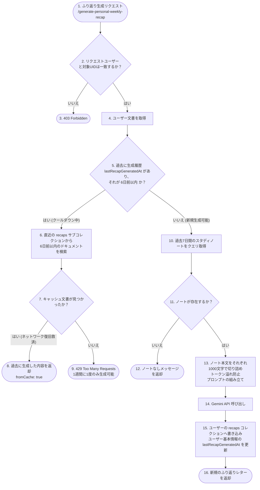

# 🔬 詳細解説：AI (Gemini) 統合と動的翻訳・週次ふり返りパイプライン

本ドキュメントでは、Scripture Habit の多言語対応を支える**「AI（Gemini）によるノート翻訳」**、学習習慣をパーソナライズする**「週次ふり返り（Weekly Recap）生成」**、およびコミュニティ活性化のための**「ディスカッショントピック自動生成」**のバックエンド実装とアーキテクチャについて詳細に解説します。

---

## ⚡ Gemini API 共通呼び出し設計

AI の呼び出し処理は [ai.ts](../../../scripture-habit/api_internal/routes/ai.ts) の `callGemini` 関数に集約されています。

```typescript
const callGemini = async (prompt: string): Promise<string> => {
    if (!process.env.GEMINI_API_KEY) throw new Error('Gemini API Key missing');
    
    const apiUrl = `https://generativelanguage.googleapis.com/v1beta/models/gemini-3.1-flash-lite-preview:generateContent?key=${process.env.GEMINI_API_KEY}`;
    const response = await axios.post(apiUrl, { 
        contents: [{ parts: [{ text: prompt }] }],
        generationConfig: {
            thinkingConfig: {
                thinkingLevel: "minimal"
            }
        }
    }, { timeout: 30000 }); // 30秒タイムアウト設定

    const candidate = response.data?.candidates?.[0];
    if (candidate?.finishReason === 'SAFETY') {
        throw new Error('AI content blocked by safety filters');
    }

    const generatedText = candidate?.content?.parts?.[0]?.text;
    if (!generatedText) throw new Error('AI failed to generate a response');
    return generatedText.trim();
};
```

### 技術的な特徴と設計判断
1. **モデルの選択 (`gemini-3.1-flash-lite-preview`)**:
   モバイルアプリとチャット画面で動的に動作するため、**極めて高い応答速度と極限までの低コスト**を両立する Flash-Lite モデルを採用しています。
2. **`thinkingLevel: "minimal"` 設定**:
   Gemini 3.1 世代の推論プロセス（思考）を最小化する設定を明示的に指定しています。翻訳や定型要約など、深い推論ステップを必要としないタスクにおいて、**API レスポンス時間を半分以下に削減**するための重要なエンジニアリングです。
3. **安全フィルター（`finishReason === 'SAFETY'`）の検証**:
   聖句やユーザーの解釈内容を扱う特性上、Gemini 側の安全機構でコンテンツがブロックされた場合に、それを検知して適切なエラーハンドリングと Sentry へのイベント記録を行います。

---

## 🔄 動的翻訳パイプライン (Dynamic Translation)

他言語ユーザーがチャット画面で共有されたノートを読む際、リクエストに応じて翻訳が実行されます。サーバーは、不要な API コストを抑えるための **2段階のキャッシュ層** を備えています。

### 1. 翻訳処理のシーケンス図


---

### 2. バルク（一括）翻訳最適化: Batch Translation

複数のチャットメッセージを一括で翻訳する画面（チャットのスクロール時など）において、個別にリクエストを送ると「リクエスト過多（429エラー）」や「超高レイテンシ」を引き起こします。これに対処するため、**「一括取得 & 一括AI呼び出し & 一括キャッシュコミット」**を行う Batch 翻訳エンドポイント（`/api/translate-batch`）が実装されています。

#### 一括処理の3ステップ
1. **並列キャッシュチェック**:
   リクエストされたすべてのメッセージ ID に対応する MD5 キーを生成し、`Promise.all` を用いて Firestore から並行してキャッシュを読み込みます。
2. **単一プロンプトでのバッチAI推論**:
   キャッシュに存在しなかったメッセージ群をまとめ、**JSON マップ形式**で返すよう Gemini に指示する単一のプロンプトを構築して呼び出します。
   - プロンプト指示: `Format: {"msg_id": "translated_text", ...}`
3. **アトミックなバッチ書き込み (`db.batch()`)**:
   Gemini から返ってきた JSON をパースし、Firestore の **`db.batch()`（バッチコミット）** を用いて、「翻訳キャッシュ（`translation_cache`）」と「メッセージ文書（`messages`）」の両方に対して、一括でアトミックに書き込みを反映します。

---

## 📅 週次ふり返り（Weekly Recap）とスマート自己修復キャッシュ

ユーザーが過去7日間の学習ノートを振り返り、AI から心温まるフィードバックレターを受け取る機能です。この機能には、**「API 悪用防止」**と**「接続エラーからの優雅な回復」**という2つの相反する要件を満たすスマートな判定設計が組み込まれています。

### 1. 週次ふり返り生成フローチャート



### 2. 賢い「6日間クールダウン」と「復旧キャッシュ」の設計思想
AI レターの生成にはトークン数が多くかかるため、本来は「週に1度」に制限したい機能です。しかし、**ユーザーの端末の回線が途中で切れたり、アプリが急に閉じられた場合、単なる一律の 429 エラー制限にしてしまうと、ユーザーは「XPや生成権限を消費したのに、中身を見られなかった」という最悪の体験**をしてしまいます。

そこで Scripture Habit では以下のロジックを実装しています。
- **クールダウンの判定**: 生成時に `lastRecapGeneratedAt` のタイムスタンプが6日以内であるかを判定。
- **スマートリカバリー（救済措置）**: 判定がクールダウン内であった場合、即時にエラーを返すのではなく、データベース内のサブコレクション（`recaps` および `letters`）を走査し、**「直近6日以内に本当に生成された文書」があるか確認します。見つかった場合はそのデータを再利用してクライアントに返却（`fromCache: true`）**します。
- これにより、通信エラーによる再読み込み時でも、API コストを一切増やさず、ユーザーに生成済みのレターを確実に届けることができます。

---

## 💻 コアコード解説

以下は、[ai.ts](../../../scripture-habit/api_internal/routes/ai.ts) 内の一括（バッチ）翻訳と週次ふり返り処理の核心部分です。

### 1. 一括翻訳と JSON クリーニングの実装

```typescript
router.post('/translate-batch', authenticate, aiLimiter, verifyAppCheck, async (req: AuthenticatedRequest, res: Response) => {
    const validation = translateBatchSchema.safeParse(req.body);
    if (!validation.success) return res.status(400).json({ error: 'Invalid input' });
    
    const { messages, targetLanguage, groupId, force } = validation.data;
    const finalResults: Record<string, string> = {};
    const toTranslate: Array<{ id: string; text: string }> = [];

    // 1. 各メッセージのキャッシュをFirestoreから並行チェック
    if (!force && db) {
        try {
            const cachePromises = messages.map(async (msg) => {
                const cacheKey = crypto.createHash('md5').update(`${msg.text}_${targetLanguage}_normal`).digest('hex');
                const cacheRef = db.collection('translation_cache').doc(cacheKey);
                try {
                    const cacheDoc = await withTimeout(cacheRef.get(), 2000);
                    if (cacheDoc && cacheDoc.exists) {
                        return { msg, translatedText: cacheDoc.data()?.translatedText };
                    }
                } catch {}
                return { msg, translatedText: null };
            });
            
            const cacheResults = await Promise.all(cachePromises);
            for (const result of cacheResults) {
                if (result.translatedText) {
                    finalResults[result.msg.id] = result.translatedText;
                } else {
                    toTranslate.push(result.msg); // キャッシュがないものだけを翻訳リストに追加
                }
            }
        } catch {
            toTranslate.push(...messages);
        }
    } else {
        toTranslate.push(...messages);
    }

    if (toTranslate.length === 0) return res.json({ success: true, translations: finalResults });

    // 2. まとめてAIにリクエスト (JSON出力の強制)
    try {
        const targetLangName = languageNames[targetLanguage] || targetLanguage;
        const prompt = `Task: Translate these message items into ${targetLangName}.
            【STRICT RULES】:
            1. Preserve the exact markdown structure, especially bold labels like **Category:** or **Comment:**.
            2. Translate the labels themselves into ${targetLangName}.
            3. Output ONLY a valid JSON object mapping IDs to their translations. NO markdown backticks or extra text.
            
            Format: {"msg_id": "translated_text", ...}
            
            Messages:
            ${JSON.stringify(toTranslate.map(m => ({ id: m.id, text: m.text })))}`;
        
        const resultRaw = await callGemini(prompt);

        // 3. 堅牢な JSON クリーニング処理
        // AIがマークダウンブロック（```json ... ```）等で囲んで返答してきた場合の対策
        const jsonStart = resultRaw.indexOf('{');
        const jsonEnd = resultRaw.lastIndexOf('}');
        if (jsonStart === -1 || jsonEnd === -1) {
            throw new Error('AI returned invalid JSON format');
        }
        const cleanedJson = resultRaw.substring(jsonStart, jsonEnd + 1);
        const batchTranslations = JSON.parse(cleanedJson);

        // 4. Firestore バッチコミットによる高速・安全な一括保存
        if (db) {
            const batch = db.batch();
            for (const msg of toTranslate) {
                const translated = batchTranslations[msg.id];
                if (translated) {
                    finalResults[msg.id] = translated;
                    
                    // キャッシュドキュメントのバッチ登録
                    const cacheKey = crypto.createHash('md5').update(`${msg.text}_${targetLanguage}_normal`).digest('hex');
                    const cacheRef = db.collection('translation_cache').doc(cacheKey);
                    batch.set(cacheRef, { 
                        originalText: msg.text, 
                        translatedText: translated, 
                        targetLanguage, 
                        createdAt: admin.firestore.FieldValue.serverTimestamp() 
                    });
                    
                    // チャットメッセージ本体内の翻訳フィールドの更新
                    const messageRef = db.collection('groups').doc(groupId).collection('messages').doc(msg.id);
                    batch.set(messageRef, { 
                        translations: { [targetLanguage]: translated } 
                    }, { merge: true });
                }
            }
            await withTimeout(batch.commit(), 5000, 'Batch commit timeout');
        }

        res.json({ success: true, translations: finalResults });
    } catch (err) {
        handleAiError(res, err, 'batch translation');
    }
});
```

---

### 2. 週次ふり返りの通信タイムアウト救済キャッシュの実装

```typescript
router.post('/generate-personal-weekly-recap', authenticate, aiLimiter, verifyAppCheck, async (req: AuthenticatedRequest, res: Response) => {
    const validation = personalRecapSchema.safeParse(req.body);
    if (!validation.success) return res.status(400).json({ error: 'Invalid input' });

    const { uid, language } = validation.data;
    const baseLang = language?.split('-')[0] || 'en';
    const targetLangName = languageNames[baseLang] || 'English';

    try {
        if (req.user?.uid !== uid) return res.status(403).send('Forbidden');

        const userRef = db.collection('users').doc(uid);
        const uSnap = await userRef.get();
        if (!uSnap.exists) return res.status(404).send('User not found');
        const uData = uSnap.data() || {};

        // === クールダウンチェック（6日間制限） ===
        if (uData.lastRecapGeneratedAt) {
            const lastDate = (uData.lastRecapGeneratedAt as admin.firestore.Timestamp).toDate();
            const sixDaysAgo = new Date();
            sixDaysAgo.setDate(sixDaysAgo.getDate() - 6);

            if (lastDate > sixDaysAgo) {
                let cachedRecapText: string | null = null;
                try {
                    // 1. 直近生成されたサブコレクション 'recaps' を検索
                    const recentRecapSnap = await userRef.collection('recaps')
                        .orderBy('createdAt', 'desc')
                        .limit(1)
                        .get();
                    if (!recentRecapSnap.empty) {
                        const recentRecapData = recentRecapSnap.docs[0].data();
                        const recapDate = (recentRecapData.createdAt as admin.firestore.Timestamp).toDate();
                        if (recapDate > sixDaysAgo && recentRecapData.text) {
                            cachedRecapText = recentRecapData.text; // キャッシュヒット
                        }
                    }

                    // キャッシュが見つかった場合は、429制限を回避して過去のレターを安全に再送する
                    if (cachedRecapText) {
                        return res.json({
                            success: true,
                            recap: cachedRecapText,
                            message: 'Returned cached recent recap.',
                            fromCache: true
                        });
                    }
                } catch (cacheErr) {
                    console.warn('[AI Personal Recap] Failed to retrieve cached recap:', cacheErr);
                }

                // キャッシュが何らかの理由で取得できない場合のみ、429制限とする
                return res.status(429).json({ error: 'Personal recap already generated recently.' });
            }
        }

        // === 新規生成処理 ===
        const sevenDaysAgo = new Date();
        sevenDaysAgo.setDate(sevenDaysAgo.getDate() - 7);
        
        // 過去7日間の学習ノートをクエリ
        const snapshot = await withTimeout(
            userRef.collection('notes')
                .where('createdAt', '>=', admin.firestore.Timestamp.fromDate(sevenDaysAgo))
                .orderBy('createdAt', 'asc')
                .limit(100)
                .get(),
            8000
        );

        const notes: string[] = [];
        snapshot.forEach(d => { 
            const data = d.data();
            const content = data.comment || data.text;
            if (content) {
                // LLMのコンテキスト長あふれを防止するため、1ノートあたり1000文字で制限（安全設計）
                const truncated = content.length > 1000 ? content.substring(0, 1000) + '...' : content;
                notes.push(truncated); 
            }
        });

        if (notes.length === 0) {
            return res.json({ message: 'No personal notes found for this week.' });
        }

        const prompt = `Task: Write a warm personal letter summarizing these study notes and encouraging the user. 
            Start with "Dear Friend" (or the equivalent in the output language).
            Notes: ${notes.join('\n\n')}
            
            【STRICT RULES】:
            1. You MUST respond ONLY in ${targetLangName}.`;

        const generatedText = await callGemini(prompt);

        // データベース保存処理（タイムスタンプの更新とサブコレクション登録）
        const recapRef = userRef.collection('recaps').doc();
        await recapRef.set({
            text: generatedText,
            createdAt: admin.firestore.FieldValue.serverTimestamp(),
            type: 'weekly_encouragement'
        });
        await userRef.update({
            lastRecapGeneratedAt: admin.firestore.FieldValue.serverTimestamp()
        });

        res.json({ success: true, recap: generatedText });
    } catch (err) {
        handleAiError(res, err, 'personal recap');
    }
});
```
