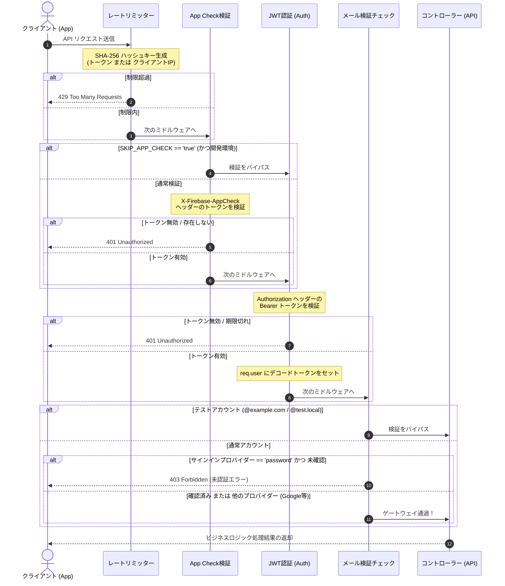

# 🔬 詳細解説: App Check と API ゲートウェイ保護セキュリティ

本書では、Scripture Habit の API サーバー（Vercel Serverless）を悪質な攻撃やスパムアクセスから保護する**「API ゲートウェイセキュリティ」**と、モバイル環境での開発・テストを両立させる**「例外バイパス設計」**について詳しく解説します。

---

## 🛡️ 多層防御（Defense-in-Depth）セキュリティトポロジ

Scripture Habit のバックエンド API は、段階的にセキュリティレベルを引き上げる**多層防御（Defense in Depth）**を採用しています。リクエストがコントローラー（ビジネスロジック）に到達するまでに、最大 5 段階のフィルターを通過します。

1. **CORS 検証**: 許可されていないオリジン（ドメイン）からのブラウザ経由のアクセスを排除。
2. **レートリミット（Rate Limiting）**: DDoS 攻撃や過剰な API 呼び出しをブロック。プライバシー対応のハッシュ化方式を採用。
3. **Firebase App Check**: 非公式アプリや直接的な API リクエスト（Curl, Postman等）を強力にブロック。
4. **Bearer JWT 認証（Firebase Auth）**: 正当な認証情報を持つ個別のユーザーを識別。
5. **メール検証チェック（Email Verified）**: パスワードログインユーザーに対してのみ、メールアドレス確認状態を強制。

---

## 🔄 API リクエスト検証シーケンス

以下は、リクエストがゲートウェイを通過してコントローラーに到達するまでのアトミックな検証シーケンスです。



---

## 🔒 Firebase App Check 検証と本番ガード

Firebase **App Check** は、公式に登録されたアプリケーション（Viteフロントエンド）から送信されたリクエストであるかを検証する防御システムです。

### 堅牢な「本番セキュリティガード」の設計
モバイルエミュレータを用いたローカル開発中、App Check を通過することは困難です。そのため開発環境用に `SKIP_APP_CHECK` 環境変数が用意されていますが、**これが本番環境（`NODE_ENV === 'production'`）で誤って有効化された場合、バックエンドの防御が完全に無効化されるという重大なセキュリティリスク**が発生します。

これを防止するため、`verifyAppCheck` ミドルウェアには**「本番ガード」**が二重に仕込まれています。

```typescript
// 本番（production）かつ SKIP_APP_CHECK が有効な場合、警告を出しリクエストを強制ブロック
if (skipRequested) {
    if (isProduction) {
        console.error('[SECURITY ALERT] SKIP_APP_CHECK is enabled in production! This is forbidden.');
        return next(new AppError('Unauthorized: Security check required', 401, 'APP_CHECK_FAILED'));
    }
    console.warn('[AppCheck] Skipping verification (Development only)');
    return next();
}
```

---

## ⚙️ 開発・テスト時のバイパス判定フロー

セキュリティを高めつつ、**「開発時の開発効率」**と**「Playwright による CI/CD E2E テストの完全自動化」**を両立するためのバイパス決定木は以下の通りです。

```mermaid
flowchart TD
    Request([API リクエスト受信]) --> AppCheckStep{1. App Checkの検証}
    
    %% App Check 分岐
    AppCheckStep --> SkipRequested{SKIP_APP_CHECK == 'true' か？}
    SkipRequested -- はい --> CheckProd{NODE_ENV == 'production' か？}
    CheckProd -- はい (本番エラー) --> Block401([401 Unauthorized を返却])
    CheckProd -- いいえ (開発環境) --> BypassAppCheck[App Check検証をスキップ]
    
    SkipRequested -- いいえ --> VerifyToken[Firebase Admin SDK でトークンを検証]
    VerifyToken -- 検証失敗 --> Block401
    VerifyToken -- 検証成功 --> AuthStep[2. JWT 認証ステップへ]
    BypassAppCheck --> AuthStep

    %% JWT & メール認証分岐
    AuthStep --> DecodedToken[トークンをデコードして req.user に格納]
    DecodedToken --> EmailStep{3. メール認証確認}
    
    EmailStep --> TestAccount{テストドメインアカウント<br/>(@example.com / @test.local)<br/>かつ !isProd か？}
    TestAccount -- はい (Playwrightテスト) --> BypassEmail[メール認証をスキップ]
    TestAccount -- いいえ --> ProviderCheck{ログイン方法は 'password'<br/>(メール・パスワード) か？}
    
    ProviderCheck -- いいえ (Google等の外部連携) --> Allowed([処理をコントローラーへ引き渡す])
    ProviderCheck -- はい --> CheckVerified{email_verified == true か？}
    
    CheckVerified -- はい --> Allowed
    CheckVerified -- いいえ --> Block403([403 Forbidden を返却])
    BypassEmail --> Allowed
```

---

## 🛡️ プライバシーを配慮したハッシュ型レートリミット

API サーバーに送られてくるリクエストを制限する際、一般的な IP アドレスベースのレートリミットは、サーバーのログやメモリ上に**生（プレーンテキスト）のIPアドレス**を保持してしまい、GDPR等のプライバシー規制において懸念事項となります。また、IPv6 やリバースプロキシを介したアクセスでは正しい判定ができない問題もあります。

Scripture Habit では、**SHA-256 による暗号ハッシュ型レートリミット**（`aiLimiterKeyGenerator`）を採用しています。

### メリットと設計決定
- **暗号ハッシュ化**: `Authorization` トークン、またはクライアントIPアドレスを SHA-256 でハッシュ化した値（ヘキサ文字列）をキーとして使用します。生のIPアドレスや個人情報はメモリ上にもログ上にも残らないため、**高いプライバシー性**が保証されます。
- **IPv6 とプロキシの標準化**: `req.headers['x-forwarded-for']` などのプロキシヘッダーから抽出されたクライアント情報を安全にハッシュ化するため、Vercelなどのサーバーレス環境や CDN ロードバランサ経由であっても、安定してレート制限が適用されます。

---

## 💻 コアコード解説

以下は、`api_internal/lib/middleware.ts` の核心ロジックと詳細注釈です。

### 1. プライバシー対応ハッシュキー生成器 (`aiLimiterKeyGenerator`)

```typescript
export const aiLimiterKeyGenerator = (req: Request) => {
    const authHeader = req.header('Authorization');
    
    // 1. 認証済みユーザーの場合は Bearer トークンを SHA-256 ハッシュ化して一意キーにする
    if (authHeader && authHeader.startsWith('Bearer ')) {
        return crypto.createHash('sha256').update(authHeader).digest('hex');
    }
    
    // 2. 未認証またはトークンがない場合は IP アドレスを取得
    const ip = (req.ip || req.headers['x-forwarded-for'] || req.socket.remoteAddress || 'unknown').toString();
    
    // 3. 生のIPをメモリに保持せず、ハッシュ化してプライバシーを保護しつつキー化
    return crypto.createHash('sha256').update(ip).digest('hex');
};

export const aiLimiter = rateLimit({
    windowMs: 60 * 60 * 1000, // 1時間制限窓
    limit: isProd ? 100 : 5000, // 本番は1時間100回、開発テスト時は5000回まで許可
    message: { error: 'AI limit reached. Please try again in an hour.' },
    standardHeaders: 'draft-7',
    legacyHeaders: false,
    keyGenerator: aiLimiterKeyGenerator,
    validate: { default: false } // IPv6 の逆引きに関する警告を無効化する安全設定
});
```

---

### 2. 本番ガード機能付き App Check 検証ミドルウェア (`verifyAppCheck`)

```typescript
export const verifyAppCheck = async (req: Request, _res: Response, next: NextFunction) => {
    const isProduction = process.env.NODE_ENV === 'production';
    const skipRequested = process.env.SKIP_APP_CHECK === 'true';

    // 1. 開発中のApp Checkスキップ処理と、本番での二重ガード
    if (skipRequested) {
        if (isProduction) {
            // 本番環境であるにもかかわらずSKIP環境変数が有効になっている場合、大至急ブロック
            console.error('[SECURITY ALERT] SKIP_APP_CHECK is enabled in production! This is forbidden.');
            return next(new AppError('Unauthorized: Security check required', 401, 'APP_CHECK_FAILED'));
        }
        console.warn('[AppCheck] Skipping verification (Development only)');
        return next();
    }

    // 2. ヘッダーから App Check トークンを抽出
    const token = req.header('X-Firebase-AppCheck');
    if (!token) {
        console.warn('[AppCheck] Security context missing from:', req.ip);
        // エラーハンドラー経由で401 Unauthorizedとして処理を引き渡す
        return next(new AppError('Unauthorized: Security check missing', 401, 'APP_CHECK_MISSING'));
    }

    try {
        if (!appCheck) {
            throw new Error('Firebase App Check service is unavailable. Please ensure FIREBASE_SERVICE_ACCOUNT or similar environment variables are set in production.');
        }
        // 3. Firebase Admin SDK による公式暗号署名検証
        await appCheck.verifyToken(token);
        next();
    } catch (err: unknown) {
        const error = err as Error;
        console.warn('[AppCheck] Verification failed for token:', token.substring(0, 10) + '...', 'Error:', error.message);
        
        // サービス一時停止（503）または トークン無効（401）を的確にハンドリングしてエラー返却
        return next(new AppError('Unauthorized: Security check failed', error.message.includes('unavailable') ? 503 : 401, 'APP_CHECK_FAILED'));
    }
};
```

---

### 3. テストバイパス付きメール検証ミドルウェア (`requireEmailVerified`)

```typescript
export const requireEmailVerified = (req: AuthenticatedRequest, _res: Response, next: NextFunction) => {
    // 前段の authenticate ミドルウェアを通過していることを保証
    if (!req.user) {
        return next(new AppError('Unauthorized: Not authenticated', 401, 'UNAUTHENTICATED'));
    }

    // 1. Playwright / CI パイプラインで使用されるテスト用アカウントの救済バイパス
    // 非本番環境かつメールアドレスが特定のテストドメインで終わる場合、メール確認済みのフローを自動で通過させる
    const isTestAccount = !isProd && (req.user.email?.endsWith('@example.com') || req.user.email?.endsWith('@test.local'));
    if (isTestAccount) {
        return next();
    }

    // 2. パスワード認証アカウントの場合のみメール確認状況を強制
    // （OAuth連携（Googleなど）のアカウントは、連携時点で確認されているためチェックをスルー）
    if (req.user.firebase.sign_in_provider === 'password' && !req.user.email_verified) {
        return next(new AppError('Email not verified. Please verify your email.', 403, 'auth/email-not-verified'));
    }

    next();
};
```
