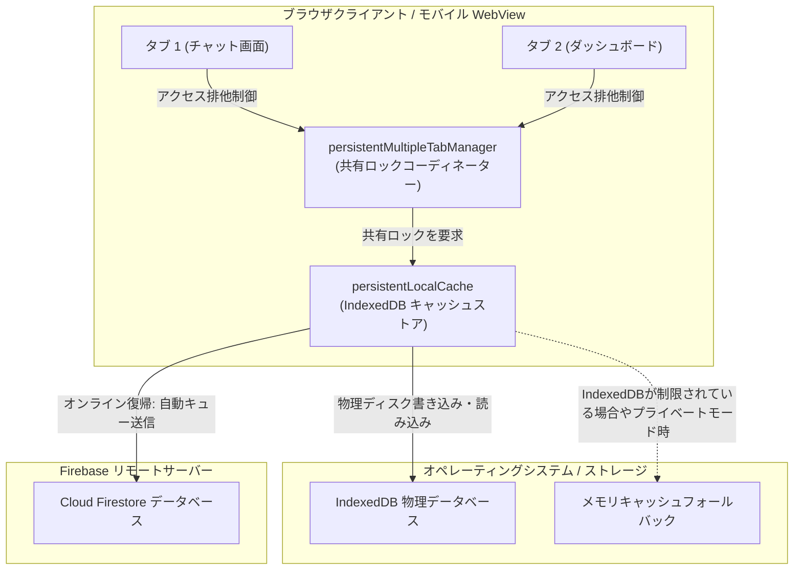
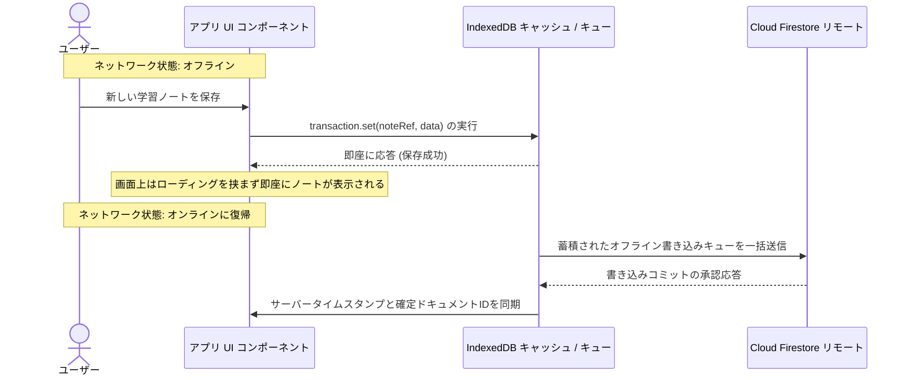

# Firestore オフライン永続化 & 複数タブ同期ロジック — 詳細設計ガイド

## 概要

Progressive Web Apps (PWA) およびハイブリッドモバイルクライアントは、電波の届かない地下鉄の移動中や一時的な通信切断環境（トンネル内など）であっても、ユーザーにストレスを与えることなく機能し続ける必要があります。このオフライン体験を支えるために、**scripture-habit** は Google Cloud Firestore の永続性ローカルキャッシュレイヤーを統合し、強固なデータ永続化と複数ブラウザタブ間での同期処理を実現しています。

この永続化システムは [`firebase.ts`](../../scripture-habit/src/firebase.ts) で初期化され、IndexedDB を活用したアトミックな書き込みキュー、タブ間の共有ロック（Shared-Locks）によるデータ競合防止、通信復帰時の自動同期、およびシークレットブラウザ等の機能制限環境に対するフェイルオーバー機能を備えています。



---

## 1. 複数タブ同期（Multi-Tab Sync）& 共有ロックの仕組み

標準のシングルタブ永続化（Single-Tab Persistence）設定では、ブラウザが IndexedDB のストレージインスタンスに対して排他的な書き込みロックを獲得します。そのため、ユーザーが同じアプリを別のタブで同時に開いた場合（例：片方でダッシュボードを開き、もう片方でグループチャットを開く等）、2番目のタブは IndexedDB へのアクセスを拒否され、低速なインメモリキャッシュへの移行を余儀なくされます。これによりタブ間でデータにズレが生じ、同じドキュメントを何度もダウンロードし直すため読み取り料金が重複して発生します。

この無駄を防止するため、**scripture-habit** は複数タブ間でIndexedDBを安全に共有するマネージャーを構成しています。

```typescript
db = initializeFirestore(app, {
  localCache: persistentLocalCache({
    tabManager: persistentMultipleTabManager()
  })
});
```

### 1.1 排他制御とタブ間連携プロセス
`persistentMultipleTabManager` は、ブラウザ標準の **Web Locks API** またはローカルストレージ（LocalStorage）内のトークンを用いて、複数のウィンドウ間で以下のように役割を分配します。

1.  **アクティブマスター（主導タブ）の選出**: 複数のタブが同時に開かれた場合、マネージャーは1つのタブを「マスタータブ」として指名します。マスタータブのみが IndexedDB への直接の読み書き処理とロック権を保持します。
2.  **セカンダリタブ（待機タブ）の挙動**: 残りのタブは「セカンダリタブ」として動作します。セカンダリタブは IndexedDB に直接書き込むのではなく、マスタータブとの間でインメモリのブロードキャストチャンネルを通じて変更データをやり取りし、連動して動作します。
3.  **シームレスなフェイルオーバー**: ユーザーがマスタータブを閉じた場合、待機していたセカンダリタブが即座にロックの喪失を検知します。すぐに新しいマスタータブが自動選出されて IndexedDB の制御権を引き継ぐため、アプリは一切フリーズすることなく稼働し続けます。

### 1.2 オフライン書き込みキューと自動バックグラウンド同期

ユーザーがオフライン状態の時、学習ノートの作成やメッセージの送信といった書き込みアクションはエラーで拒否されません。Firestore SDK は、ローカルに適用された変更を IndexedDB 内の **「オフラインミューテーションキュー（書き込み待ち行列）」** に安全に一時蓄積します。



この処理のおかげで、ネットワークの再ネゴシエーションを待って画面が砂時計（ローディング）で止まることがなくなり、完全にゼロレイテンシーのユーザー体験が実現します。

---

## 2. プライベートブラウジング時のフォールバック保護

iOS Safari のプライベートブラウジングモード（シークレットモード）や、サンドボックス化された特定の WebView 内では、プライバシーとセキュリティの制限により IndexedDB へのアクセスがブラウザ自体によって完全に遮断されます。この状態で無条件に永続化を有効化しようとすると、Firestore SDK が致命的な初期化例外を投げ、アプリ全体がロード画面でクラッシュしてしまいます。

この致命的なクラッシュを防止し、どのようなブラウザ環境でも確実にアプリを起動させるために、**scripture-habit** はデータベースの初期化プロセスを try-catch ブロックで安全に保護しています。

```typescript
let db: Firestore;
try {
  // 1. 高性能な複数タブ対応のオフラインキャッシュの初期化を試行
  db = initializeFirestore(app, {
    localCache: persistentLocalCache({
      tabManager: persistentMultipleTabManager()
    })
  });
} catch (e) {
  // 2. IndexedDB がブロックされている場合は標準のメモリキャッシュへフォールバック
  console.error("Firestore initialization with persistence failed, falling back to default:", e);
  db = getFirestore(app); 
}
```

### 2.1 各モードのパフォーマンス動作対比

| 評価指標 | 通常のオフラインキャッシュモード（IndexedDB） | プライベートブラウジング・フォールバックモード（メモリ） |
|---|---|---|
| **ストレージエンジン** | 物理ディスクの IndexedDB キャッシュ | JS ランタイム上のメモリキャッシュ |
| **オフライン耐久性** | ブラウザを閉じても半永久的に維持 | ブラウザタブを閉じるとデータは完全に消失 |
| **タブ間同期同期** | ブロードキャスト通信経由で完全に同期 | タブごとにそれぞれメモリ内に独立保持 |
| **通信読み取りコスト** | 極めて優秀（ローカルディスクから読み出すため） | 標準（アプリ起動のたびに全件リモートから再取得） |

このフェイルオーバー戦略により、ユーザーがどれほど厳格なブラウザのプライバシー設定を利用していても、アプリがクラッシュして起動しなくなるリスクをゼロに抑えています。

---

## 3. E2E 自動テストにおける高速化チューニング

Playwright などの自動テストランナー（ヘッドレス Chromium 等）が走る CI/CD 環境では、ブラウザは常に「クッキーや履歴が完全に空のクリーンプロファイル」で起動されます。デフォルト状態の Firebase Authentication はセッションメモリにセッション情報を保持するため、新しいテストファイルが実行されるたびに、何度もログイン画面（Googleログイン等）を経由してサインインをやり直す必要があり、テストパイプラインの実行遅延の大きな原因になっていました。

これを解決しテスト全体の実行速度を爆発的に高めるため、アプリ側で自動テスト環境を検知し、認証情報をローカルストレージ（LocalStorage）に永続化する仕組みが導入されています。

```typescript
// E2E テストの最適化: Playwrightがセッションを取得できるよう LocalStorage 永続化を強制
if (typeof window !== 'undefined' && navigator.webdriver && auth) {
  window.firebaseAuth = auth;
  setPersistence(auth, browserLocalPersistence).catch(err => {
    console.error("Failed to set auth persistence:", err);
  });
}
```

### 3.1 テスト環境向けの最適化アプローチ
1.  **自動化ツール（webdriver）の検知**: ブラウザに標準搭載されている `navigator.webdriver` フラグを評価します。このフラグは、Playwright や Selenium などのヘッドレス自動化ツールによってブラウザが制御されている間のみ `true` になります。
2.  **認証セッションの強制ローカルキャッシュ**: テスト環境であることを検知すると、Firebase Auth の永続化レベルを `browserLocalPersistence`（`localStorage`）へ強制上書きします。これにより、テスト実行中にページがリロードされたりタブが切り替わったりしても、ログイン状態が消えずに自動維持されます。
3.  **グローバル debug インターフェースの露出**: 認証用インスタンスを `window.firebaseAuth` としてグローバル window オブジェクトに直接バインドします。これにより、Playwright の実行スクリプト側から直接 JWT トークンを抜き出したり、セッションの状態をテストコード側から即座に検証できるようになり、テスト全体の安定性とスピードが飛躍的に向上します。
