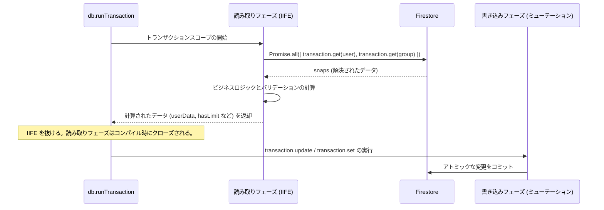

# Firestore トランザクションとパフォーマンス最適化 — ディープダイブ

## 概要

**scripture-habit** のデータベース層は、高い並行性、低リードコスト、そして厳格な結果整合性を実現するように設計されています。Google Cloud Firestore は、トランザクションにおける厳格な **Read-before-Write（書き込み前の読み込み）** ルールなどの構造的なパフォーマンス制限を課しているため、アプリはコンパイル時に安全なトランザクション境界と最適化を採用しています。

このシステムは、ノートの共有、ストリークの更新、チャットメッセージ、メンバーシップ変更などの操作を、データベースの競合や不要な読み取りコストを発生させることなく、数千人の同時アクティブユーザーにスケールできるように設計されています。

---

## 1. コンパイル時に安全な Read/Write フェーズの分離（IIFE パターン）

Google Cloud Firestore のトランザクションは、楽観的並行性制御を使用します。これにより、**すべての読み取り操作（クエリ、get）は、書き込み操作（set、update、delete）がキューに登録される前に実行および解決される必要があります**。書き込みの後に読み取りを呼び出すと、ランタイムエラーが発生します。

この制約を構築段階で厳密に適用し、デグレードを防止するために、コードベースはトランザクション操作を **非同期即時実行関数式 (IIFE)** ブロックでラップし、**フェーズ1: 読み取りフェーズ** を表現しています。



### コードアーキテクチャの例 (`NoteService` / `MessageService`):
```typescript
const result = await db.runTransaction(async (transaction) => {
    // -----------------------------------------------------------------
    // フェーズ 1: 読み取りおよび純粋な計算フェーズ (書き込みは厳格に禁止)
    // -----------------------------------------------------------------
    const { userData, groupData, activeMembers } = await (async () => {
        // シーケンスの最上部での並行読み取り
        const [userSnap, groupSnap] = await Promise.all([
            transaction.get(userRef),
            transaction.get(groupRef)
        ]);

        if (!userSnap.exists) throw new Error('User not found');
        if (!groupSnap.exists) throw new Error('Group not found');

        // 純粋な数学的計算 (例: タイムゾーンオフセットやローカル日境界の評価)
        const timezone = userSnap.data()?.timeZone || 'UTC';
        const hasExceededLimit = (groupSnap.data()?.membersCount || 0) >= 100;

        // 外部のトランザクションスコープに解決されたペイロードを返す
        return {
            userData: userSnap.data(),
            groupData: groupSnap.data(),
            hasExceededLimit
        };
    })(); // 即座に実行されます！

    // -----------------------------------------------------------------
    // フェーズ 2: 書き込みフェーズ (ミューテーションのみ)
    // -----------------------------------------------------------------
    if (userData.hasExceededLimit) {
        throw new Error('Group capacity reached.');
    }

    transaction.update(userRef, { lastActivityAt: admin.firestore.FieldValue.serverTimestamp() });
    transaction.update(groupRef, { totalActiveMembers: activeMembers });
});
```

読み取りと計算を専用の自己完結型スコープに分離することで、開発者が将来の更新時に書き込みミューテーションの後に誤ってデータベースクエリを挿入することが不可能になります。

---

## 2. トランザクション読み取りの最適化

データベースコストを低く抑えるために、トランザクションエンジンはドキュメントの読み取りを能動的に最小化します。

1. **配列長チェックによる読み取りの回避**: ユーザーがグループに参加する際、エンジンは現在のグループ容量を確認する必要があります。メンバーサブドキュメントをすべて読み取る代わりに、親グループドキュメントのメタデータフィールドである `members` UID配列の長さや `membersCount` を直接確認します（グループの存在確認のためにすでにフェッチされたスナップショットを再利用します）。これにより、参加試行時のデータベース操作数を節約できます。
2. **スナップショットの再利用**: 招待コードを確認する際、エンジンは `inviteCodes` コレクションを照会します。返される `QueryDocumentSnapshot` にはすでにグループのメタデータがすべて含まれています。エンジンは、セカンダリの `transaction.get(groupRef)` 呼び出しを実行する代わりに、このスナップショットを直接再利用し、追加の読み取りを1回節約します。

---

## 3. リードバジェット監査システム (`test-setup.ts`)

開発者がアップデート中に非効率なデータベース読み取りパターン（ループ内での N+1 クエリなど）を誤って導入しないように、テスト環境には自動化された **グローバルリード監査** が組み込まれています。

[`test-setup.ts`](../../scripture-habit/api_internal/test-setup.ts) に配置されたこのモジュールは、統合テスト中に対象の Firestore ドライバプロトタイプをラップします。

### 3.1 プロキシラッパーによるインターセプション

テスト実行時、テストハーネスは JavaScript の標準機能である `Proxy` を使用して Firestore クライアントメソッドをラップし、アプリケーションが行うすべてのドキュメント読み取り呼び出しを追跡し、グローバルなテレメトリカウンターをインクリメントします。

この追跡は、標準のモック復元（`vi.restoreAllMocks()`）の影響を完全に受けないため、テストスイート実行中の絶対的な精度を保証します。

### 3.2 300回リードバジェット警告

テスト実行の最後に、ハーネスはデータベース操作を要約したテレメトリレポートを出力します。

```text
📊 [Firestore Read Audit] -----------------------------
   Transaction GETs:    14
   Transaction GETALLs: 1
   Document GETs:       8
   👉 Total Reads:      23
   Collection Breakdown:
     - users: 8 reads
     - groups: 12 reads
-------------------------------------------------------
```

テストファイルが **300回の Firestore 読み取り** のバジェットを超えると、`test-setup.ts` は N+1 クエリの有無をクエリチェーンで確認するよう促すコンパイル警告を出力します。これにより、コードベースを高度に最適化し、コスト効率の高い状態に保ちます。
