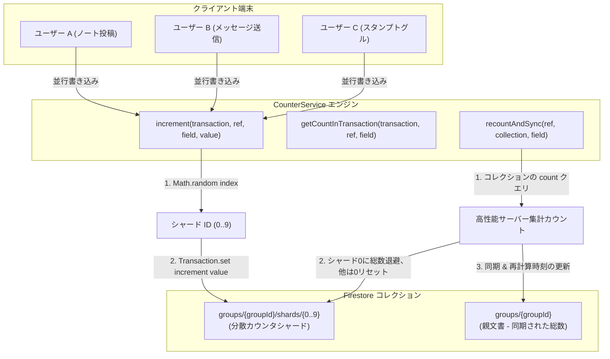
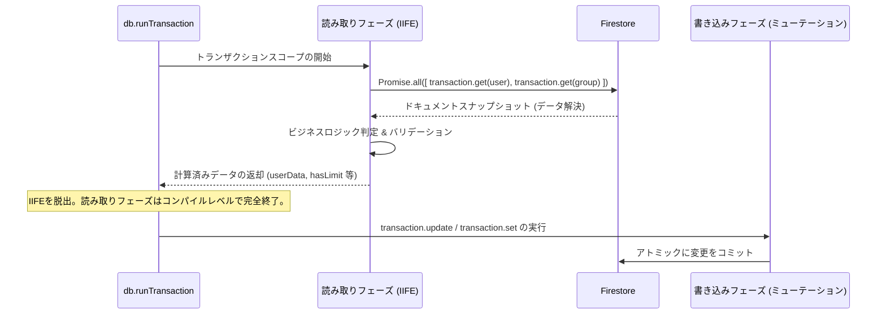

# Firestore トランザクション & 分散カウンタシャード — 詳細設計ガイド

## 概要

**scripture-habit** のデータベースレイヤーは、高い並行性、低読み取りコスト、および厳密な結果整合性を実現するように設計されています。Google Cloud Firestore には、「同一ドキュメントへの書き込みは **秒間約1回** まで」という物理的な制限や、トランザクション内における「**Read-before-Write（書き込み前の読み取り）**」の徹底ルールといった構造的な制約があります。これらを克服するため、システムは高度な分散シャインディング（Counter Sharding）とトランザクション制御を採用しています。

このカウンターシステムは、サーバーレスのクラス **`CounterService`** ([`counter-service.ts`](../../scripture-habit/api_internal/services/counter-service.ts)) および厳格なコンパイル安全性のトランザクション境界によって制御されています。これにより、ノートの共有、ストリークの更新、チャットメッセージ、メンバーシップ変更などの書き込み集中型のアクションが、データベースの競合やホットスポットを起こすことなく、数千の並行アクティブユーザーへ自動スケールします。



---

## 1. 分散カウンタシャード（Counter Sharding）パターン

数百人のグループメンバーが同時に学習ノートを投稿したり、チャットメッセージを送信したりする場合、中央のグループドキュメント上の単一の `messageCount` や `noteCount` フィールドを直接インクリメント（加算）しようとすると、書き込み競合（ホットスポット）により処理がエラーになります。

この問題を解決するために、**`CounterService`** はカウントの加算処理を専用のサブコレクション内の「シャード（破片）」ドキュメントへ分散させます。

### 1.1 動的シャードハッシュ & 書き込み処理

システムは、シャード対象のフィールドごとに **10個のシャード** (`NUM_SHARDS = 10`) を保持します。インクリメント処理が発生すると、サービスは `0` から `9` までのランダムなシャードIDを動的に選択し、Firestore トランザクションを利用してアトミックな加算操作（セット）を実行します。

```typescript
private static NUM_SHARDS = 10;

static increment(
    transaction: admin.firestore.Transaction, 
    ref: admin.firestore.DocumentReference, 
    fieldName: string = 'count', 
    value: number = 1
) {
    // 1. 0〜9のランダムなシャードインデックスを生成
    const shardId = Math.floor(Math.random() * this.NUM_SHARDS).toString();
    const shardRef = ref.collection('shards').doc(shardId);
    
    // 2. アトミックなインクリメントオペレータを用いて merge: true でセット
    transaction.set(shardRef, {
        [fieldName]: admin.firestore.FieldValue.increment(value)
    }, { merge: true });
}
```

書き込み処理を10個の物理的なドキュメントへ分散させることで、データベース競合を起こすことなく、このカウンターの理論上の書き込みスループットを **10倍**（秒間約1回から秒間約10回まで）へとスケールさせることができます。Firestore は別々のドキュメントへの書き込みを並行してアトミックに実行するためです。

### 1.2 トランザクション内外での読み取り処理

シャード化されたカウンターの総数を取得するには、すべてのシャードドキュメントをロードしてその数値を合算する必要があります。システムはこれを用途に応じて2種類の方法で実行します。

#### A. トランザクション外での合算処理 (`getCount`)
バックグラウンド処理や定期集計ジョブで使用される、標準的な非同期読み取りです。
```typescript
static async getCount(ref: admin.firestore.DocumentReference, fieldName: string = 'count'): Promise<number> {
    const shards = await ref.collection('shards').get();
    let totalCount = 0;
    shards.forEach((doc) => {
        totalCount += doc.data()[fieldName] || 0;
    });
    return totalCount;
}
```

#### B. トランザクション内での合算処理 (`getCountInTransaction`)
バリデーションや別ステータスの算出のために、トランザクションの*内部*で現在の合計値を読み取る必要がある場合、ループの中で順番に `get()` を呼ぶと、複数回のネットワーク往復が発生し、トランザクションの「Read-before-Write」フェーズ規則にも抵触しやすくなります。
これを防ぐため、サービスは全10シャードの参照を最初にすべて生成し、`transaction.getAll(...)` を用いて一回の並行リクエストで全シャードドキュメントを一括フェッチします。

```typescript
static async getCountInTransaction(
    transaction: admin.firestore.Transaction, 
    ref: admin.firestore.DocumentReference, 
    fieldName: string = 'count'
): Promise<number> {
    const shardRefs = [];
    for (let i = 0; i < this.NUM_SHARDS; i++) {
        shardRefs.push(ref.collection('shards').doc(i.toString()));
    }
    
    // 並行フェッチ: 10個のシャード文書を1回のネットワークラウンドトリップで一括取得
    const snaps = await transaction.getAll(...shardRefs);
    let totalCount = 0;
    snaps.forEach((doc) => {
        if (doc.exists) {
            totalCount += doc.data()?.[fieldName] || 0;
        }
    });
    return totalCount;
}
```

---

## 2. コンパイル安全な Read/Write フェーズ分離（IIFE パターン）

Google Cloud Firestore のトランザクションモデルでは、楽観的並行性制御を採用しています。これにより、**「すべてのデータベース読み取り操作（get, query）は、いかなる書き込み操作（set, update, delete）よりも先に完了しなければならない」** という厳格な制約があります。一度書き込みアクションをトランザクションに予約したあとに読み取りを行おうとすると、実行時エラーが発生します。

この制約を「コードの構造自体」で強制し、将来のアップデート時における先祖返りバグを防ぐため、コードベースではトランザクション内の全処理を **「非同期 IIFE（即時実行関数）ブロック」** で包み、**フェーズ1: 読み取り専用フェーズ** として物理的に分離しています。



### コード設計の実例 (`NoteService` / `MessageService`):
```typescript
const result = await db.runTransaction(async (transaction) => {
    // -----------------------------------------------------------------
    // フェーズ 1: 読み取り & 計算専用フェーズ（書き込みは一切禁止）
    // -----------------------------------------------------------------
    const { userData, groupData, activeMembers } = await (async () => {
        // トランザクションの最上部で並行して一括読み取り
        const [userSnap, groupSnap] = await Promise.all([
            transaction.get(userRef),
            transaction.get(groupRef)
        ]);

        if (!userSnap.exists) throw new Error('User not found');
        if (!groupSnap.exists) throw new Error('Group not found');

        // タイムゾーン解析や、アクティブ日付境界の算出などの「純粋な計算」を実行
        const timezone = userSnap.data()?.timeZone || 'UTC';
        const hasExceededLimit = (groupSnap.data()?.membersCount || 0) >= 100;

        // 計算結果やスナップショットの中身を、外側のトランザクションスコープへ返却
        return {
            userData: userSnap.data(),
            groupData: groupSnap.data(),
            hasExceededLimit
        };
    })(); // 即時実行！

    // -----------------------------------------------------------------
    // フェーズ 2: 書き込み専用フェーズ（ミューテーションのみをアトミックに登録）
    // -----------------------------------------------------------------
    if (userData.hasExceededLimit) {
        throw new Error('Group capacity reached.');
    }

    transaction.update(userRef, { lastActivityAt: admin.firestore.FieldValue.serverTimestamp() });
    transaction.update(groupRef, { totalActiveMembers: activeMembers });
});
```

IIFEブロックによって読み取りフェーズと書き込みフェーズを物理的に分離することで、将来別の開発者がコードを修正した際にも、書き込み処理のあとに誤って読み取りクエリを混入させてしまうバグを確実に防ぐことができます。

---

## 3. データ整合性の担保 & 自動自己修復（再計算）パイプライン

分散されたシャードによるカウンターは高い並行処理能力を持つ一方、極端なネットワーク障害や開発者による手動データ修正の際に、実データ数とカウント値に「ズレ（ドリフト）」が生じる可能性があります。また、高速化のためにメモリ上にキャッシュされた値を、検索用に定期的に親ドキュメントに同期させる必要もあります。

これらを解決するため、エンジンには以下の2つの自己修復用再計算パイプラインが組み込まれています。

### 3.1 同期 & 集計自動処理 (`aggregateAndSync`)

定期実行されるバックグラウンド処理が分散されたシャードをスキャンし、合算した正しい総数を親グループドキュメントのフィールドへ書き戻します。これにより、クライアントはグループ一覧画面などでシャードを毎度フェッチすることなく、安価に総数を読み取ることができます。

```typescript
static async aggregateAndSync(ref: admin.firestore.DocumentReference, fieldName: string) {
    const total = await this.getCount(ref, fieldName);
    await ref.update({
        [fieldName]: total,
        [`${fieldName}_syncedAt`]: admin.firestore.FieldValue.serverTimestamp()
    });
    return total;
}
```

### 3.2 サーバーサイド超高速再計算 (`recountAndSync`)

実体ドキュメントの数とシャードの数値を完全に再キャリブレーション（再計算）する場合、数万件のドキュメントをすべて読み取ってループカウントするのは非常に非効率です。
`CounterService` は、Firestore の超高速な **`count()` アグリゲーションクエリ** を使用します。これにより、すべての文書をクライアント側へロードすることなく、データベースサーバー内部で一瞬でドキュメント数をカウントし、Firestoreの読み取り料金を劇的に削減します。

```typescript
static async recountAndSync(docRef: admin.firestore.DocumentReference, collectionName: string, fieldName: string) {
    // 1. 高性能サーバーサイド集計カウントの取得
    const snapshot = await docRef.collection(collectionName).count().get();
    const actualTotal = snapshot.data().count;

    // 2. シャードの値を実際のカウントにリセット (簡単のため、総数をシャード0に格納し、他は0にする)
    const batch = db.batch();
    for (let i = 0; i < this.NUM_SHARDS; i++) {
        batch.set(docRef.collection('shards').doc(i.toString()), {
            [fieldName]: i === 0 ? actualTotal : 0
        }, { merge: true });
    }
    
    batch.update(docRef, {
        [fieldName]: actualTotal,
        [`${fieldName}_syncedAt`]: admin.firestore.FieldValue.serverTimestamp(),
        [`${fieldName}_recountedAt`]: admin.firestore.FieldValue.serverTimestamp()
    });
    
    await batch.commit();
    return actualTotal;
}
```

### 3.3 アーカイブを考慮したチャットログ再計算 (`recountMessageCountWithArchive`)

チャット画面では、クライアント側のデータ読み込み量を最小限に抑えるため、古いメッセージを圧縮バケット（`message_buckets`）へ順次アーカイブ退避させるクリーンアップが走ります。

もし単純にアクティブチャットコレクション（`/messages`）の件数だけをカウントすると、過去メッセージがアーカイブされたあとにカウンターの値が急減少してしまいます。これを防ぐため、再計算エンジンは **アーカイブ状況を認識（Archive-Aware）** できる設計になっています。アクティブなメッセージ件数と、退避済みバケット内のメタデータ数値を合算して真の総数を割り出します。

```typescript
static async recountMessageCountWithArchive(groupRef: admin.firestore.DocumentReference) {
    // 1. コレクション内のアクティブメッセージ数を高速アグリゲーションカウント
    const msgSnapshot = await groupRef.collection('messages').count().get();
    const individualCount = msgSnapshot.data().count;

    // 2. 退避済みアーカイブバケット群に記録されている件数を合算
    const bucketSnapshot = await groupRef.collection('message_buckets').get();
    let archivedCount = 0;
    bucketSnapshot.forEach(doc => {
        archivedCount += (doc.data().count || 0);
    });

    const trueTotal = individualCount + archivedCount;

    // 3. 全シャードと親ドキュメントを真の総数で再同期
    const batch = db.batch();
    for (let i = 0; i < this.NUM_SHARDS; i++) {
        batch.set(groupRef.collection('shards').doc(i.toString()), {
            'messageCount': i === 0 ? trueTotal : 0
        }, { merge: true });
    }

    batch.update(groupRef, {
        'messageCount': trueTotal,
        'messageCount_syncedAt': admin.firestore.FieldValue.serverTimestamp(),
        'messageCount_recountedAt': admin.firestore.FieldValue.serverTimestamp()
    });

    await batch.commit();
    return trueTotal;
}
```

---

## 4. トランザクション内の読み取り最適化（Read削減）

システム運用コストを抑えレスポンス速度を最大化するため、トランザクション内の読み取り（Read）処理は極限まで排除されています。

1. **シャード読み取りのバイパス**: ユーザーがグループに参加する際、現在のメンバー数が定員（100人）を超えていないかバリデーションする必要がありますが、そのためにトランザクション内で 10個のシャードを毎度フェッチすると読み取りコストが激増します。代わりに、既にグループの存在チェックのために取得した親グループドキュメント上の `membersCount` フィールドを直接参照することで、**毎回の参加処理で10回のFirestore読み取りを削減**しています。
2. **クエリドキュメントスナップショットの再利用**: グループの招待リンク（Invite Code）を照合する際、クエリによって取得した `QueryDocumentSnapshot` にはすでにグループの全データが含まれています。これを直接再利用することで、別途 `transaction.get(groupRef)` を呼ぶ無駄な重複処理を回避しています。

---

## 5. テスト環境の読み取り監査システム (`test-setup.ts`)

コード変更の過程で、開発者が誤ってループ内でのドキュメント取得（N+1問題）や無駄な多重クエリを実装してしまわないように、テストの実行環境には自動的な **「読み取り監査（Read Audit）」** が張り巡らされています。

これは [`test-setup.ts`](../../scripture-habit/api_internal/test-setup.ts) で制御されており、統合テストの実行時に Firestore ドライバーのプロトタイプを内部的にフックします。

### 5.1 プロトタイプのインターセプト（割り込み監視）

テストスイートの実行中、アプリケーションが行うすべての読み取りメソッドがインターセプトされ、件数とコレクション名がロギングされます。

```typescript
const originalGet = admin.firestore.Transaction.prototype.get;
admin.firestore.Transaction.prototype.get = function(ref) {
    incrementReadTelemetry(ref);  // コレクション名ごとの集計をインクリメント
    return originalGet.apply(this, arguments);
};
```

この処理は、Vitest のテストモックリセット（`vi.restoreAllMocks()`）の影響を受けないため、テスト中の本物のデータベース読み取り数を完璧にトレースできます。

### 5.2 300-Read 警告バジェットシステム

各テストファイルの実行終了時、フックされた集計から以下のようなレポートが自動出力されます。

```text
📊 [Firestore Read Audit] -----------------------------
   Transaction GETs:    14
   Transaction GETALLs: 1
   Document GETs:       8
   👉 Total Reads:      23
   Collection Breakdown:
     - users: 8 reads
     - groups: 12 reads
     - message_buckets: 3 reads
-------------------------------------------------------
```

もし1つのテストファイル内で、設定されたバジェットである **「300 Firestore Reads」** を超過した場合、監査ヘルパーはビルド警告メッセージを出力し、開発者にクエリループや結合処理の改善を促します。これにより、本番環境に非効率なクエリコードがデプロイされるのを未然に防いでいます。
