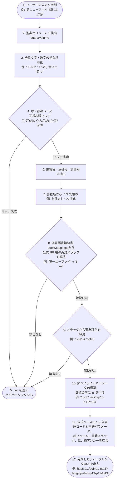
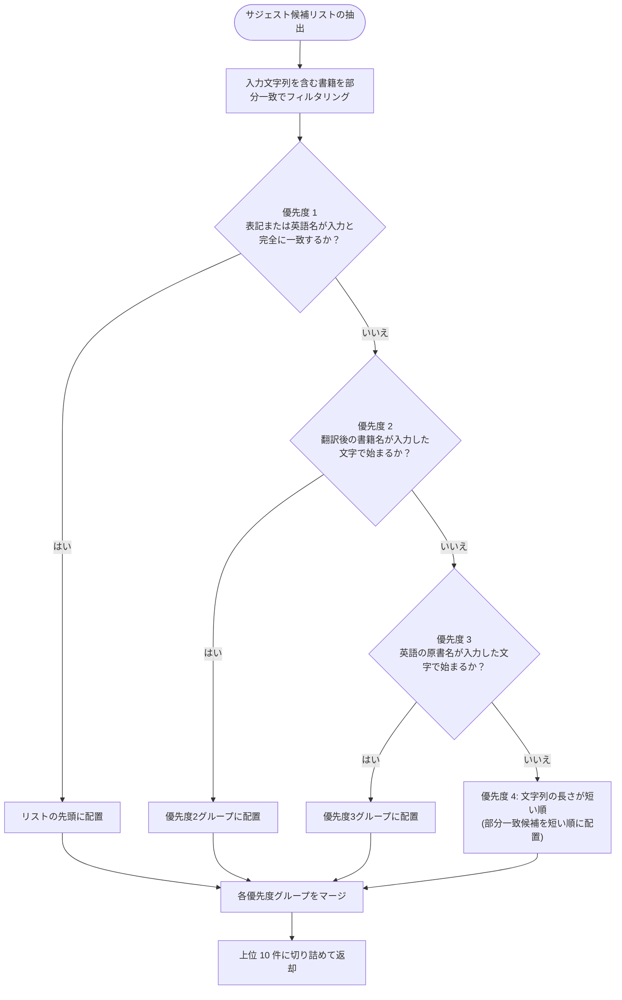

# 🔬 詳細解説：福音ライブラリマッパー & 多言語Unicode正規化エンジン

本ドキュメントでは、Scripture Habit のグローバル展開を強力に支える2つのコアユーティリティ、**「福音ライブラリ（Gospel Library）公式リンク自動生成マッパー」**と、日本語ひらがな・カタカナの相互変換を備えた**「多言語書籍サジェスト（自動補完）検索エンジン」**について、詳細に解説します。

---

## 🗺️ 福音ライブラリリンク自動マッピング (Gospel Library Mapper)

ユーザーがスタディノートに「どの聖句を読んだか（例: `マタイ 3:13-17` や `1 Nephi 3`）」を入力すると、システムはそれを自動解析し、公式ウェブサイトの該当する章、さらには**該当する「節」がハイライト表示されて自動スクロールするディープリンク（ディープハイライトURL）**を動的に生成します。

この機能は、10ヶ国語（日本語、英語、スペイン語、ポルトガル語、中国語、韓国語、タイ語、タガログ語、ベトナム語、スワヒリ語）に対応しています。

### マッピング処理フローチャート

生のユーザー入力から完全な公式ディープリンクURLが生成されるまでのパイプラインです。



---

## 🔍 多言語書籍オートコンプリート検索提案エンジン

ユーザーが新しいノートを書く際、聖典の書籍名を素早く選択できるようにするためのサジェスト機能です。
特に日本語環境では、ユーザーが**「ひらがな（またい）」で入力しても、正規の書籍名「マタイ（カタカナ）」を極めて高速に検索・補完できる「発音コードシフト（ひらがな➔カタカナ変換）」**を備えています。

### 1. 4段階の優先度ソートアルゴリズム

検索窓に入力された文字に対して、以下の優先順序でサジェスト順を制御することで、ユーザーの入力意図に最もマッチする候補を先頭に表示します。



### 2. 「ひらがな➔カタカナ」発音コードシフトの仕組み
Unicode において、「ひらがな」の文字コード領域（`\u3041`〜`\u3096`）と「カタカナ」の文字コード領域の間には、正確に **`0x60`（十進数で96）** のオフセット値が存在します。

この特性を利用し、ユーザーがひらがなを入力した際、正規表現でひらがなを検出し、各文字コードに `0x60` を加算することで、**外部の辞書や重い変換ライブラリを一切使わず、わずか1行の高速な正規表現置換のみで完璧な「ひらがな➔カタカナ変換」を実現**しています。

---

## 💻 コアコード解説

以下は、`src/utils/gospel-library-mapper.ts` と `src/utils/suggestion-utils.ts` のコプロジックと日本語注釈です。

### 1. 全角文字標準化と節ハイライト処理 (`gospel-library-mapper.ts`)

```typescript
export const getGospelLibraryUrl = (
    volume: string | null | undefined, 
    chapterInput: string | null | undefined, 
    language: string = 'en'
): string | null => {
    if (!chapterInput) return null;

    const baseUrl = "https://www.churchofjesuschrist.org/study/scriptures";
    
    // 1. 各言語に応じた公式のクエリパラメータの設定 (日本語は jpn)
    let langParam = "?lang=eng";
    if (language === 'ja') langParam = "?lang=jpn";
    else if (language === 'pt') langParam = "?lang=por";
    else if (language === 'es') langParam = "?lang=spa";
    else if (language === 'ko') langParam = "?lang=kor";
    // ... (他言語の設定)

    // 2. 文字の全角・半角正規化処理（マルチバイト入力時の揺れを吸収）
    let cleanChapterInput = chapterInput;
    
    // 全角英数字 [０-９] を半角 [0-9] に一括変換
    cleanChapterInput = cleanChapterInput.replace(/[０-９]/g, s => String.fromCharCode(s.charCodeAt(0) - 0xFEE0));
    
    // 各種記号の標準化
    cleanChapterInput = cleanChapterInput
        .replace(/：/g, ':')
        .replace(/[，、]/g, ',')
        .replace(/\u3000/g, ' ') // 全角スペースを半角へ
        .replace(/[－—―]/g, '-'); // 全角ハイフンを半角へ

    // 日本語特有の「〇〇章〇〇節」という表記を「〇〇:〇〇」に置換
    cleanChapterInput = cleanChapterInput
        .replace(/章\s*(?=\d)/g, ':')
        .replace(/章/g, '')
        .replace(/節/g, '');

    // 3. 正規表現による書籍名、章番号、節範囲の抽出
    // 例: "1 nephi 3:13-17" ➔ match[1]: "1 nephi", match[2]: "3", match[3]: "13-17"
    const match = cleanChapterInput.match(/(.*?)\s*(\d+)(?::([\d\s,-]+))?\s*$/);
    if (!match) return null;

    const bookName = match[1].trim().toLowerCase().replace(/[.]/g, '').replace(/^第(?=\d)/, '');
    const chapterNum = match[2];
    const verses = match[3];

    // 4. 多言語書籍マッピングから公式英語スラッグに変換 (10ヶ国語混在辞書)
    const bookUrlPart = bookMappings[bookName];
    if (!bookUrlPart) return null;

    // ボリューム（旧約、新約、モルモン書等）の解決
    let volumeUrlPart = detectVolume(volume, chapterInput);
    if (!volumeUrlPart) {
        // スラッグ名から所属ボリュームを推測するフォールバック
        volumeUrlPart = slugToVolume[bookUrlPart] || "";
    }
    if (!volumeUrlPart) return null;

    // 5. 節（Verses）ハイライトアンカーの自動生成
    // 公式サイトの仕様: 13節-17節のハイライトURL ➔ &id=p13-p17#p13
    let urlSuffix = langParam;
    if (verses) {
        // 数値の前に "p" を付加する正規表現置換
        const idValue = verses.replace(/\d+/g, m => `p${m}`);
        const firstVerse = verses.match(/\d+/)?.[0]; // 最初の開始節を取得してハッシュアンカーにする
        if (idValue) {
            urlSuffix += `&id=${idValue}`;
            if (firstVerse) urlSuffix += `#p${firstVerse}`;
        }
    }

    // 6. 最終的なディープリンクURLの組み立て
    if (volumeUrlPart === "dc-testament" && bookUrlPart === "dc") {
        return `${baseUrl}/dc-testament/dc/${chapterNum}${urlSuffix}`; // 教義と聖約専用のパスルール
    }
    return `${baseUrl}/${volumeUrlPart}/${bookUrlPart}/${chapterNum}${urlSuffix}`;
};
```

---

### 2. ひらがなコードシフトと4段階ソート (`suggestion-utils.ts`)

```typescript
export const getBookSuggestions = (
    volume: string | null | undefined,
    input: string | null | undefined,
    language: string,
    currentLanguageBooks: Record<string, string>
): BookSuggestion[] => {
    if (!volume || !input || !currentLanguageBooks) return [];

    const volumeList = volumeBooks[volume];
    if (!volumeList) return [];

    // 1. 正規化ヘルパー関数
    const normalize = (str: string | null | undefined): string => {
        if (!str) return '';
        // NFKC正規化で全角半角や合字の揺れを標準化
        let res = str.toLowerCase().normalize('NFKC');
        
        // 2. 【核心】日本語の「ひらがな ➔ カタカナ」コードシフト置換
        // ひらがなの文字コード（\u3041〜\u3096）に 0x60 (96) を加算するとカタカナコードに変換される
        if (language === 'ja') {
            res = res.replace(/[\u3041-\u3096]/g, m => String.fromCharCode(m.charCodeAt(0) + 0x60));
        }
        return res;
    };

    const normalizedInput = normalize(input);
    if (!normalizedInput) return [];

    // 各書籍オブジェクトの正規化名を準備
    const translatedList = volumeList.map(englishName => {
        const translatedName = currentLanguageBooks[englishName] || englishName;
        return {
            english: englishName,
            translated: translatedName,
            normalizedTranslated: normalize(translatedName),
            normalizedEnglish: normalize(englishName)
        };
    });

    // 3. 部分一致フィルタリングと 4段階カスケードソート
    return translatedList
        .filter(book =>
            book.normalizedTranslated.includes(normalizedInput) ||
            book.normalizedEnglish.includes(normalizedInput)
        )
        .sort((a, b) => {
            // 優先度 1: 完全一致
            if (a.normalizedTranslated === normalizedInput) return -1;
            if (b.normalizedTranslated === normalizedInput) return 1;

            // 優先度 2: 翻訳名が入力文字列で始まる（前方一致）
            const aStartsT = a.normalizedTranslated.startsWith(normalizedInput);
            const bStartsT = b.normalizedTranslated.startsWith(normalizedInput);
            if (aStartsT && !bStartsT) return -1;
            if (!aStartsT && bStartsT) return 1;

            // 優先度 3: 英語名が入力文字列で始まる
            const aStartsE = a.normalizedEnglish.startsWith(normalizedInput);
            const bStartsE = b.normalizedEnglish.startsWith(normalizedInput);
            if (aStartsE && !bStartsE) return -1;
            if (!aStartsE && bStartsE) return 1;

            // 優先度 4: 文字列長が短い順（「ニーファイ第一」と「ニーファイ第二」などのノイズ削減）
            return a.translated.length - b.translated.length;
        })
        .slice(0, 10); // 上位10件のみ表示
};
```
