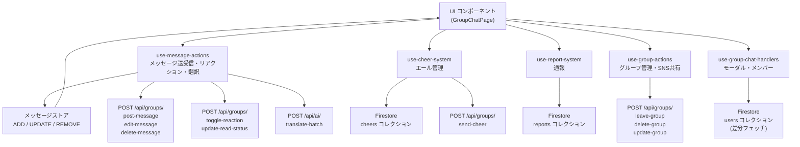
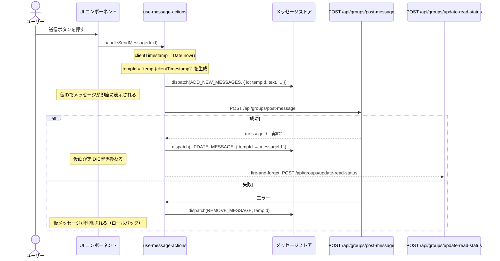
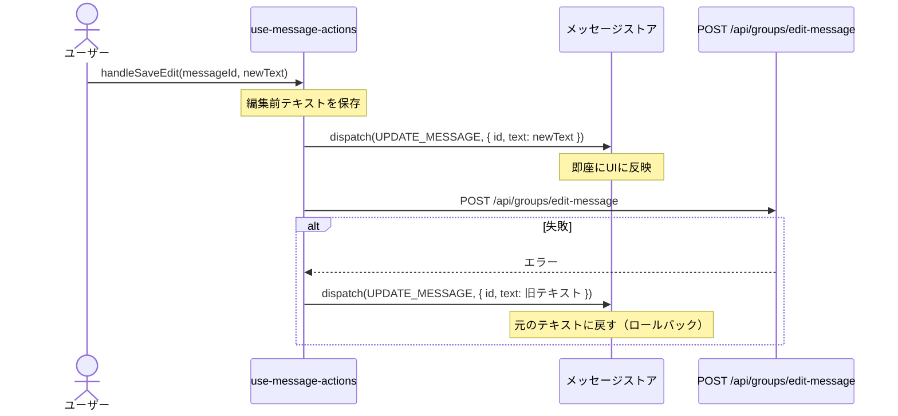
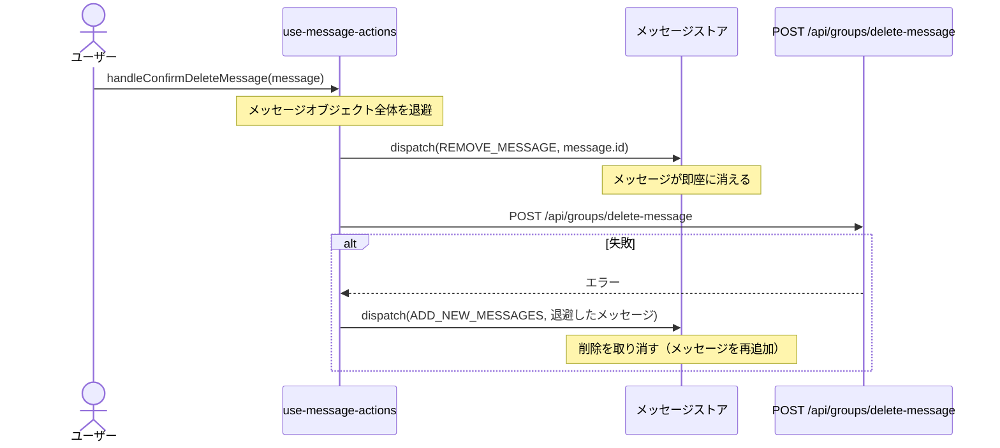
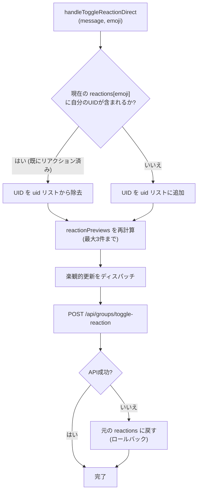
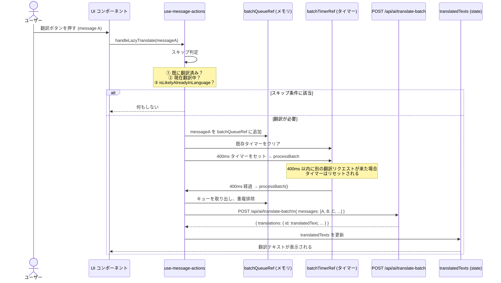
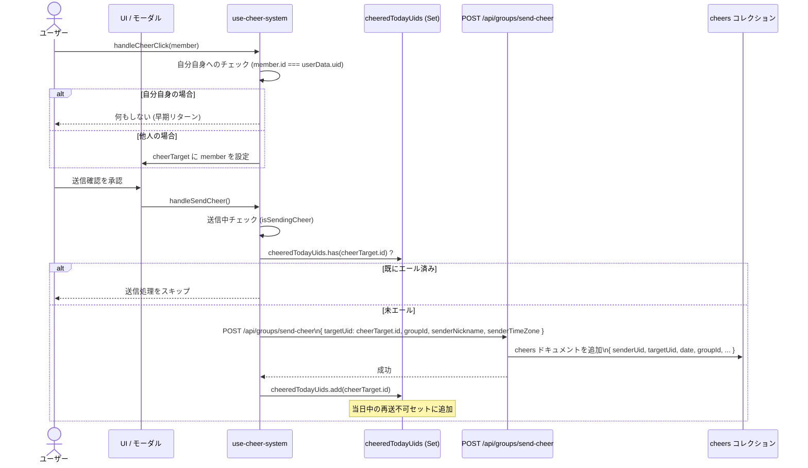
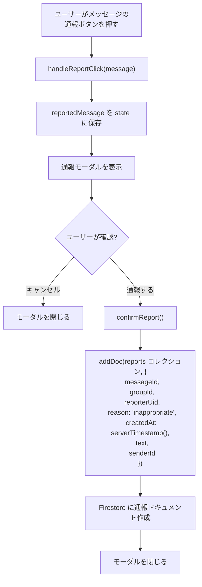
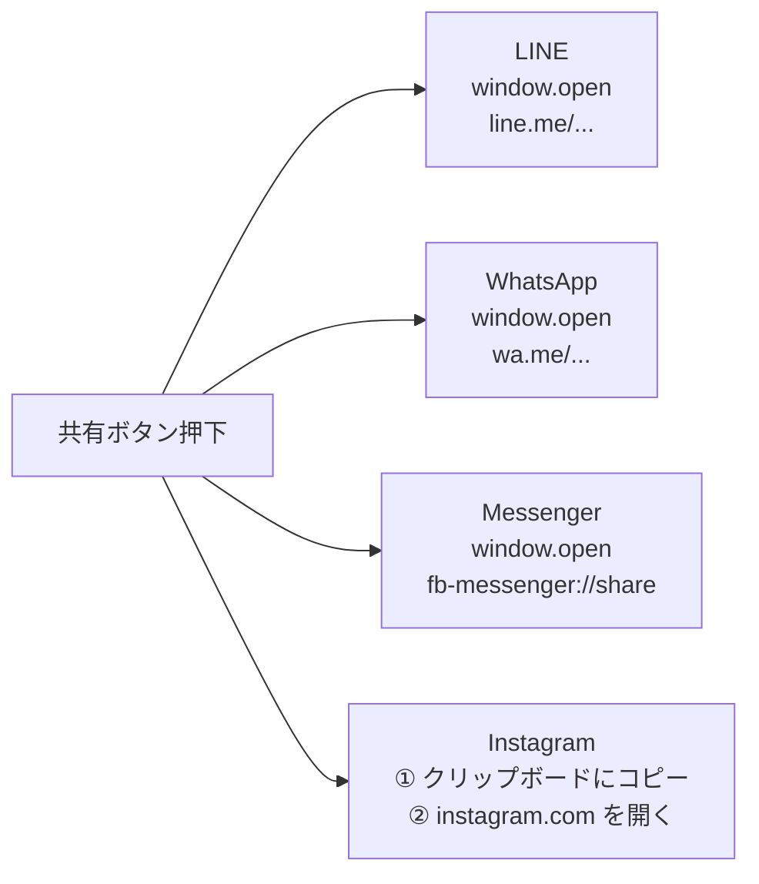
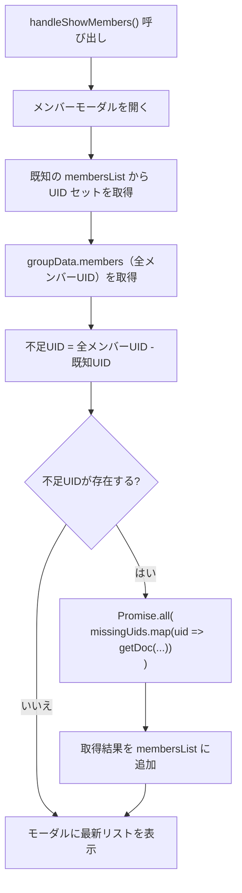

# グループチャット インタラクションエンジン — コアロジック詳細

## 概要

グループチャット機能は、**5つの専用カスタムフック**によって構成されています。それぞれが明確な責務を担い、UI層からビジネスロジックを切り離すことで、保守性と再利用性を高めています。

| フック | ファイルパス | 主な責務 |
|--------|------------|---------|
| `use-message-actions.ts` | `hooks/api/` | メッセージ送信・編集・削除・リアクション・翻訳 |
| `use-cheer-system.ts` | `hooks/interaction/` | エール送信・一日一回制限管理 |
| `use-report-system.ts` | `hooks/api/` | コンテンツ通報・Firestore直接書き込み |
| `use-group-actions.ts` | `hooks/api/` | グループ退出・削除・設定変更・SNS共有 |
| `use-group-chat-handlers.ts` | `hooks/interaction/` | モーダル管理・メンバーリスト・リアクション展開 |

### 全体アーキテクチャ




---

## 1. 楽観的メッセージ送受信パイプライン

グループチャットのメッセージ操作（送信・編集・削除）はすべて**楽観的UI更新（Optimistic UI）**パターンを採用しています。ユーザー操作への即時フィードバックを優先しつつ、API失敗時には自動的にロールバックします。

### 1.1 メッセージ送信フロー



> [!IMPORTANT]
> 仮ID (`temp-{clientTimestamp}`) はクライアント側のタイムスタンプから生成されるため、衝突のリスクは極めて低いですが、実IDへの確実な置き換えが必要です。`UPDATE_MESSAGE` アクションは `tempId` をキーとして実IDに更新します。

> [!NOTE]
> `update-read-status` の呼び出しは **fire-and-forget** です。送信処理の完了を待たず、失敗してもロールバックは行われません。これは既読管理がUX上のベストエフォートで十分なためです。

```typescript
// handleSendMessage の核心ロジック（概念）
const clientTimestamp = Date.now();
const tempId = `temp-${clientTimestamp}`;

// 楽観的追加
dispatch(ADD_NEW_MESSAGES, { id: tempId, text, senderId: currentUid, ... });

try {
  const { messageId } = await post('/api/groups/post-message', { text, groupId });
  // 仮IDを実IDに解決
  dispatch(UPDATE_MESSAGE, { oldId: tempId, newId: messageId });
  // 既読更新（fire-and-forget）
  post('/api/groups/update-read-status', { groupId });
} catch {
  // ロールバック
  dispatch(REMOVE_MESSAGE, tempId);
}
```

### 1.2 メッセージ編集フロー



### 1.3 メッセージ削除フロー



> [!WARNING]
> 削除のロールバックでは `REMOVE_MESSAGE` の逆として `ADD_NEW_MESSAGES` を使用します。退避したメッセージオブジェクト全体を再追加するため、元の順序が保証されるよう、ストア側でタイムスタンプ順ソートが適切に実装されている必要があります。

---

## 2. リアクション & リプライシステム

### 2.1 リアクショントグルロジック

`handleToggleReactionDirect(message, emoji)` は以下の手順でリアクションを処理します：



### 2.2 `reactionPreviews` の3件上限

`reactionPreviews` は各絵文字に対して**最大3件**のニックネームプレビューを保持します。これはUI上で「田中, 鈴木, 他1名」のような表示に使用されます。

```typescript
// reactionPreviews 計算の概念コード
const MAX_PREVIEWS = 3;

// ReactionPreview 型: { uid: string, nickname: string, photoURL: string | null }
const newPreviews: Record<string, ReactionPreview[]> = {};
for (const [emojiKey, uidList] of Object.entries(newReactions)) {
  // uidList の先頭 MAX_PREVIEWS 件のプレビューオブジェクトを生成
  newPreviews[emojiKey] = uidList
    .slice(0, MAX_PREVIEWS)
    .map(uid => ({ uid, nickname: membersMap[uid]?.nickname ?? uid, photoURL: membersMap[uid]?.photoURL ?? null }));
}
```

> [!NOTE]
> プレビューは表示上の最適化であり、正確なリアクション数は `reactions[emoji].length` から取得します。`reactionPreviews` が古くなっても、正確なカウントに影響はありません。

### 2.3 リアクションデータ構造

```typescript
// メッセージオブジェクト内のリアクション関連フィールド
type ReactionPreview = { uid: string; nickname: string; photoURL: string | null };

type Message = {
  id: string;
  reactions: Record<string, string[]>;
  // 例: { "😊": ["uid1", "uid2", "uid3"], "👍": ["uid2"] }

  reactionPreviews: Record<string, ReactionPreview[]>;
  // 例: { "😊": [{ uid: "uid1", nickname: "田中", photoURL: "..." }, ...], "👍": [...] }
  // ※ 各絵文字につき最大3件のオブジェクト
};
```

---

## 3. 遅延バッチ翻訳エンジン

翻訳機能はパフォーマンスとAPI呼び出し効率を最大化するため、**400msデバウンス + バッチ処理**アーキテクチャを採用しています。

### 3.1 翻訳フロー全体



### 3.2 言語検出スキップ (`isLikelyAlreadyInLanguage`)

翻訳不要なメッセージをAPIに送らないよう、クライアントサイドで言語を推定します。

```typescript
// 言語検出の概念（日本語 vs ラテン文字）
function isLikelyAlreadyInLanguage(text: string, targetLang: string): boolean {
  if (targetLang === 'ja') {
    // Unicode 範囲で日本語文字（ひらがな・カタカナ・漢字）を検出
    const japaneseRegex = /[\u3040-\u309F\u30A0-\u30FF\u4E00-\u9FFF]/;
    return japaneseRegex.test(text);
  }
  // ラテン文字圏の場合は逆の判定
  const latinRegex = /[a-zA-Z]/;
  return latinRegex.test(text);
}
```

> [!TIP]
> この言語検出はヒューリスティックであり、完全な精度を保証するものではありません。混合言語テキスト（例：「Hello 世界」）は誤検出される可能性があります。ただし、API呼び出しコストの削減と応答速度の向上というトレードオフで、実用上十分な精度です。

### 3.3 `processBatch` の重複排除

ユーザーが同じメッセージの翻訳ボタンを複数回押した場合でも、`processBatch` はキュー内のメッセージIDを重複排除してからAPIを呼び出します。

```typescript
// processBatch の重複排除（概念コード）
function processBatch() {
  // batchQueueRef からメッセージを取り出す
  const rawQueue = batchQueueRef.current;
  batchQueueRef.current = []; // キューをクリア

  // messageId で重複排除
  const seen = new Set<string>();
  const dedupedMessages = rawQueue.filter(msg => {
    if (seen.has(msg.id)) return false;
    seen.add(msg.id);
    return true;
  });

  // バッチAPIを呼び出す
  await post('/api/ai/translate-batch', { messages: dedupedMessages });
}
```

### 3.4 グループ切替時のキャッシュクリア

`groupId` が変わると、翻訳キャッシュと翻訳中IDセットを自動的にリセットします。

```typescript
// groupId 変更を監視するuseEffect（概念）
useEffect(() => {
  // 別グループの翻訳キャッシュを持ち越さない
  setTranslatedTexts({});
  translatingIdsRef.current = new Set();
}, [groupId]);
```

> [!IMPORTANT]
> グループ切替時のクリアを忘れると、前のグループの翻訳テキストが新しいグループのメッセージに表示される可能性があります。`useEffect` の依存配列に `groupId` を正確に含めることが重要です。

---

## 4. エール（Cheer）システム

### 4.1 概要

エールはグループメンバー同士が**一日一回**送り合える称賛機能です。タイムゾーンに対応した日付管理により、世界中のユーザーが公平に利用できます。

### 4.2 初期化：Firestoreクエリパターン

コンポーネントマウント時に、今日すでにエールを送った相手のUIDセットをFirestoreから取得します。

```typescript
// マウント時のFirestoreクエリ（概念）
const todayStr = new Intl.DateTimeFormat('sv-SE', {
  timeZone: userData.timeZone  // 例: "Asia/Tokyo"
}).format(new Date());
// → "2026-05-28" (YYYY-MM-DD 形式)

const q = query(
  collection(db, 'cheers'),
  where('senderUid', '==', userData.uid),
  where('date', '==', todayStr)
);

const snapshot = await getDocs(q);
const cheeredUids = new Set(snapshot.docs.map(doc => doc.data().targetUid));
// → cheeredTodayUids に保存
```

> [!NOTE]
> 日付フォーマットに `sv-SE` ロケールを使用するのは、スウェーデン語のロケールが ISO 8601 形式（YYYY-MM-DD）を自然に出力するためです。これはタイムゾーン対応日付文字列を生成する簡潔なテクニックです。

### 4.3 エール送信フロー



### 4.4 エール制限のガード仕様

| 条件 | 結果 |
|------|------|
| `member.id === userData.uid` | 処理中断（自分へのエール不可、`handleCheerClick` 内で制御） |
| `cheeredTodayUids.has(member.id)` | 送信不可（本日分は使用済み、UIボタン無効化や `handleSendCheer` 内で制御） |
| 上記のいずれでもない | API呼び出しを実行 |

> [!WARNING]
> `cheeredTodayUids` はメモリ上のSetであるため、ページをリロードすると再度Firestoreからクエリし直します。サーバー側でも重複チェックを実施することを強く推奨します（Firestoreのセキュリティルールまたはバックエンドで強制）。

---

## 5. コンテンツモデレーション: 通報システム

### 5.1 設計方針

通報システムはバックエンドAPIを経由せず、**クライアントから Firestore `reports` コレクションへ直接書き込む**設計です。これにより、バックエンドへの通報処理の実装コストを省きつつ、Firestore のセキュリティルールで書き込み権限を制御できます。

### 5.2 通報フロー



### 5.3 `reports` コレクションのドキュメント構造

```typescript
// Firestore reports コレクションに保存されるフィールド
interface ReportDocument {
  messageId: string;      // 通報対象メッセージのID
  groupId: string;        // 所属グループのID
  reporterUid: string;    // 通報者のUID
  reason: string;         // 通報理由（デフォルト: 'inappropriate'）
  createdAt: Timestamp;   // Firestore サーバータイムスタンプ
  text: string;           // 通報対象メッセージの本文
  senderId: string;       // 通報対象メッセージの送信者UID
}
```

> [!NOTE]
> `createdAt` には `serverTimestamp()` を使用しています。クライアントの時計のズレに依存せず、Firestoreサーバーの正確な時刻が記録されます。

> [!TIP]
> デフォルトの通報理由は `'inappropriate'` ですが、UIで理由を選択させる拡張が容易です。`confirmReport()` 呼び出し前に `reason` を更新するだけで対応できます。

---

## 6. グループ管理アクション

### 6.1 退出・削除の二重送信防止ガード

`handleLeaveGroup` と `handleDeleteGroup` は共に `actionInProgress` refを使用して、ボタンの連打（ダブルタップ）による重複リクエストを防ぎます。

```typescript
// actionInProgress ref ガードパターン（概念）
const actionInProgress = useRef(false);

async function handleLeaveGroup() {
  if (actionInProgress.current) return; // 二重送信防止
  actionInProgress.current = true;

  try {
    await post('/api/groups/leave-group', { groupId });
    router.push(`/${language}/dashboard`);
  } finally {
    actionInProgress.current = false; // 完了後にリセット
  }
}
```

> [!IMPORTANT]
> `useRef` を使用する理由は、`useState` と異なり値の変更が再レンダリングを引き起こさないためです。ガードフラグは純粋に副作用の制御に使用するため、`ref` が適切です。

### 6.2 グループ名・説明の翻訳ペイロード

`handleUpdateGroupName` は翻訳フィールドがある場合に `translations` オブジェクトを動的に構築します。

```typescript
// 翻訳ペイロードの構築（概念）
function handleUpdateGroupName(
  name: string,
  desc: string,
  transName?: string,
  transDesc?: string
) {
  const payload: Record<string, unknown> = { name, description: desc, groupId };

  // 翻訳フィールドが存在する場合のみ追加
  if (transName || transDesc) {
    payload.translations = {
      [language]: {
        ...(transName && { name: transName }),
        ...(transDesc && { description: transDesc }),
      }
    };
  }

  return post('/api/groups/update-group', payload);
}
```

### 6.3 公開設定トグル

```typescript
// 現在の isPublic の反転値を送信
function togglePublicStatus() {
  return post('/api/groups/update-group', {
    groupId,
    isPublic: !groupData.isPublic,
  });
}
```

### 6.4 SNS共有ハンドラー

各SNSの動作方式は以下の通りです。

| SNS | 方式 | 詳細 |
|-----|------|------|
| **LINE** | `window.open` | `https://line.me/...` に招待メッセージをURLエンコードして開く |
| **WhatsApp** | `window.open` | `https://wa.me/?text=...` に招待メッセージをURLエンコードして開く |
| **Messenger** | `window.open` | MessengerのカスタムURLスキーム（`fb-messenger://share`）を開く |
| **Instagram** | クリップボード + `window.open` | 招待リンクをクリップボードにコピー後、Instagram を開く |

> [!NOTE]
> InstagramはWeb経由の直接テキスト共有APIを提供していないため、**リンクをクリップボードにコピー**してからInstagramアプリを開くという二段階の方式を採用しています。ユーザーへの説明UI（「リンクがコピーされました」等のトースト通知）が重要です。



---

## 7. メンバーリスト & リアクションモーダル

### 7.1 メンバーリストの差分フェッチ

`handleShowMembers()` はすでに取得済みのメンバー情報を再取得せず、**不足しているUIDのみをFirestoreから取得**します（差分フェッチ）。



```typescript
// 差分フェッチの概念コード
async function handleShowMembers() {
  setShowMembersModal(true);

  const knownUids = new Set(membersList.map(m => m.id));
  const allUids: string[] = groupData.members;

  const missingUids = allUids.filter(uid => !knownUids.has(uid));

  if (missingUids.length > 0) {
    // 不足分のみ並列取得
    const fetchedDocs = await Promise.all(
      missingUids.map(uid => getDoc(doc(db, 'users', uid)))
    );
    const newMembers = fetchedDocs
      .filter(d => d.exists())
      .map(d => ({ id: d.id, ...d.data() }));

    // 既存リストに追加
    appendToMembersList(newMembers);
  }
}
```

> [!TIP]
> `Promise.all` による並列フェッチにより、メンバー数が多い場合でも各ドキュメント取得を直列に待たずに済みます。ただし、一度に多数のドキュメントを取得する場合はFirestoreの読み取りコストに注意してください。

### 7.2 リアクション平坦化ロジック

`handleShowReactions(reactions, previews)` は `Record<emoji, uid[]>` 形式のネストされたデータを、モーダル表示に適した平坦な配列に変換します。

```typescript
// リアクション平坦化の概念コード
type ReactionPreview = { uid: string; nickname: string; photoURL: string | null };

type ReactionItem = {
  emoji: string;
  userId: string;
  nickname: string;
};

function handleShowReactions(
  reactions: Record<string, string[]>,
  previews?: Record<string, ReactionPreview[]>
): ReactionItem[] {
  const items: ReactionItem[] = [];

  Object.entries(reactions).forEach(([emoji, uids]) => {
    if (!Array.isArray(uids)) return;
    uids.forEach(uid => {
      // previews 内の uid を検索してニックネームを特定
      const preview = previews?.[emoji]?.find((p: ReactionPreview) => p.uid === uid);
      
      // ニックネームの解決優先順位:
      // 1. membersMap（最新のメンバーデータ）
      // 2. preview（FCM経由で送られてきた一時プレビュー）
      // 3. 'Unknown'（フォールバック）
      const nickname = membersMap[uid]?.nickname || preview?.nickname || 'Unknown';

      items.push({
        userId: uid,
        emoji,
        nickname
      });
    });
  });

  return items;
}
```

**変換例：**

```
// 入力
reactions = { "😊": ["uid1", "uid2"], "👍": ["uid2"] }
previews  = { "😊": ["田中", "鈴木"],  "👍": ["鈴木"] }

// 出力 (ReactionItem[])
[
  { emoji: "😊", uid: "uid1", nickname: "田中" },
  { emoji: "😊", uid: "uid2", nickname: "鈴木" },
  { emoji: "👍", uid: "uid2", nickname: "鈴木" },
]
```

### 7.3 非アクティブバナーの非表示設定

```typescript
// handleDismissInactivityBanner の動作
function handleDismissInactivityBanner() {
  // 1. Zustandストア (useChatStore) のフラグを更新（即時UI反映）
  setShowInactivityPolicyBanner(false);

  // 2. safeStorage に永続化（ページリロード後も維持）
  safeStorage.set('hasDismissedInactivityPolicy', 'true');
}
```

> [!NOTE]
> `safeStorage` は `localStorage` のラッパーで、プライベートブラウジング等でのエラーを安全に処理します。ストアとストレージの両方に書き込むことで、メモリ上の即時反映と永続化を両立しています。

---

## まとめ：設計上の重要な判断

| 設計上の選択 | 理由 |
|------------|------|
| 楽観的UI更新（全操作） | ネットワーク遅延に関わらず即時フィードバックを提供 |
| 仮ID (`temp-{timestamp}`) | サーバー応答前にメッセージをストアで管理可能にする |
| 翻訳の400msデバウンス | 連続タップ時のAPI呼び出し数を最小化 |
| バッチ翻訳 | 複数メッセージを1回のAPIリクエストにまとめコストを削減 |
| エールの`sv-SE`ロケール | ISO 8601日付（YYYY-MM-DD）を簡潔に生成するテクニック |
| 通報のFirestore直接書き込み | バックエンド実装コスト削減、セキュリティルールで制御 |
| `actionInProgress` ref ガード | 再レンダリングを発生させずに副作用を制御 |
| メンバーリストの差分フェッチ | 既取得データの再取得を避けFirestoreコストを最小化 |
