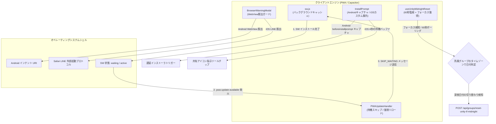
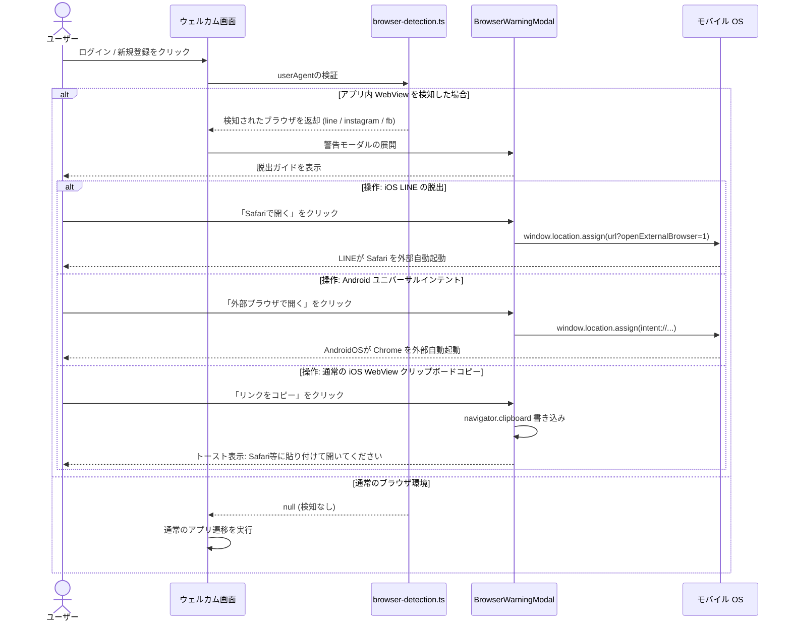

# PWA & Capacitor ハイブリッドモバイルライフサイクル — 詳細設計ガイド

## 概要

**scripture-habit** アプリケーションは、ハイブリッドアーキテクチャの下で動作しています。標準のウェブブラウザ上では Progressive Web App (PWA) として提供され、モバイル端末上では **Capacitor** を用いてラップされることで、ネイティブの iOS および Android パッケージとして動作します。

このマルチプラットフォーム展開には、アップデートの検知、OS固有のインストールプロンプト制御、WebView（アプリ内ブラウザ）のサンドボックス制限、および異なるタイムゾーン間でのグループアクティビティ自動深夜リセットなど、多くの複雑な制御が必要になります。本書では、これらの課題をスマートに解決するために実装されているライフサイクルフック、イベントコントローラ、およびWebView脱出メカニズムについて詳細に解説します。



---

## 1. PWA アップデート & サービスワーカー（SW）制御

ユーザーの作業（学習ノートの執筆中など）を妨げることなく、バックグラウンドで安全にアプリを最新状態に更新するために、**scripture-habit** は [`PWAUpdateHandler`](../../scripture-habit/src/components/pwaupdatehandler/pwa-update-handler.tsx) 内にアクティブな更新検出システムを構築しています。

### 1.1 非ブロッキング待機パターン

ブラウザがサーバー上の新しいサービスワーカー（Service Worker）の存在を検知すると、以下のステップを踏みます。
1. **休止待機（Dormant Waiting）**: 新しい SW はバックグラウンドで取得・インストールされますが、現在のページの動作を壊さないために `waiting`（待機中）状態にとどまります。
2. **イベント通知**: アップデート検知エンジンがカスタムイベント `pwa-update-available` を発火させ、詳細（detail）として待機中の `ServiceWorkerRegistration` オブジェクトを伝達します。
3. **インフォメーショントーストの表示**: `PWAUpdateHandler` がこのイベントを捕捉し、画面下部に「更新が利用可能です」という閉じられないインフォトーストをポップアップ表示します。

### 1.2 待機スキップ（SKIP_WAITING）と3秒セーフティラッチ

ユーザーが「アップデート」ボタンをクリックした際、ハンドラーはボタンの二重入力を防ぎ、スピナー表示に切り替えた上で、待機中のワーカーに直接 `SKIP_WAITING` の postMessage を送信して制御権の交代を指示します。万が一ブラウザがフリーズしたり制御権変更の検知に失敗した場合を考慮し、3秒間のフォールバックタイマーが手動のリロードを実行します。

```typescript
toast.info(
  <div className="pwa-update-toast-container">
    <span className="pwa-update-message">{updateMessage}</span>
    <button
      onClick={(e) => {
        // ボタンの二重クリックを防止し、スピナーを表示
        const btn = e.currentTarget;
        btn.disabled = true;
        btn.innerHTML = '<span class="loading-spinner" style="... animation:spin 1s linear infinite;"></span> Updating...';
        btn.style.opacity = '0.7';

        if (registration) {
          const worker = registration.waiting || registration.installing;
          if (worker) {
            // 待機中のサービスワーカーに主導権の交代を指示
            worker.postMessage({ type: 'SKIP_WAITING' });
            // 万が一のフリーズ対策として3秒後に強制リロードを実行
            setTimeout(() => window.location.reload(), 3000);
          } else {
            window.location.reload();
          }
        } else {
          window.location.reload();
        }
      }}
      className="pwa-update-button"
    >
      {updateButtonText}
    </button>
  </div>,
  {
    toastId: 'pwa-update',
    position: "bottom-center",
    autoClose: false,
    closeOnClick: false,
    draggable: false,
    closeButton: false
  }
);
```

---

## 2. プラットフォーム適合型の PWA インストール

ユーザーのホーム画面にアプリアイコンを追加してもらうために、OSの種類や環境に適応したインストール案内バナーを表示します。

### 2.1 表示制限ルール（UXへの配慮）
ユーザーの閲覧の邪魔にならないよう、バナーの表示には厳格なフィルターがかかっています。
*   **インストール済みチェック**: すでにスタンドアロンモード（インストール起動）として動いている場合（`window.matchMedia('(display-mode: standalone)').matches`）はバナーを自動非表示にします。
*   **7日間のクールダウン**: ユーザーがバナーを一度拒否（閉じる）した場合、その日付がローカルストレージに記憶され、**7日間**は再度表示されないように制御します。
*   **画面・UIとの保護**: バナーは `/dashboard` 画面でのみ表示され、かつポップアップや他のモーダルウィンドウが開いている間は表示が抑制されます。

### 2.2 OSごとの適応戦略

#### A. Android: beforeinstallprompt イベントのキャプチャ
Android/Chrome等のブラウザでは、ブラウザの標準的な `beforeinstallprompt` イベントをリッスンしてキャプチャし、カスタムの「アプリをインストール」ボタンをダッシュボードに違和感なく配置します。

```typescript
window.addEventListener('beforeinstallprompt', (e) => {
    e.preventDefault();
    deferredPromptRef.current = e; // イベントオブジェクトを退避
    setIsPromptReady(true);
});

const handleInstallApp = async () => {
    const promptEvent = deferredPromptRef.current;
    if (!promptEvent) return;
    
    // ブラウザのネイティブダイアログを起動
    promptEvent.prompt();
    const { outcome } = await promptEvent.userChoice;
    console.log(`User installation outcome: ${outcome}`);
    
    deferredPromptRef.current = null;
    setIsPromptReady(false);
};
```

#### B. iOS: 共有メニュー指示ツールチップの表示
Appleの iOS Safari では、ネイティブのインストールイベントが提供されていません。そのため、以下の手順で独自のポップアップガイドを表示します。
1.  **4秒の待機バッファ**: ダッシュボードを開いてから4秒間遅らせてバナーを表示し、画面ロード時のUI競合を防ぎます。
2.  **共有メニューのハイライト**: Safariの下部ツールバー（iPadでは上部）に配置されている「共有（Share）」ボタンを指し示すツールチップガイドを表示します。
3.  **ホーム画面への追加ガイド**: 共有メニューから「**ホーム画面に追加**」を選択する手順を視覚的に誘導します。

---

## 3. アプリ内 WebView と脱出シークエンス

ユーザーが LINE、Facebook、Instagram、Telegram 等のリンクからアプリを開いた場合、そのアプリ内部のサンドボックスである「アプリ内 WebView（In-App Browser）」上でレンダリングされます。
これらの WebView はセキュリティ保護のために著しく機能が制限されており、サービスワーカー（Service Worker）の登録やプッシュ通知の許可がブロックされ、IndexedDB がアプリを閉じるたびに破棄されるなど、PWAや Capacitor の動作に支障をきたします。

これを防止するため、アプリ側で WebView サンドボックスを検知し、外部ブラウザへ強制脱出させる **WebView 脱出プロトコル** を実装しています。



### 3.1 WebView シグネチャの検知ロジック
検知ユーティリティ ([`browser-detection.ts`](../../scripture-habit/src/utils/browser-detection.ts)) は、ユーザーエージェント文字列から以下の特異なパターンを検証します。
*   **LINE**: `/Line\//i`
*   **Instagram**: `/Instagram/i`
*   **Facebook**: `/FBAN|FBAV/i` (iOS) および `/FB_IAB/i` (Android)
*   **WhatsApp**: `/WhatsApp/i`

### 3.2 外部ブラウザ自動起動（脱出）ロジック
通常のページリダイレクトを行うとWebView内でそのままエラーになるため、OSネイティブの機能と直接連携するプロトコルスキームを使用して脱出します。

*   **iOS LINE**: URLに `?openExternalBrowser=1` を付与します。LINE iOS版がこのクエリパラメータを傍受し、自動的にWebViewを閉じて Safari を外部プロセスとして立ち上げます。
*   **Android ユニバーサルインテント**: Android OS が解釈可能なインテントスキームに変換してリダイレクトします。これにより、OS 側がデフォルトに設定されているブラウザ（Google Chromeなど）を強制起動します。
    ```
    intent://[ホストとパス]#Intent;scheme=https;action=android.intent.action.VIEW;end
    ```
*   **クリップボードへのコピーフォールバック**: LINE や Android 以外の、自動起動スキームが完全にブロックされている WebView（Instagram等）では、`navigator.clipboard.writeText` を呼び出してログインURLを自動コピーし、標準ブラウザに貼り付けるための案内トーストを表示します。

---

## 4. タイムゾーン対応の UI 深夜リセット

グループチャット内では、深夜の0時を跨ぐとグループメンバー全員の学習ノート提出率（Unity Percentage）が `0%` にクリアされます。グループメンバーが世界中の異なるタイムゾーンに住んでいる場合を想定し、この日付変更の判定はクライアント側で [`useUnityMidnightReset.ts`](../../scripture-habit/src/hooks/use-unity-midnight-reset.ts) を用いて動的に処理されます。

### 4.1 ハイブリッド型ポーリング & フォーカス監視

スマートフォンでアプリをバックグラウンドに置いたままデバイスをロックすると、OS の省電力制御によって標準的な `setInterval`（タイマー）は一時停止（スリープ）してしまいます。

デバイスが復帰した瞬間に即座に画面上の％をリセットするために、このフックは **60秒間隔のポーリングタイマー** と **ウィンドウフォーカスイベント（復帰検知）** の両方を二重で監視しています。

```typescript
useEffect(() => {
    // コンポーネントがマウントされた瞬間に直ちに確認を実行
    checkAndReset();

    // バックグラウンドポーリング
    const interval = setInterval(checkAndReset, 60000);

    // 画面復帰イベント: スマホがロック解除された際やブラウザタブに戻った際に即座に実行
    const handleFocus = () => {
        checkAndReset();
    };
    window.addEventListener('focus', handleFocus);

    return () => {
        clearInterval(interval);
        window.removeEventListener('focus', handleFocus);
    };
}, [checkAndReset]);
```

### 4.2 タイムゾーン指定の日付評価処理

日付判定はクライアントの端末時間（JST等）をそのまま使用するのではなく、グループが設定したタイムゾーン（例: `America/New_York`）に高精度変換し、Firestoreに記録されている最終更新日付と比較します。これにより、深夜リセットのずれが絶対に発生しないようにしています。

```typescript
const checkAndReset = useCallback(async () => {
    if (!groupId || isResettingRef.current) return;

    // 1. 所属グループのタイムゾーンにおける「本日」の日付を計算
    const now = new Date();
    const todayStr = formatDateInTimeZone(now, groupTimeZone || 'UTC');
    const normalizedToday = normalizeDateString(todayStr);

    // 2. 本日すでに再計算チェックが通過しているなら処理をバイパス
    if (lastCheckedDateRef.current === normalizedToday) return;

    // 3. Firestore に保存されている前回の最終ノート提出日付を取得
    let normalizedActivityDate = null;
    if (dailyActivityDate) {
        const rawDate = dailyActivityDate;
        const dateObj = typeof rawDate === 'string' ? null : parseTimestampToDate(rawDate);
        const dateStr = dateObj ? formatDateInTimeZone(dateObj, groupTimeZone) : String(rawDate);
        normalizedActivityDate = normalizeDateString(dateStr);
    }
    
    // 4. 深夜判定: グループのタイムゾーン上で日付が切り替わっているか確認
    if (normalizedActivityDate && normalizedActivityDate !== normalizedToday) {
        isResettingRef.current = true;
        try {
            // セキュアなAPI呼び出しとリセットのトリガーを実行
            onReset?.(); // クライアント側のUI表示率を0%へクリア
            lastCheckedDateRef.current = normalizedToday;
        } finally {
            isResettingRef.current = false;
        }
    } else {
        lastCheckedDateRef.current = normalizedToday;
    }
}, [groupId, groupTimeZone, dailyActivityDate, onReset]);
```

### 4.3 App Check セキュア認証連携

悪意ある第三者が直接APIエンドポイントを叩いてグループの達成率を意図的に破壊するのを防止するため、`/api/groups/reset-unity-if-midnight` に対するリクエストは厳格に保護されています。
1.  **ユーザー認証 ID トークン**: リクエスト送信者が実際にグループの正当なメンバーであることを検証します。
2.  **App Check インテグリティトークン**: Firebase App Check JWT が付与されていることを確認し、リクエストが本物の正規アプリ（PWAまたはCapacitor）から発信されたものであり、改ざんされたスクリプトではないことを保証します。

```typescript
const currentUser = auth.currentUser;
const idToken = await currentUser.getIdToken();

let appCheckToken = '';
if (appCheck) {
    const tokenResponse = await getToken(appCheck, false);
    appCheckToken = tokenResponse.token;
}

const headers: Record<string, string> = {
    'Content-Type': 'application/json',
    'Authorization': `Bearer ${idToken}`,
};
if (appCheckToken) {
    headers['X-Firebase-AppCheck'] = appCheckToken;
}

await fetch('/api/groups/reset-unity-if-midnight', {
    method: 'POST',
    headers,
    body: JSON.stringify({ groupId })
});
```
これにより、世界中どこからでも、アタックを防ぎながら、正確な深夜リセットをバックグラウンドで摩擦なく実現しています。
