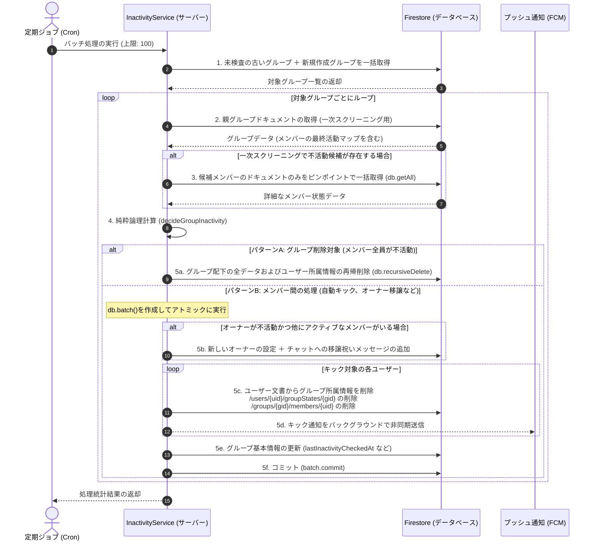
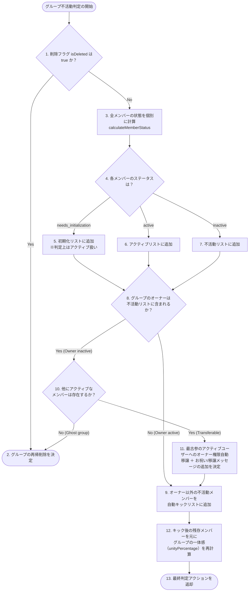

# 不活動判定スイープ ＆ 自動キック / オーナー移譲エンジン — 詳細設計ガイド

本書では、Scripture Habitのバックグラウンド運用を完全自動化する「不活動スイープ処理」、Firestoreの読み取り（Read）コストを劇的に削減する「2段階クエリ最適化」、およびグループのゴースト化を防ぐ「オーナー権限の自動移譲＆自動消滅エンジン」について詳細に解説します。

---

## バッチ処理 ＆ ダブルローテーション戦略

不活動検知プロセスは、日次の cron ジョブによって実行されるバックエンドのバッチ処理です。数百から数千のグループを効率的かつ均等にスキャンするため、「ローテーション（Rotation）」と「ネット（The Net）」という2つのスキャン戦略を組み合わせています。

1. **ローテーション**:
   グループを最後の検査タイムスタンプ（`lastInactivityCheckedAt`）の古い順にソートしてバッチ処理します。これにより、すべてのグループが均等にスキャンされることが保証されます。
2. **ネット**:
   新しく作成されたグループには `lastInactivityCheckedAt` フィールドがないため、単純な「最も古いものから」のソートでは検出から漏れる可能性があります。これらを確実に捕捉（および自己修復）するため、最近作成された未検査のグループを別途取得し、ローテーションバッチの末尾に追加します。

---

## 2段階読み取り最適化（Firestore Readコスト削減）

Firestoreの課金モデルはドキュメントの読み取り回数に基づいています。毎日数万人規模のユーザーのアクティビティ状態を確認する際、各ユーザーのドキュメントを個別に読み取ると、莫大な読み取りコストが発生してしまいます。

Scripture Habitでは、**「1回の読み取りで複数のステータスを判定する」**ための高度な2段階最適化設計を採用しています。

* **ステージ1: 親グループドキュメントによる一次スクリーニング**
  各グループの親ドキュメント（`/groups/{groupId}`）には、メンバー全員の最終アクティビティ日時を同期するマップオブジェクト（`memberLastActive` および `memberLastReadAt`）が保持されています。
  スイーパーはまず、**この親グループのドキュメント1件のみを読み込み、マップ情報を元にメンバーの活動状況を一次判定**します。この段階で「確実にアクティブ」と判定されたメンバーについては、**配下にある個別のメンバー状態ドキュメントの読み込みを完全にスキップ**します。
* **ステージ2: 不活動の疑いがある候補メンバーのみをピンポイント取得（getAll）**
  一次スクリーニングで「不活動または未初期化の可能性がある」と判定されたユーザーのみ、その配下にあるメンバー状態ドキュメント（`/groups/{groupId}/members/{uid}`）を、`db.getAll()` を使って100件ずつのバッチ単位で並列取得します。
  これにより、単純なアプローチと比較して**データベースのドキュメント読み取り数を 90% 以上削減**することに成功しています。

---

## スイープ＆自動キックのトランザクションプロセスフロー

以下は、定期ジョブ（Cron）の開始から、不活動メンバーの自動キック、グループの自動消滅、およびオーナー権限の自動移譲が Firestore トランザクションとして実行されるまでの一連のシーケンスです。



---

## 不活動検知 ＆ オーナー移譲判定デシジョンツリー

グループの運命を決定する判定ロジックは、I/Oを一切伴わない**純粋関数（Pure Function）**である `decideGroupInactivity` 内で完全に処理されます。これにより、時間やテストデータをモックするだけで完璧なユニットテストを実行可能です。



---

## コアコード解説

### 1. 2段階読み取りによる不活動評価の準備 (`inactivity-service.ts`)

親ドキュメントのマップ情報を利用してFirestoreの読み取り回数を最小限に抑える、中核となるロジックです。

```typescript
export class InactivityService {
    static async processGroupInactivity(groupId: string, groupSnap?: admin.firestore.DocumentSnapshot) {
        const groupRef = db.collection('groups').doc(groupId);
        const actualSnap = groupSnap || await groupRef.get();
        if (!actualSnap.exists) return { removedCount: 0, initializedCount: 0, transferCount: 0, groupDeleted: false };

        const groupData = actualSnap.data() as GroupDocument;
        const membersArray = groupData.members || [];
        const now = new Date();

        // 1. サブコレクションの自己修復機能（セルフヒーリング）
        // ドキュメント同期エラー等でmembers配下が空になった場合、limit(1)で安価に検知し、バッチで自己修復
        if (membersArray.length > 0) {
            const oneMemberSnap = await groupRef.collection('members').limit(1).get();
            if (oneMemberSnap.empty) {
                const healBatch = db.batch();
                for (const uid of membersArray) {
                    const memberRef = groupRef.collection('members').doc(uid);
                    const joinedAt = groupData.memberJoinedAt?.[uid] || groupData.createdAt || admin.firestore.FieldValue.serverTimestamp();
                    healBatch.set(memberRef, {
                        uid, joinedAt,
                        lastActiveAt: groupData.memberLastActive?.[uid] || joinedAt,
                        lastReadAt: groupData.memberLastReadAt?.[uid] || joinedAt,
                        kickThreshold: groupData.memberKickThresholds?.[uid] || 3,
                        readMessageCount: 0
                    });
                }
                await healBatch.commit();
            }
        }

        // 2. 【第1段階：グループ親文書マップによるスクリーニング】
        const allPossibleUids = new Set([
            ...membersArray,
            ...Object.keys(groupData.memberLastActive || {}),
            ...Object.keys(groupData.memberJoinedAt || {})
        ]);

        const activeMemberIds = new Set<string>();
        const potentiallyInactiveUids = new Set<string>();

        for (const uid of allPossibleUids) {
            const joinedAt = groupData.memberJoinedAt?.[uid];
            const lastActive = groupData.memberLastActive?.[uid];
            const lastRead = groupData.memberLastReadAt?.[uid];
            
            if (!joinedAt && !lastActive && !lastRead) {
                potentiallyInactiveUids.add(uid); // マップ情報がない場合は詳細確認へ
            } else {
                // グループ親文書のマップ情報を元に、モックデータで一旦アクティブ判定を試みる
                const mockMemberData: InactivityMemberData = { joinedAt, lastActiveAt: lastActive, lastReadAt: lastRead };
                const result = calculateMemberStatus(uid, mockMemberData, groupData, now);
                if (result.status === 'active') {
                    activeMemberIds.add(uid); // 親データだけで「確実にアクティブ」と分かれば終了
                } else {
                    potentiallyInactiveUids.add(uid); // 不活動の疑いがあれば詳細取得へ
                }
            }
        }

        const memberList: any[] = [];
        // 確実にアクティブなユーザーは親文書のデータで確定（ドキュメント読み込み回避！）
        for (const uid of activeMemberIds) {
            memberList.push({
                uid,
                data: {
                    joinedAt: groupData.memberJoinedAt?.[uid],
                    lastActiveAt: groupData.memberLastActive?.[uid],
                    lastReadAt: groupData.memberLastReadAt?.[uid],
                }
            });
        }

        // 【第2段階：不活動予備軍のみサブコレクションを db.getAll() でピンポイント取得】
        const uidsToFetch = Array.from(potentiallyInactiveUids);
        if (uidsToFetch.length > 0) {
            for (let i = 0; i < uidsToFetch.length; i += 100) {
                const chunk = uidsToFetch.slice(i, i + 100);
                const refs = chunk.map(uid => groupRef.collection('members').doc(uid));
                const docs = await db.getAll(...refs); // FirestoreのgetAllで超高速バルク取得
                for (let j = 0; j < docs.length; j++) {
                    const doc = docs[j];
                    const uid = chunk[j];
                    if (doc.exists) {
                        memberList.push({ uid, data: doc.data(), createTime: doc.createTime });
                    } else {
                        memberList.push({ uid, data: {} }); // ゴーストメンバー
                    }
                }
            }
        }

        // 3. 純粋関数による判定処理
        const decision = decideGroupInactivity(groupData, memberList, now);

        // ... (判定結果に基づき、アトミックなバッチ書き込みを実行)
    }
}
```

---

### 2. 純粋な不活動・オーナー移譲判定ロジック (`inactivity-utils.ts`)

ネットワークやFirestoreのモックを使用することなく、ステータスを容易にテストできる完全決定論的な判定エンジンです。

```typescript
export function decideGroupInactivity(
    groupData: InactivityGroupData,
    members: { uid: string, data: InactivityMemberData, createTime?: any }[],
    now: Date = new Date()
): GroupInactivityDecision {
    const decision: GroupInactivityDecision = {
        shouldDeleteGroup: false,
        membersToRemove: [],
        membersToInitialize: [],
        membersToRepair: []
    };

    // グループ削除フラグがある場合は即解散
    if (groupData.isDeleted === true) {
        decision.shouldDeleteGroup = true;
        return decision;
    }

    const activeMemberIds: string[] = [];
    const inactiveMemberIds: string[] = [];
    const ownerUserId = groupData.ownerUserId;

    // 各メンバーのステータスを集約
    for (const member of members) {
        const memberId = member.uid;
        const memberData = member.data;

        // 【自己修復】joinedAt がサーバー遅延等で破損している場合の自動補正
        if (memberData.joinedAt && member.createTime) {
            const joinedMs = toMillis(member.createTime);
            const storedJoinedMs = toMillis(memberData.joinedAt);
            if (storedJoinedMs > joinedMs && joinedMs > 0) {
                // 登録日時が作製日時より未来になっているバグを検知し、修復対象に指定
                decision.membersToRepair.push({ uid: memberId, joinedAt: joinedMs });
                memberData.joinedAt = joinedMs;
            }
        }

        const result = calculateMemberStatus(memberId, memberData, groupData, now);

        if (result.status === 'needs_initialization') {
            decision.membersToInitialize.push(memberId);
            activeMemberIds.push(memberId); // 未初期化者は猶予期間としてアクティブ扱い
        } else if (result.status === 'inactive') {
            inactiveMemberIds.push(memberId);
        } else {
            activeMemberIds.push(memberId);
        }
    }

    // 【オーナーの不活動判定と移譲処理】
    if (ownerUserId && inactiveMemberIds.includes(ownerUserId)) {
        // 自分自身以外の「アクティブな残存メンバー」を抽出
        const otherActiveMembers = activeMemberIds.filter(id => id !== ownerUserId);

        if (otherActiveMembers.length > 0) {
            // アクティブなメンバーがいれば、最古参のユーザーへオーナー権限を自動移譲
            decision.newOwnerId = otherActiveMembers[0];
        } else {
            // アクティブなメンバーが一人もいない場合、グループ自体を安全に自動消滅させる
            decision.shouldDeleteGroup = true;
            return decision;
        }
    }

    // オーナー以外の不活動メンバーをキック対象に決定
    const finalOwnerId = decision.newOwnerId || ownerUserId;
    decision.membersToRemove = inactiveMemberIds.filter(uid => uid !== finalOwnerId);

    return decision;
}
```
