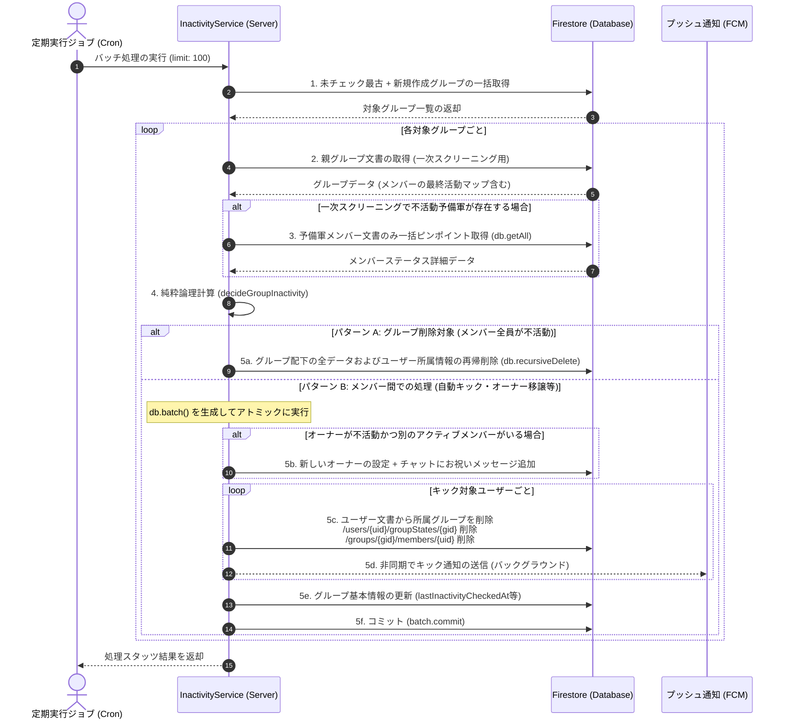
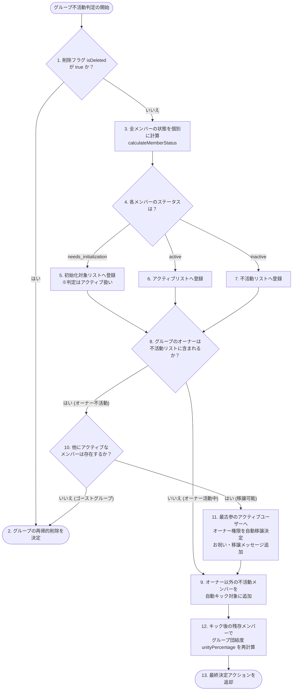

# 🔬 詳細解説：不活動スキャン & 自動キック・オーナー移譲エンジン

本ドキュメントでは、Scripture Habit のバックグラウンド運用を完全自動化する**「不活動判定（Inactivity Sweep）ミドルウェア」**、およびFirestoreの読み込みコストを極限まで削減する**「2段階クエリ最適化」**、そしてグループがゴースト化するのを防ぐ**「オーナー権限自動移譲・グループ自動解散エンジン」**について、詳細に解説します。

---

## 🔄 バッチチェック & ダブルローテーション戦略

不活動判定処理は、毎日 Cron ジョブ経由で呼び出されるバックエンドバッチ処理です。何百・何千ものグループを無駄なく均等に走査するため、**「ローテーション（Rotation）」**と**「ザ・ネット（The Net）」**という2つのスキャン戦略を組み合わせています。

1. **ローテーション（Rotation）**:
   最後にチェックした日時 `lastInactivityCheckedAt` が最も古いグループから順に並び替えてバッチ処理します。これにより、全グループが均等に走査されます。
2. **ザ・ネット（The Net）**:
   新しく作成されたばかりのグループは `lastInactivityCheckedAt` フィールドが存在しないため、単純な古い順ソートから漏れてしまう可能性があります。これをキャッチ（自浄）するため、直近作成されたグループを別途取得し、まだチェックされていないものをローテーションバッチの末尾に結合します。

---

## 🛡️ 2段階読み取り最適化 (Firestore Read Optimization)

Firestore はドキュメントの読み取り件数（Reads）ごとに課金される料金体系です。何万人ものユーザーの活動状況を毎日調べる際、愚直に全員のドキュメントを個別に読み取ると、膨大な読み取りコストが発生します。

Scripture Habit では、**「1回の読み取りで多数の状況を判定する」**ための高度な2段階最適化設計を採用しています。

*   **第1段階：グループ基本文書による一次スクリーニング**
    各グループの親文書（`/groups/{groupId}`）には、各メンバーの最終活動状況を同期したマップオブジェクト（`memberLastActive` や `memberLastReadAt`）が保持されています。
    スイーパーは、まず**グループ親文書1件を読み込むだけで、そのマップ情報を基にメンバーのステータスを計算**します。ここで「確実にアクティブ」と判断されたメンバーについては、**配下の個別ドキュメントの読み取りを完全にスキップ**します。
*   **第2段階：不活動予備軍のみのピンポイント取得（getAll）**
    「一次スクリーニングで不活動（または未初期化）の可能性がある」と判断されたユーザーに限り、配下のメンバーステータスドキュメント（`/groups/{groupId}/members/{uid}`）を `db.getAll()` を使用して100件ずつのチャックに分けて一括並列取得します。
    これにより、**データベースへの読み取り回数を通常の 90% 以上削減**することに成功しています。

---

## 🔄 スイープ & キックトランザクション処理フロー

以下は、Cron ジョブが起動してから、不活動メンバーのキックやグループの自動解散、オーナー移譲が Firestore トランザクションとして完了するまでのシーケンスです。



---

## 📅 不活動判定 & オーナー移譲決定ツリー

グループの命運を分ける判定ロジックは、完全に I/O フリーな**純粋関数（Pure Function）**である `decideGroupInactivity` 内で処理されます。これにより、時間とテストデータをモックするだけで完璧なユニットテスト実行が可能になっています。



---

## 💻 コアコード解説

### 1. 2段階読み取りによる不活動判定の準備 (`inactivity-service.ts`)

一次スクリーニングマップを駆使して Firestore の Read 数を最小化するコプロジックです。

```typescript
export class InactivityService {
    static async processGroupInactivity(groupId: string, groupSnap?: admin.firestore.DocumentSnapshot) {
        const groupRef = db.collection('groups').doc(groupId);
        const actualSnap = groupSnap || await groupRef.get();
        if (!actualSnap.exists) return { removedCount: 0, initializedCount: 0, transferCount: 0, groupDeleted: false };

        const groupData = actualSnap.data() as GroupDocument;
        const membersArray = groupData.members || [];
        const now = new Date();

        // 1. サブコレクションの自己修復機能（セルフヒーリング）
        // ドキュメント同期エラー等でmembers配下が空になった場合、limit(1)で安価に検知し、バッチで自己修復
        if (membersArray.length > 0) {
            const oneMemberSnap = await groupRef.collection('members').limit(1).get();
            if (oneMemberSnap.empty) {
                const healBatch = db.batch();
                for (const uid of membersArray) {
                    const memberRef = groupRef.collection('members').doc(uid);
                    const joinedAt = groupData.memberJoinedAt?.[uid] || groupData.createdAt || admin.firestore.FieldValue.serverTimestamp();
                    healBatch.set(memberRef, {
                        uid, joinedAt,
                        lastActiveAt: groupData.memberLastActive?.[uid] || joinedAt,
                        lastReadAt: groupData.memberLastReadAt?.[uid] || joinedAt,
                        kickThreshold: groupData.memberKickThresholds?.[uid] || 3,
                        readMessageCount: 0
                    });
                }
                await healBatch.commit();
            }
        }

        // 2. 【第1段階：グループ親文書マップによるスクリーニング】
        const allPossibleUids = new Set([
            ...membersArray,
            ...Object.keys(groupData.memberLastActive || {}),
            ...Object.keys(groupData.memberJoinedAt || {})
        ]);

        const activeMemberIds = new Set<string>();
        const potentiallyInactiveUids = new Set<string>();

        for (const uid of allPossibleUids) {
            const joinedAt = groupData.memberJoinedAt?.[uid];
            const lastActive = groupData.memberLastActive?.[uid];
            const lastRead = groupData.memberLastReadAt?.[uid];
            
            if (!joinedAt && !lastActive && !lastRead) {
                potentiallyInactiveUids.add(uid); // マップ情報がない場合は詳細確認へ
            } else {
                // グループ親文書のマップ情報を元に、モックデータで一旦アクティブ判定を試みる
                const mockMemberData: InactivityMemberData = { joinedAt, lastActiveAt: lastActive, lastReadAt: lastRead };
                const result = calculateMemberStatus(uid, mockMemberData, groupData, now);
                if (result.status === 'active') {
                    activeMemberIds.add(uid); // 親データだけで「確実にアクティブ」と分かれば終了
                } else {
                    potentiallyInactiveUids.add(uid); // 不活動の疑いがあれば詳細取得へ
                }
            }
        }

        const memberList: any[] = [];
        // 確実にアクティブなユーザーは親文書のデータで確定（ドキュメント読み込み回避！）
        for (const uid of activeMemberIds) {
            memberList.push({
                uid,
                data: {
                    joinedAt: groupData.memberJoinedAt?.[uid],
                    lastActiveAt: groupData.memberLastActive?.[uid],
                    lastReadAt: groupData.memberLastReadAt?.[uid],
                }
            });
        }

        // 【第2段階：不活動予備軍のみサブコレクションを db.getAll() でピンポイント取得】
        const uidsToFetch = Array.from(potentiallyInactiveUids);
        if (uidsToFetch.length > 0) {
            for (let i = 0; i < uidsToFetch.length; i += 100) {
                const chunk = uidsToFetch.slice(i, i + 100);
                const refs = chunk.map(uid => groupRef.collection('members').doc(uid));
                const docs = await db.getAll(...refs); // FirestoreのgetAllで超高速バルク取得
                for (let j = 0; j < docs.length; j++) {
                    const doc = docs[j];
                    const uid = chunk[j];
                    if (doc.exists) {
                        memberList.push({ uid, data: doc.data(), createTime: doc.createTime });
                    } else {
                        memberList.push({ uid, data: {} }); // ゴーストメンバー
                    }
                }
            }
        }

        // 3. 純粋関数による判定処理
        const decision = decideGroupInactivity(groupData, memberList, now);

        // ... (判定結果に基づき、アトミックなバッチ書き込みを実行)
    }
}
```

---

### 2. 純粋な不活動・オーナー移譲判定ロジック (`inactivity-utils.ts`)

ネットワークやFirestoreのモックを使わずに状態をテストできる、完全決定論的な判定エンジンです。

```typescript
export function decideGroupInactivity(
    groupData: InactivityGroupData,
    members: { uid: string, data: InactivityMemberData, createTime?: any }[],
    now: Date = new Date()
): GroupInactivityDecision {
    const decision: GroupInactivityDecision = {
        shouldDeleteGroup: false,
        membersToRemove: [],
        membersToInitialize: [],
        membersToRepair: []
    };

    // グループ削除フラグがある場合は即解散
    if (groupData.isDeleted === true) {
        decision.shouldDeleteGroup = true;
        return decision;
    }

    const activeMemberIds: string[] = [];
    const inactiveMemberIds: string[] = [];
    const ownerUserId = groupData.ownerUserId;

    // 各メンバーのステータスを集約
    for (const member of members) {
        const memberId = member.uid;
        const memberData = member.data;

        // 【自己修復】joinedAt がサーバー遅延等で破損している場合の自動補正
        if (memberData.joinedAt && member.createTime) {
            const joinedMs = toMillis(member.createTime);
            const storedJoinedMs = toMillis(memberData.joinedAt);
            if (storedJoinedMs > joinedMs && joinedMs > 0) {
                // 登録日時が作製日時より未来になっているバグを検知し、修復対象に指定
                decision.membersToRepair.push({ uid: memberId, joinedAt: joinedMs });
                memberData.joinedAt = joinedMs;
            }
        }

        const result = calculateMemberStatus(memberId, memberData, groupData, now);

        if (result.status === 'needs_initialization') {
            decision.membersToInitialize.push(memberId);
            activeMemberIds.push(memberId); // 未初期化者は猶予期間としてアクティブ扱い
        } else if (result.status === 'inactive') {
            inactiveMemberIds.push(memberId);
        } else {
            activeMemberIds.push(memberId);
        }
    }

    // 【オーナーの不活動判定と移譲処理】
    if (ownerUserId && inactiveMemberIds.includes(ownerUserId)) {
        // 自分自身以外の「アクティブな残存メンバー」を抽出
        const otherActiveMembers = activeMemberIds.filter(id => id !== ownerUserId);

        if (otherActiveMembers.length > 0) {
            // アクティブなメンバーがいれば、最古参のユーザーへオーナー権限を自動移譲
            decision.newOwnerId = otherActiveMembers[0];
        } else {
            // アクティブなメンバーが一人もいない場合、グループ自体を安全に自動消滅させる
            decision.shouldDeleteGroup = true;
            return decision;
        }
    }

    // オーナー以外の不活動メンバーをキック対象に決定
    const finalOwnerId = decision.newOwnerId || ownerUserId;
    decision.membersToRemove = inactiveMemberIds.filter(uid => uid !== finalOwnerId);

    return decision;
}
```
