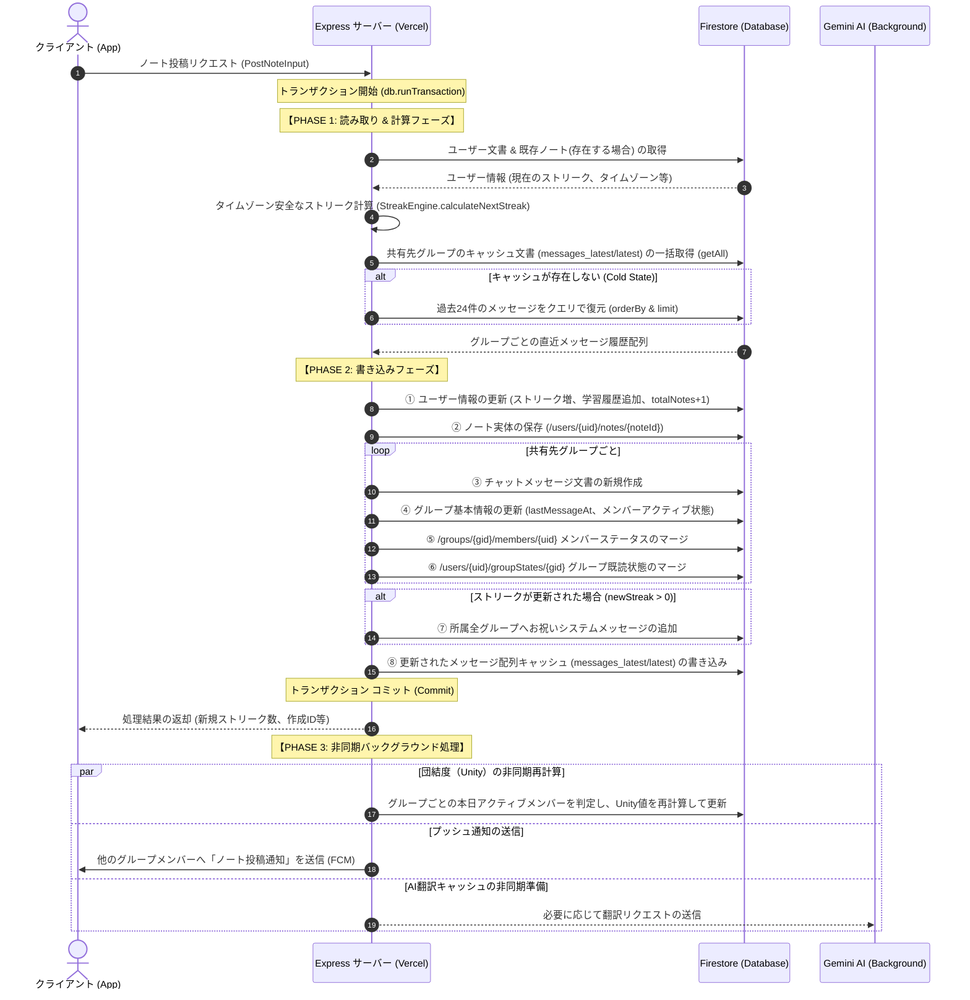
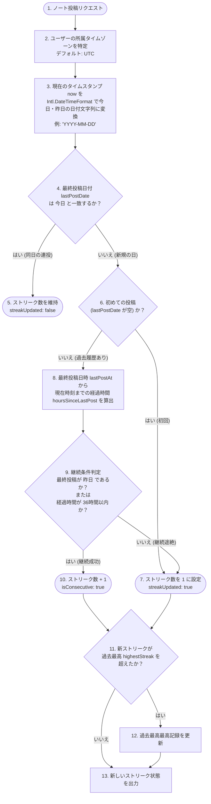

# 詳細解説：ノート投稿とストリーク（継続日数）計算ロジック

本ドキュメントでは、Scripture Habit のコアイベントである**「スタディノートの投稿」**と、それに伴う**「ストリーク（継続日数）の計算」**、さらに**「グループ内団結度（Unity）のリアルタイム集計」**に至るまでの一連の処理設計について、詳細に解説します。

---

## データベース設計 & エンティティ関係

ノート投稿時に影響を受ける Firestore のスキーマとコレクション構造は以下の通りです。

```
/users/{uid}                           [ユーザーのメイン文書：ストリーク数、タイムゾーン、学習日履歴]
  └── /notes/{noteId}                  [ユーザー個人のノート履歴：本文、聖句、話者、共有先情報]
  └── /groupStates/{groupId}           [ユーザーの所属グループ状態：既読件数、最終アクティブ日時]

/groups/{groupId}                      [グループのメイン文書：所属メンバー、メッセージ件数、団結度]
  └── /messages/{messageId}            [グループ内の全チャットメッセージ：投稿ノート、ストリーク発表]
  └── /messages_latest/latest          [メッセージキャッシュ文書：直近25件の高速読み込み用配列]
  └── /members/{uid}                   [グループ内メンバーの活動メタデータ：最終投稿日、既読件数]
```

---

## 投稿トランザクション処理フロー

ユーザーがノートを投稿すると、サーバーは **Firestore トランザクション（`db.runTransaction`）** を開始します。Firestore のトランザクションは競合を防ぐため、**「読み取りフェーズ（厳密な Read-before-Write）」**をすべて終えた後に**「書き込みフェーズ」**に移行する設計ルールを徹底しています。

### トランザクション シーケンス図



---

## ストリーク（継続日数）計算アルゴリズム

ユーザーが異なるタイムゾーン（日本、アメリカ、フィリピンなど）からアクセスする場合でも、**「サーバー時間」ベースで判定すると日付跨ぎの判定にズレが生じます**。

これを防ぐため、Scripture Habit ではユーザーが設定した（または端末から取得した）**「ローカルタイムゾーン」**を基準にカレンダー日付を計算し、さらに**36時間の猶予（グレースピリオド）**を設けて継続性を優しく判定しています。

### ストリーク判定フローチャート



---

## コアコード解説

### 1. ストリークエンジン (`streak-engine.ts`)

以下は、タイムゾーンと36時間ルールを組み合わせたストリーク評価エンジンの核心ロジックです。

```typescript
export class StreakEngine {
    static calculateNextStreak(
        currentState: StreakState,
        options: { now: Date; clientTimeZone?: string | null }
    ): StreakResult {
        const { now } = options;
        const { streakCount, highestStreak, lastPostDate, lastPostAt, timeZone } = currentState;

        // 1. タイムゾーンの特定 (クライアントのものを優先し、なければDB、最悪はUTC)
        const effectiveTimeZone = timeZone || 'UTC';
        
        let today: string;
        let yesterday: string;

        // 2. Intl API を用いて、指定タイムゾーンにおける「今日」と「昨日」の 'YYYY-MM-DD' を安全に算出
        try {
            const formatter = new Intl.DateTimeFormat('sv-SE', { 
                timeZone: effectiveTimeZone, 
                year: 'numeric', 
                month: '2-digit', 
                day: '2-digit' 
            });
            today = formatter.format(now);
            
            // 昨日の日付を得るため、ミリ秒から24時間をマイナスしてフォーマット
            const yesterdayDate = new Date(now.getTime() - 24 * 60 * 60 * 1000);
            yesterday = formatter.format(yesterdayDate);
        } catch {
            // 例外時のフォールバック (UTCベースの簡易抽出)
            today = now.toISOString().split('T')[0];
            const yesterdayDate = new Date(now.getTime() - 24 * 60 * 60 * 1000);
            yesterday = yesterdayDate.toISOString().split('T')[0];
        }

        let newStreak = Number(streakCount || 0);
        let currentHighest = Number(highestStreak || newStreak);
        let streakUpdated = false;
        let isConsecutive = false;

        // 3. 連投ガード: 最終投稿が「今日」すでに行われている場合、ストリークは増やさない
        if (lastPostDate === today) {
            return {
                newStreak,
                currentHighest,
                today,
                streakUpdated: false,
                isConsecutive: false
            };
        }

        // 4. 初回投稿判定
        if (!lastPostDate) {
            newStreak = 1;
            streakUpdated = true;
        } else {
            // 5. 昨日の日付と一致するか
            const isTargetDay = lastPostDate === yesterday;
            
            // 6. 36時間（1.5日）の猶予期間判定
            // 時差の切り替わりや生活リズムの遅れによる「カレンダー日付のズレ」を救済する仕組み
            const getMillisSafely = (ts: any): number => {
                if (!ts) return 0;
                if (ts instanceof Date) return ts.getTime();
                if (ts.toMillis) return ts.toMillis();
                if (ts.seconds) return ts.seconds * 1000;
                return Number(ts) || 0;
            };

            const lastTimeMillis = getMillisSafely(lastPostAt);
            const hoursSinceLastPost = (now.getTime() - lastTimeMillis) / (1000 * 60 * 60);
            const withinGracePeriod = lastTimeMillis > 0 && hoursSinceLastPost <= 36;

            // 昨日に投稿したか、または36時間以内の投稿であれば継続扱い
            if (isTargetDay || withinGracePeriod) {
                newStreak += 1;
                isConsecutive = true;
                streakUpdated = true;
            } else {
                // 期間が空きすぎた場合はストリークをリセット
                newStreak = 1;
                streakUpdated = true;
            }
        }

        // 7. 最高記録の更新
        if (newStreak > currentHighest) {
            currentHighest = newStreak;
        }

        return {
            newStreak,
            currentHighest,
            today,
            streakUpdated,
            isConsecutive
        };
    }
}
```

---

### 2. トランザクション処理 (`note-service.ts`)

投稿時のアトミック書き込みを実現する Firestore トランザクションコードの主要部分です。

```typescript
export class NoteService {
    static async postNote(input: PostNoteInput) {
        const { uid, messageText, comment, shareOption, selectedShareGroups, clientTimeZone } = input;
        
        try {
            const result = await db.runTransaction(async (transaction) => {
                const userRef = db.collection('users').doc(uid);
                const noteRef = db.collection('users').doc(uid).collection('notes').doc();

                // === PHASE 1: 厳密な読み取りと状態計算 ===
                const userSnap = await transaction.get(userRef);
                if (!userSnap.exists) throw new NotFoundError('User not found.');
                const userData = userSnap.data()!;

                const userGroupIds: string[] = userData.groupIds || [];
                let groupsToPost: string[] = [];
                // 共有設定に応じた宛先グループの解決
                if (shareOption === 'all') groupsToPost = userGroupIds;
                else if (shareOption === 'specific') groupsToPost = selectedShareGroups || [];
                // (重複削除と最大20件制限)
                groupsToPost = [...new Set(groupsToPost.filter(gid => !!gid))].slice(0, 20);

                const currentNow = new Date();
                
                // ストリークの判定処理呼び出し
                const streakResult = StreakEngine.calculateNextStreak({
                    streakCount: Number(userData.streakCount || 0),
                    highestStreak: Number(userData.highestStreak || 0),
                    lastPostDate: userData.lastPostDate || null,
                    lastPostAt: userData.lastPostAt ? (userData.lastPostAt.toDate ? userData.lastPostAt.toDate() : new Date(userData.lastPostAt)) : null,
                    timeZone: userData.timeZone || 'UTC'
                }, { now: currentNow, clientTimeZone });

                const { newStreak, currentHighest, today, streakUpdated } = streakResult;

                // === PHASE 2: アトミックな一括書き込み ===
                const userUpdate: any = {
                    lastPostAt: admin.firestore.Timestamp.fromDate(currentNow),
                    totalNotes: admin.firestore.FieldValue.increment(1)
                };

                if (streakUpdated) {
                    userUpdate.daysStudiedCount = admin.firestore.FieldValue.increment(1);
                    userUpdate.streakCount = newStreak;
                    userUpdate.lastPostDate = today;
                    userUpdate.studiedDates = admin.firestore.FieldValue.arrayUnion(today);
                    if (newStreak > currentHighest) userUpdate.highestStreak = newStreak;
                }

                // ユーザー文書の更新
                transaction.update(userRef, userUpdate);

                // 各共有先グループへのノート書き込み処理
                for (const gid of groupsToPost) {
                    const gRef = db.collection('groups').doc(gid);
                    const msgRef = gRef.collection('messages').doc();

                    const msgData = {
                        text: messageText,
                        senderId: uid,
                        senderNickname: userData.nickname || 'Member',
                        createdAt: admin.firestore.Timestamp.fromDate(currentNow),
                        isNote: true,
                        originalNoteId: noteRef.id,
                    };

                    transaction.set(msgRef, msgData);
                    
                    // グループの最終更新日時やカウンタの更新
                    transaction.update(gRef, {
                        lastMessageAt: admin.firestore.Timestamp.fromDate(currentNow),
                        lastNoteAt: admin.firestore.Timestamp.fromDate(currentNow),
                        messageCount: admin.firestore.FieldValue.increment(1),
                        noteCount: admin.firestore.FieldValue.increment(1),
                        [`memberLastActive.${uid}`]: admin.firestore.Timestamp.fromDate(currentNow)
                    });
                }

                // 個人ノートの保存
                transaction.set(noteRef, {
                    text: messageText,
                    createdAt: admin.firestore.Timestamp.fromDate(currentNow),
                    comment,
                    shareOption,
                    sharedWithGroups: groupsToPost,
                });

                // ストリークお祝いシステムメッセージの追加
                if (streakUpdated && newStreak > 0) {
                    for (const gid of userGroupIds) {
                        const msgRef = db.collection('groups').doc(gid).collection('messages').doc();
                        transaction.set(msgRef, {
                            text: `${userData.nickname} さんが ストリーク ${newStreak} 日を達成しました！`,
                            senderId: 'system',
                            createdAt: admin.firestore.Timestamp.fromDate(new Date(currentNow.getTime() + 1000)),
                            isSystemMessage: true,
                        });
                    }
                }

                return { personalNoteId: noteRef.id, newStreak, streakUpdated };
            });

            return result;
        } catch (error) {
            console.error('[NoteService] PostNote Transaction Error:', error);
            throw error;
        }
    }
}
```

---

## レベルアップ & XP（経験値）計算モデル

Scripture Habit は学習の継続意欲を促すため、投稿に応じてレベル（等級）が上がる仕組みを導入しています。

1. **基本獲得XP**: 1回のノート投稿ごとに **100 XP** を獲得。
2. **ストリークボーナス**:
   - `連続日数（Streak）× 10 XP` がボーナスとして追加付与されます。
   - 例：10日連続の日の投稿は、`100 XP（基本） + 100 XP（ボーナス） = 200 XP` を獲得。
3. **レベルアップ基準公式**:
   - レベル $L$ に到達するために必要な累計XPは以下の数式で定義されます。
     $$\text{必要な累計XP} = 500 \times (L - 1)$$
   - 次のレベルまでの進行度は、クライアント側UI（ダッシュボードの進捗バー）でアニメーション表示されます。

---

## 非同期バックグラウンド処理の分離設計

なぜ **「団結度（Unity）の再計算」** や **「FCMプッシュ通知の送信」** はトランザクションの外側（非同期）で実行されるのでしょうか？

### 理由1: トランザクション内の処理時間（レイテンシ）最小化
Firestore のトランザクションは、実行中にアクセスしたドキュメントを一時的にロックします。FCMプッシュ通知の送信処理や、グループ内の全メンバーデータを参照して計算する「団結度」のロジックをトランザクションの内部に入れてしまうと、ロック時間が長くなり、**同一グループ内の他ユーザーが同時にノートを投稿した際に「トランザクション競合エラー（Aborted/Timeout）」が発生**しやすくなります。

### 理由2: 外部APIへの二重リクエスト防止
Firestore のトランザクションは、競合を検知すると**「最初から自動でリトライ」**されます。もし通知送信や外部サービス呼び出しをトランザクション内に書いていると、リトライが発生した回数分、ユーザーに**二重・三重にプッシュ通知が届いてしまう**ことになります。

したがって、以下のように明確な設計境界を設けています。
- **トランザクション内 (アトミック保証)**: ユーザー情報、ノート、グループの投稿数カウンターなど「直接的なデータ整合性」が必要な書き込み。
- **トランザクション外 (イベント駆動/バックグラウンド)**: 団結度計算 (`unityPercentage`)、プッシュ通知 (`NotificationService.notifyNotePosted`)、Gemini AIによる自動翻訳の準備。
